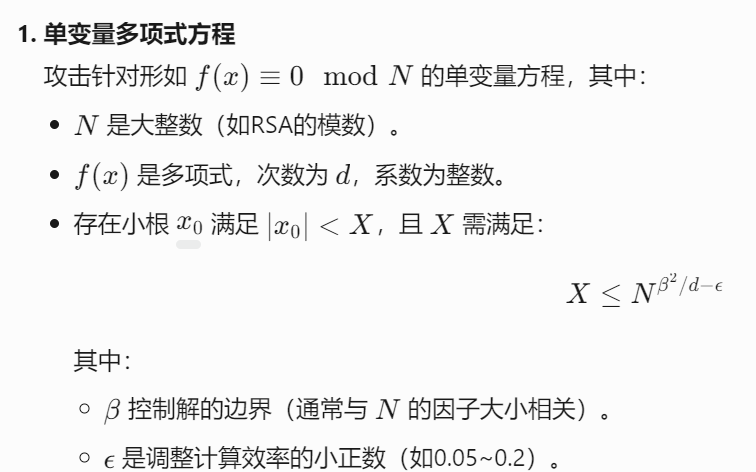

**1.coppersmith攻击**
rsa的d的低位泄露
​


**​**

```python
from Crypto.Util.number import *
def find_p(p_low, bit, n):
    PR.<x> = PolynomialRing(Zmod(n))
    f = (2<<bit)*x + p_low #等价于x*2**410取x的高410位，因为低位泄露了
    f = f.monic()
    root = f.small_roots(X=2^(512-bit), beta=0.3)
    if root :
        return (2<<bit)*root[0] + p_low
n = 156739515226635581524592797610847324418529702729659760727202454324501479907596255649349406182566636617352761983459648380669151952249526892078378572831346100444943020314226860094300911303589453661009834514243241261318188779118227457185670049393331570167726982038500849886842419000632840251465852441285715712609
d = 1865327042408619801352057511348007441275330638921397637214779955824487081626289235627502761209800783644652914147540081431451
c = 72260884070910873253619893714557327479300651539617744913822595501549980223259020597000998829262506949824325397279990912888752157554696212466966682483623575703479116305560808218806054242135099446883072418808228726774129042552815016924170283352225826854235696829480360844745488070927932843928843556296485306121
bit = 410
e = 7
for k in range(1, e+1):
    X = var('X')
    re = solve_mod([e*d*X == X + k*(X-1)*(n-X)], 2<<bit)
    for x in re:
        p_low = int(x[0])
        p = find_p(p_low, bit, n)
        if p:
            break
p = int(p)
q = n//p
d = inverse(e, (p-1)*(q-1))
m = pow(c, d, n)
print(long_to_bytes(int(m)))
```
关于 f = (2<<bit)*x + p_low感觉很奇怪，已知p的低410位，那么求p的完整位数不是应该求x*2**(512-410)为什么是直接乘2**410呢，?回头考虑下，没错，这里就是要直接乘410次方
**2.coppersmith找小根**
参考：

```python
P.<t> = PolynomialRing(Zmod(n), implementation='NTL')
f = t + (key_high - 11451419)
#这里The_key=key_high+t
# 使用Coppersmith方法寻找小根t
t_find = f.small_roots(X=2^150, beta=0.48, epsilon=0.02)
```
x是上界，x=2**k，其中k是未知的高位或者低位的位数，
beta通常满足0 < beta ≤ 1.0，，和模数n相关，通常默认beta=1.0当p和q接近时，一般来讲求p或者q的低位或高位时通常设为0.4-0.5，
#### `**epsilon**`（可选，默认值 `0.1`）

- **含义**：平衡计算时间和成功概率的系数。
- **作用**：较小的 `epsilon` 会增加计算时间但可能找到更大的根。
- **建议值**：`0.05 ≤ epsilon ≤ 0.2`3.攻击条件


 epsilon就是上面那个d-e中的e，这里的d指的是多项式指数，可以使用sagemath里面的degree函数来求，通过这个来
其中B是对于n而言的，一般当p和q和根号n接近时，B取0.5左右，p=n**0.4时，B取0.4
#### **β 的实战意义**
在攻击中，`β` 直接决定了 **攻击能容忍的未知部分的大小**：

- **β 越大**：允许的未知部分 *X* 越大，攻击更容易成功。
- **β 越小**：未知部分 *X* 必须更小，攻击需要更多已知信息一般来讲，使用coppersmith要先设置参数，例如求小根时，先设置参数，然后进行x的上界判定，

```python
c = '0x3a80caebcee814e74a9d3d81b08b1130bed6edde2c0161799e1116ab837424fbc1a234b9765edfc47a9d634e1868105d4458c9b9a0d399b870adbaa2337ac62940ade08daa8a7492cdedf854d4d3a05705db3651211a1ec623a10bd60596e891ccc7b9364fbf2e306404aa2392f5598694dec0b8f7efc66e94e3f8a6f372d833941a2235ebf2fc77c163abcac274836380045b63cc9904d9b13c0935040eda6462b99dd01e8230fdfe2871124306e7bca5b356d16796351db37ec4e574137c926a4e07a2bfe76b9cbbfa4b5b010d678804df3e2f23b4ec42b8c8433fa4811bf1dc231855bea4225683529fad54a9b539fe824931b4fdafab67034e57338217f'
p_high = '0xa9cb9e2eb43f17ad6734356db18ad744600d0c19449fc62b25db7291f24c480217d60a7f87252d890b97a38cc6943740ac344233446eea4084c1ba7ea5b7cf2399d42650b2a3f0302bab81295abfd7cacf248de62d3c63482c5ea8ab6b25cdbebc83eae855c1d07a8cf0408c2b721e43c4ac53262bf9aaf7a000000000000000'
n = '0x841a5a012c104e600eca17b451d5fd37c063ad347707a2e88f36a07e9ad4687302790466e99f35b11580cbe8b0a212e6709686c464a6393c5895b1f97885f23ea12d2069eb6dc3cb4199fb8c6e80a4a94561c6c3499c3c02d9dc9cf216c0f44dc91701a6d9ec89981f261a139500420a51014492f1da588a26e761439dd5739b32540ca6dc1ec3b035043bc535304a06ccb489f72fcd1aa856e1cffe195039176937f9a16bd19030d1e00095f1fd977cf4f23e47b55650ca4712d1eb089d92df032e5180d05311c938a44decc6070cd01af4c6144cdab2526e5cb919a1828bec6a4f3332bf1fa4f1c9d3516fbb158fd4fbcf8b0e67eff944efa97f5b24f9aa65'
e = '0x10001'
c=int(c,16)
p_high = int(p_high,16)
n = int(n,16)
e = int(e,16)

P.<t> = PolynomialRing(Zmod(n), implementation='NTL')
f = t + p_high
t_find = f.small_roots(X=2^60, beta=0.48, epsilon=0.02)
t = int(t_find[0])
p = t+p_high
q = n//p
print(p)
print(q)
```
一个经典的p的高位泄露的题目1，这里p的低60位未知，使用coppersmith求出p的低60位，在组合成完整的p进而求出flag，要跑一定时间
可以这样理解，要找到的是满足mod p =0的根，然而这里p未知，因此就退而其次求mod n = 0的根，因为mod p=0必然mod n也等于0，因此这里使用mod n来求解这根
4.求一个模p下的根

```python
from Crypto.Util.number import *
p = 133497915779382863191750985139274661777547262395290628161924420897772911005538338729076080701700641387222690295548776566406640902391412661622674862629221960258683570655393881212072865809598640669325347893228617784548982886334708010706482958773921901369314425694414231562752232070402056445403762485870067804611
a = 9956367951694116871507184264812038680047685394446603010101493156120195118634053526664122377707243776744926630820373051608195739431033785355316509320690639
b = 10372715760267086803036635068149481902075294943354407472550232447612611381527989796797133302495652064200149218004252582942179771677307157495328484190016267
c = 6954444546090251351899752282258945069765577103755637726562318645879810909547057855773433206441550954298878711294660493586907360045986061150306446126101573
d = 12708905621484064085174866220764918657140490021181156214236692898034114314742314389460399916798129560082685314351680895409634875081403212130502800572290391
y = 89881957270704175663646084308402351944545222001266778194637035700540903495792268004845278611707036762628657152963392762363015748904045511650663013086598899685992255568758440781657480520250399778976982455784259655683731183717562593121780657623767804362641533930566522430
h = 584447473604416360596641349947186936435346265446590336271443321812736224750414727189483734666053582372219773206703655293254283559436185831581631


P.<x> = PolynomialRing(Zmod(p), implementation='NTL')
f = a*x**3 + b*x**2 + c*x + d-y
f = f.monic()
root = f.small_roots(X=2^128, beta=0.48, epsilon=0.02)
x = int(root[0])
print(x)
m = h//x
print(long_to_bytes(m))
```
5.coppersmith恢复m
这里注意一个点，使用copper本质上都是在求模n下的一个根，无论是恢复高位还是低位都一样，都要把多项式转换成f =0 mod n 的形式，然后求出mod n下的根，进而恢复完整的p或m，同时这里要记得对多项式进行首一化 首一化主要就是在恢复明文的时候和低位泄露的时候使用，高位好像不用？
当`beta=0.4`时，在未知位数少于等于227bit时，可以恢复p
当`beta=0.4,epsilon=0.01`时，在未知位数少于等于248bit时，可以恢复p

```plain
from Crypto.Util.number import *
from gmpy2 import *
from secret import flag

m = bytes_to_long(flag)
e = 65537
p= getPrime(256)
leak_p = p >> 120
print("leak_p =",leak_p)
q = getPrime(256)
n = p*q
c= pow(m,e,n)
print("n =",n)
print("c =",c)
# leak_p = 57303545022436031674172379509633863887077
# n = 6290400850108673527783456723558868077251853788073859360516042680251422818079380463161520548743184302018140978345372703177688378631564416901363981788817257
# c = 3018879496435827891565409624549580574355607699876796814908055868300197064252462047054251836059387617618529706009316747223510404878163964048672091931778452

```

```plain
from sage.all import *
from Crypto.Util.number import *
from gmpy2 import *


n = 6290400850108673527783456723558868077251853788073859360516042680251422818079380463161520548743184302018140978345372703177688378631564416901363981788817257
c = 3018879496435827891565409624549580574355607699876796814908055868300197064252462047054251836059387617618529706009316747223510404878163964048672091931778452
e = 65537
pbits = 256

# leak_p = 57303545022436031674172379509633863887077

# print(hex(leak_p<<8))

# leak_p = 0xa8666553ec59acad3ed8208f060abba8e500

for i in range(1, 127):
    leak_p = 0xa8666553ec59acad3ed8208f060abba8e500
    leak_p = leak_p + int(hex(i),16)

#     print(leak_p)

    kbits = pbits - leak_p.nbits()  # 设置界的 bit上限

#     print(kbits)

    p_high = leak_p << kbits
    PR.<x> = PolynomialRing(Zmod(n))
    f = p_high + x
    roots = f.small_roots(X=2^kbits, beta=0.4)  #计算模多项式的小整数根

    if(roots):
        print('roots =',roots)
        p = p_high + int(roots[0])
        q = n//int(p)
        

        phi = (p-1)*(q-1)
        d = invert(e,phi)
        flag = int(pow(c,d,n))
        print(long_to_bytes(flag))

```
[https://yyskm.github.io/2025/05/06/Coppersmith/](https://yyskm.github.io/2025/05/06/Coppersmith/)  一个讲的比较详细的网站
