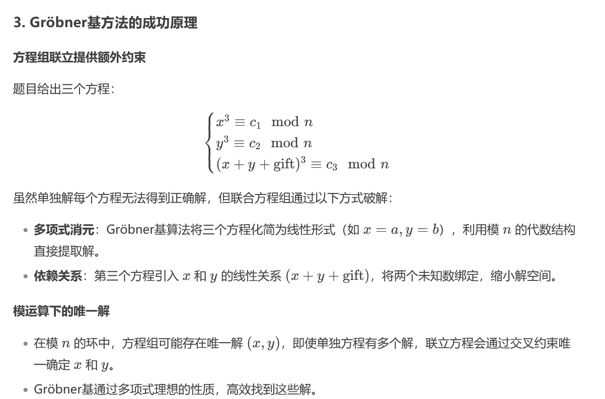

**1.多项式环的构建**
寻找小根
```plain
P.<t> = PolynomialRing(Zmod(n), implementation='NTL')
f = t + (key_high - 11451419)
#这里The_key=key_high+t
# 使用Coppersmith方法寻找小根t
t_find = f.small_roots(X=2^150, beta=0.48, epsilon=0.02)
#以列表形式储存 
#在模p下找到满足多项式的小根
#应该说是因为p是n的因子，所以能通过在模n的方式下间接性找到模p的根
```
2.grobner基
求解线性方程组的解，通过约束求出唯一解 例题是newstar的**学以致用**


3.sage解方程

```plain
from sympy import symbols, Eq, solve

# 定义符号变量 p 和 q
var('p')
var('q')

# 定义第一个方程：p^2 * q == n
eq1 = p**2*q==n

# 定义第二个方程：p + q == sum
eq2 = p+q == sum

# 使用 sympy 的 solve 函数来求解这两个方程
solution = solve([eq1, eq2], p, q)

# 输出解
solution
```
4.在模p下找到满足x**e-c的所有根，同理找到模q下的，同时满足这两个式子，进而使得其满足模n下的所有根
