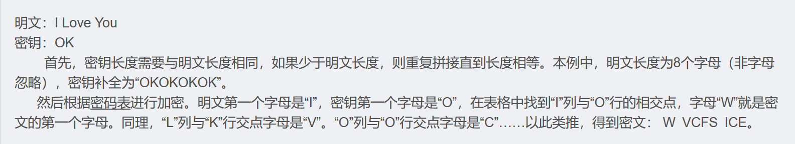
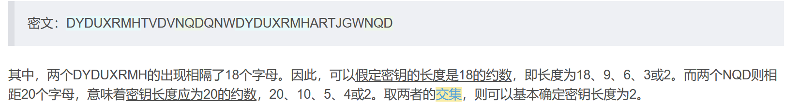
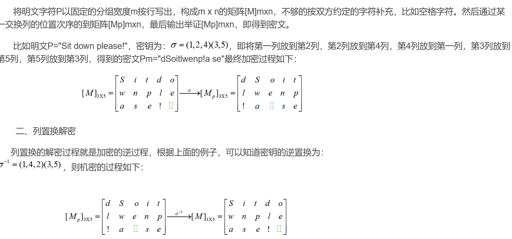
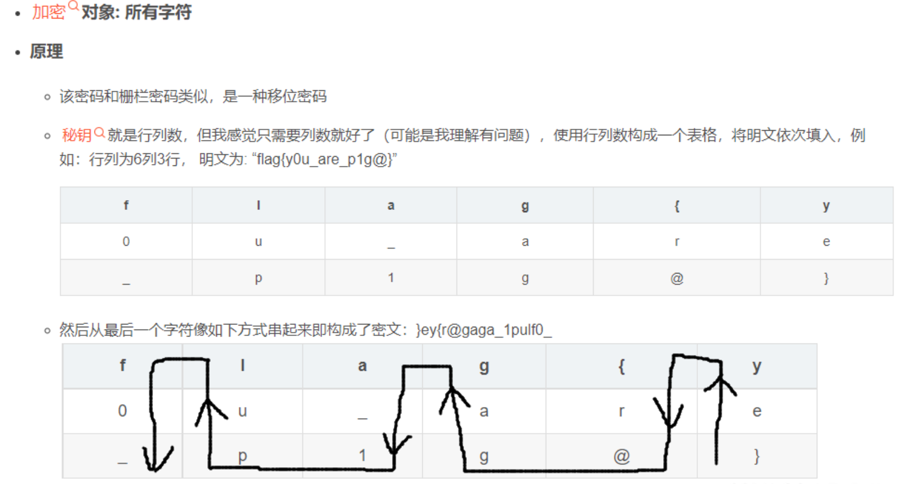
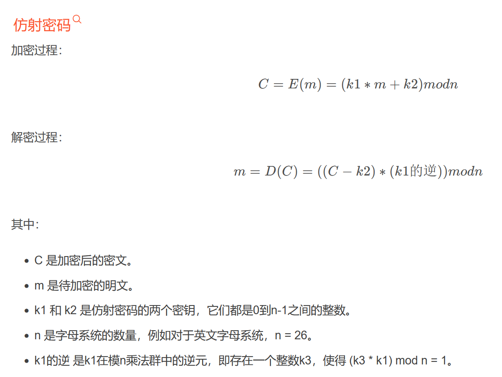

**替换密码：（使用quipquip.com可自动破解替换）**
**1.凯撒密码caesar**
对明文根据密钥长度进行位移
**2.维吉尼亚密码**
使用字母表进行加密

**置换密码：**
**3.栅栏密码：**
把明文分成N个一组，然后把每组的第一个字连起来
**4.列置换密码**

**5.曲路密码**

**​**
**其他：**
**6.培根密码、**

**7.仿射密码（本质上也是替换密码）**

**​**
