**1.定义**
 给定n维空间中一组**线性无关**向量，其**整系数**组合构成的点的集合称为格。也就是类似于向量空间里面的由任意一组基向量表示的所有向量的集合，y=ax+by只是这里的a和b都只能是整数。
格点本质上还是点，是由基向量所生成的向量的终点，而格本质上也是点的集合，它是由许多个格点组成的，只是可以说是由线性无关向量的线性组合而成的点的集合
应该说因为对于任意一个格点，可以表示成一组基向量的线性组合
**2.格密码难题**
(1) 最短向量问题SVP
给定一个格，找到其中欧几里得长度（两点之间直线距离）最短的非零向量
随着维数的增加，越难找到。
(2) 最近向量问题 CVP
给定一个格和一个目标向量，找到格中最接近该目标向量的向量
 这是一个NP难问题，意味着在一般情况下，没有已知的多项式时间算法可以解决该问题。随着格的维度和复杂度增加，找到最近向量的难度也会急剧上升
3.NTRU算法（非对称加密算法）
 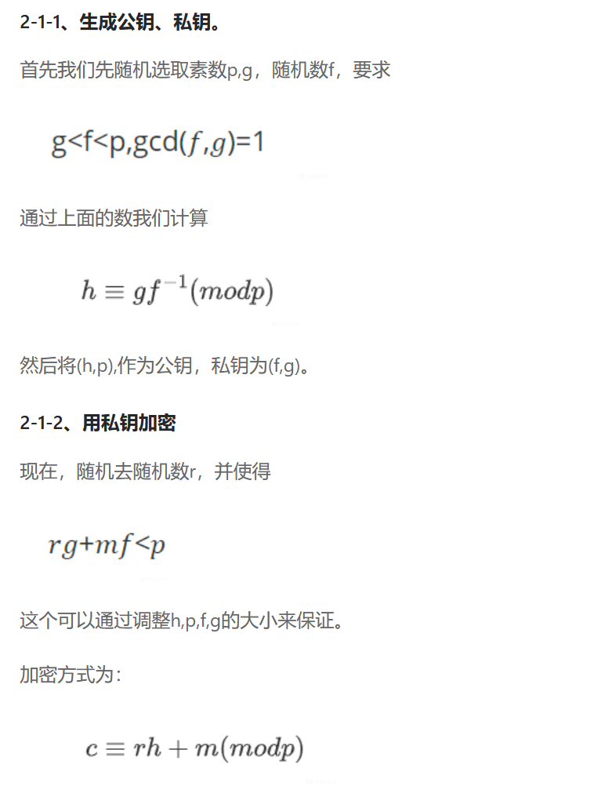
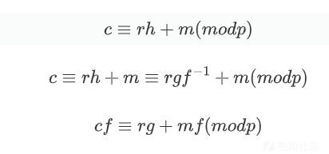
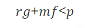


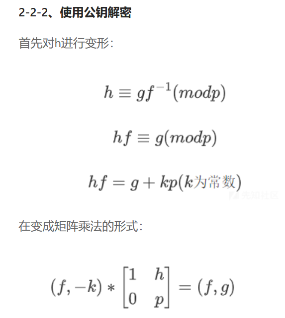

 而上面那个矩阵乘法说明(f,g)在格L上，也就是说(f,g)是格的一个格点，所以我们能用svp问题的解法来解，也就是LLL格基规约算法来解。
使用格的目的本质是要求出私钥(f,g),他这里是直接对构造的格基进行LLL格基规约算法，直接通过这个算法求出满足(f,g)=(f,f⋅h−k⋅q) 的短向量  ，而这个最短向量应该就是对应的私钥（f,g）
**3.LLL格基规约算法 ** 
LLL算法（Lenstra-Lenstra-Lovász算法）是一种求解最短向量问题的近似算法。其基本思路是将给定的格分解为一个格基，然后找到一个新的格基，其基向量更短，并且更接近于原格。这个过程可以通过不断地将格分解为更小的子格并找到更短的基向量来实现。
具体来介绍就是根据给的格基，通过规约算法得到一组相对前面更简单的格基（都在一个格上，相当于以一个格为有限域，在里面计算），然后不断优化的到最优化的格基，和中国剩余定理的辗转相除法很像，就是一直迭代，直到没法再优化为止。
而通过上面得到的最优格基就是我们要的最短非零向量


**这里对于有些题目要进行配平，使得其构造的格基能够满足Hermite定理，能够进行格基规约算法**
一个测试的例子
```plain
import gmpy2
from Crypto.Util.number import *

b = 2 ** 0
flag = b'flag{Do_you_like_Laooooooo00000ooottice?Addoil}'
print(len(flag))
f = bytes_to_long(flag)
print(f.bit_length())  
p = getPrime(512)
g = getPrime(128)
g = g

#行列式的值
temp = gmpy2.iroot(2 * b * p, 2)[0]  #bit = (248 + 512) / 2
print(temp.bit_length()) 

#最短向量的值
temp2 = gmpy2.iroot(f**2+(b*g)**2, 2)[0]  #主要在于f g没有太大影响
#此外一定要注意 在python中 ^是异或  **才是平方 
print(temp2.bit_length())  

```
4.格基规约算法满足的条件 Hermite定理
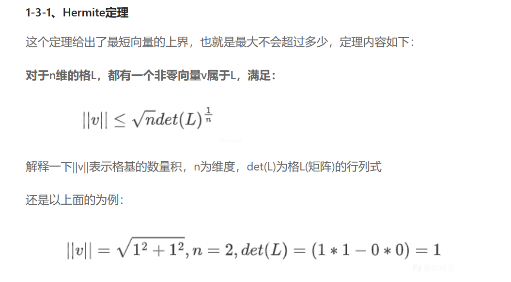

这里的L就是所构造的格向量，det(L)就是求其行列式的值，n是维度就是基向量的个数
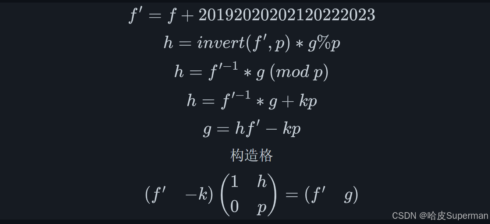

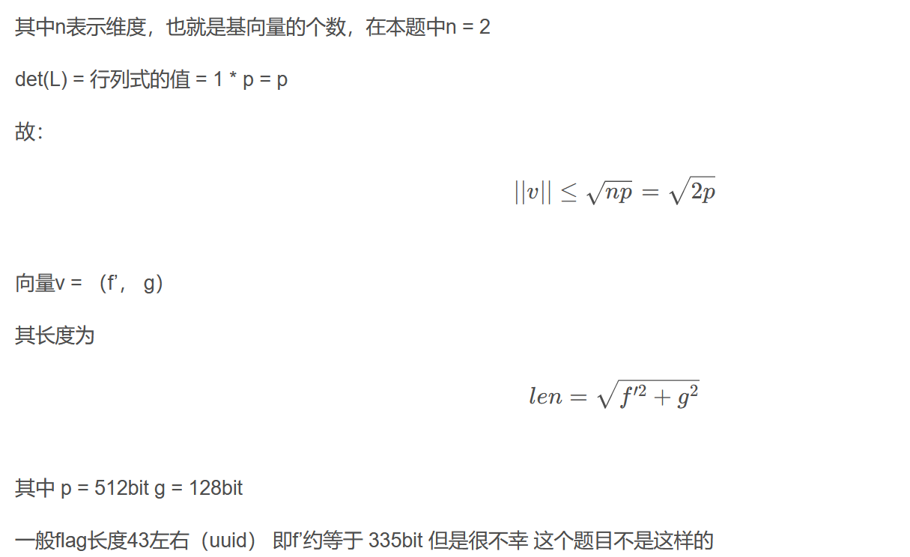

这里注意一个点，三次或者更多次进行配平时，前面的根号2变成根号3，也就是对3进行开二次根号，跟后面的行列式的开3次根号是不一样的，要分开算，但是对于后面的最短向量来说就是还是开二次根号就可以
一般配平  这种配平可以通过编程直接进行测试，也就是格基规约后得到的后面的那个向量的长度要小于前面构造的向量的长度，给定相应位数的数比如b，g就可以对最后的结果进行比较，下面这题flag长度47，也就是376位，而根号2*p的位数只有256位左右，小于376，因此进行配平，同乘2**256，flag长度在375左右，根号2p在384，满足hermite定理，可以进行格基规约
配平后进行格基规约
```python
from Crypto.Util.number import *
import gmpy2
q = 24445829856673933058683889356407393860808522483552243481673407476395441107312130500945533047834993780864465577896968035259377721441466959027298166974554621753030728893320770628116412892838297326949997096948374940319126319050202262831370086992122741039059235809755486170276098658609363789670834482459758766315965501103856358827004129316458293962968758091319313119139703281758409686502729987426264868783862562150543872477975124482520151991822540312287812454562890993596447391870392038170902308036014733295394468384998808411243690466996284064331048659179342050962003962851315539367769981491650514319735943099663094899893
h = 4913183942329791657370364901346185016154546804260113829799181697126245901054001842015324265348151984020885129647620152505641164596983663274947698263948774663097557712000980632171097748594337673511102227336174939704483645747401790373320060474777199502879236509921155985395351647045776678540066383822814858118010995298071799515355111562392871675582742450331679030377003011729873888234401630551097244308473512890467393558048369156638425711104036276296581364374424105121033213701940135560177615395895359023414249846471332180098181632276243857635719541258706892559869642925945927703702696983949003370155033272664851406633
b = 2**1024

L = Matrix(ZZ,[[1,b*h],
               [0,b*q]])
M = L.LLL()
f,g = M[0]
g = g//2**1024
c = 23952867341969786229998420209594360249658731959635047659110331734424497403162506614140213749790708068086973241468969253395309243550869149482017583754015801740198734485871141965939993554966887039832701333623276590311516052334557237678750680087492306461195312290860900992532859827406262394480605001436094705579158919540851727801502678160085863180222123880690741582667929660533985778430252783414931317574267109741748071838599712027351385462245528001743693258053631099442571041984251010436099847588345982312217135023484895981833846397834589554744611429133085987275209019352039744743479972391909531680560125335638705509351

m = (f * c % q) * gmpy2.invert(f, g) % g
print(long_to_bytes(m))
#这里格基规约后得到的结果也变成(f,b*g)，要整除b得到原来的g
```
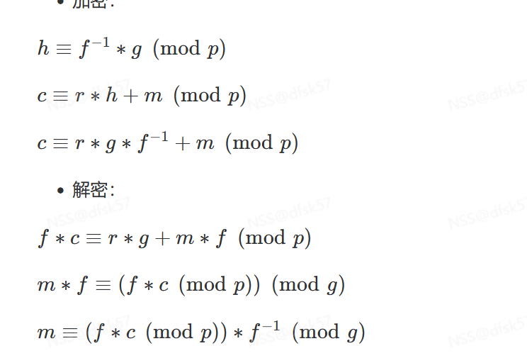

注意这里的f的逆元是在模g情况下的，而不是模p
经典格基脚本

```plain
import libnum
h = 9848463356094730516607732957888686710609147955724620108704251779566910519170690198684628685762596232124613115691882688827918489297122319416081019121038443
p = 11403618200995593428747663693860532026261161211931726381922677499906885834766955987247477478421850280928508004160386000301268285541073474589048412962888947 

b = 2^256
print(b)
Ge = Matrix(ZZ,[[1,b*h],
                [0,b*p]])
print(Ge.LLL())
f,g = Ge.LLL()[0]
f,g = abs(f),abs(g)

print(libnum.n2s(int(f)))

```
​
**例题：[NSSRound#11 Basic]NTR**

```python
import gmpy2
from flag import flag
from Crypto.Util.number import *

def init():
    p = getPrime(2048)
    while True:
        x = getRandomNBitInteger(1024)
        y = getPrime(768)
        z = gmpy2.invert(x, p) * y % p
        return (p, x, y, z)

def encrypt(cipher, p, z):
    message = bytes_to_long(cipher)
    r = getRandomNBitInteger(1024)
    c = (r * z + message) % p
    return c

p, x, y, z = init()
c = encrypt(flag, p, z)
with open("cipher.txt", "w") as f:
    f.write("binz = " + str(bin(z)) + "\n")
    f.write("binp = " + str(bin(p)) + "\n")
    f.write("binc = " + str(bin(c)) + "\n")
binz = 0b10000100100000110000100001011001100110110111111110101001011100111001101101100100010010100110111010000001000001100011111011011000110000000111011100100010010001100110101001001110011000110000100101111001101010000101001101010001111001110000010100011001101010111000110111011111100101100100101100111000101011111101111011000101000100000010100100000110000001011100011100010001101001100101100100000101101101001100110100100101110000011001000000000010100010100011001100110101011000010000001111100101001001110111000110010001101111111110000111100001110011100001101010001101010011011110101100100110110011001111110111100100000011101000000100010011101110111100111100111100011001000111010110100101100110111101010010111110000100100001110101011000010101110010010100101110001001101010101001100000111010011110001000010100000100010000010000110011100111100110011100110111101011101001000110110011001011010101100110111111110001011110000100100011110111100011111011111011100110011011100010111010110010111101010001100010001010010111111101110011010101000010000011100000110001100110100001010011010111000000110001010110000110000000100111000101010000010100000110111111111001100100101001111001010010101101101100111010000001100101100100101010111010000011101000100011011111010101100000011100100101110001100100010010010100010000100100100111101101110110111101011001111011011101001110110100101111110001010110010000101111011110111011100111100110000110000010101001101001101000111010100110011000101010001110100110101101110011111010110010010111110111101100111100101110110011110100100000101000101100111000100011001111110001000010010001010101110001110000111100110001101111110110001001001100101110001010111111000111000100011001110001010101000100110001000101110110101000000001100010001000101110000000010001001001100110100100011100101101010010100001011111001011010011001000101101101001111001100101011101111110111101101100111110000100110110011110000111111011010010010011011100100101000000111110110010101110010011000111101101011111110001100101100011111110111111100111001011001010010101000011001110

binp = 0b10011001100000011101010111000011011000001101101000010101101110001111101010101100110000100111101101000100011101001011001100101000110010001000100001010011011100110011001110111001101010000111100000111110110101011101110000010111111101101111001011111111101100010011010001000011000100000010111111001000100000010001010001110101101011001100110001100000001100111010010011010101000011001101111011001110101111111011111101010100100000111101010101001101110000010101100011111001111100001100111010000111100110000001010001001101111111111100010010010001100110000011100110100100001000001001011010000000010100100011001000000000000010100111010011000111011010001010111010001000101100101011001001101101001101101001110101111011010110100101000000001111000001100101000000010101011011011100000001010001111000000100110011011001010011101000010101100101001000001100111001101000111101000000111001110010100001111100101001001101001101000011111001001000101001100101010001011010101111001001101110011101011001011110000001000100100110110001011010101000111001111001011001000001011111110000111000001100011110000011001110000010110101010000000101001111111011100010000000111001110100000010001101100110111010100000011101000100111011111011110001011001110000010001101010011110100110100111001000100010000110110110010111100101111010011110011110100000001001110111100111101000100011011100011101111100101100110110100011101110001111111110010001000001101111100100101011111110111110010100101010110111010111110010110111101011101111110110110101001111101101000010010100000101111000100010110100010011101000100111000011111100111010011010011101110110000100101100101010111111000110100010010101001000001111001100100110101000100110101001011110111101010101110001111101111001110000101000001010110011111000000010010100010000111011001000111000011000011110100000111101101011100000101000111011101110101100101001110001101000111100111011110000110010101010000100110100011010111110111100010111111101010110001000010010011110111101000110001100101111000111101010101101101100100010110011101111101000011101100000101001111001

binc = 0b1111010111110100110011100100001100111101111000010010000010010011101110101000101000100011111101011100110010010111111010000111001101010101010111100000000100111111001111110001111011110100001111001001010001000000011110000001001000011010100111100011110011011010011010011011111111100100110000110010011101110111001001011010101001101011100110101110001111111100100111011010011001001001100010110100000011100000000100110010101100000001010000101000100010000101101111010101000001000110011101100101010111110111000100001011110101010011010010110111010010100101001001010011000100110010010010110100101001111001111000011011000000110000111111001101001111010011110101001001111111110001001100011100101100011110110101000110010110110110101110110110111010110111100101101000111101101011000010011001111111010111000001100101001010010110111100100100100011110101010010010010010100100011001100011111010011101101101101000010101101011000100101101100001000000001101111111100100101111000101011001010010011000011001101101110101001011111010110000111111111011000101100000000011001010000000111110000001101101100101010010001101101010101000010010010110101110100100110011001001011101011111110011100000100001100010100000101011100001110101101011011110000101110011011100010100101010011101011001011011111100001100010000010110010001111010000110010000011100010010101110000101011110000111101001110001111111111101011000110001111011100100111000010110001111110100100011110000100010000011101110101111101000110100110111101110001011101110100001101101100011111000010101111100011100011011001011110010000000001010010101100111001111110110101000010110101110001011000101101110100110111100000110101101010010111001101000010001101110011101010111111011001110000001110000110001000101110110010001001001101010011110100000010100000100010110000001000011001011010000010111010100100101010100010011001100111011110111100101111100000100110110110101101110100011011101101100000101111000011110011000010000000100010000011110110010000010101001110000111110111110001001101000010011101010101101111101010100001101010111010000010000
```
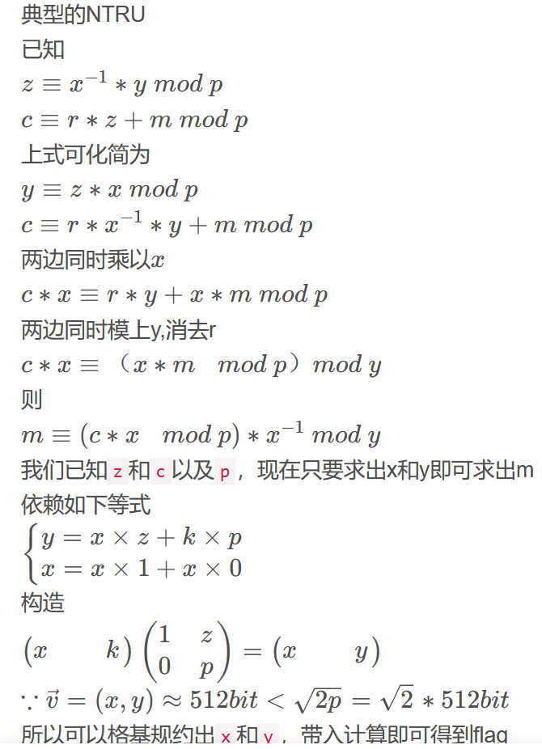

解法
```python
#---------- NTRU -------------
binz = 0b10000100100000110000100001011001100110110111111110101001011100111001101101100100010010100110111010000001000001100011111011011000110000000111011100100010010001100110101001001110011000110000100101111001101010000101001101010001111001110000010100011001101010111000110111011111100101100100101100111000101011111101111011000101000100000010100100000110000001011100011100010001101001100101100100000101101101001100110100100101110000011001000000000010100010100011001100110101011000010000001111100101001001110111000110010001101111111110000111100001110011100001101010001101010011011110101100100110110011001111110111100100000011101000000100010011101110111100111100111100011001000111010110100101100110111101010010111110000100100001110101011000010101110010010100101110001001101010101001100000111010011110001000010100000100010000010000110011100111100110011100110111101011101001000110110011001011010101100110111111110001011110000100100011110111100011111011111011100110011011100010111010110010111101010001100010001010010111111101110011010101000010000011100000110001100110100001010011010111000000110001010110000110000000100111000101010000010100000110111111111001100100101001111001010010101101101100111010000001100101100100101010111010000011101000100011011111010101100000011100100101110001100100010010010100010000100100100111101101110110111101011001111011011101001110110100101111110001010110010000101111011110111011100111100110000110000010101001101001101000111010100110011000101010001110100110101101110011111010110010010111110111101100111100101110110011110100100000101000101100111000100011001111110001000010010001010101110001110000111100110001101111110110001001001100101110001010111111000111000100011001110001010101000100110001000101110110101000000001100010001000101110000000010001001001100110100100011100101101010010100001011111001011010011001000101101101001111001100101011101111110111101101100111110000100110110011110000111111011010010010011011100100101000000111110110010101110010011000111101101011111110001100101100011111110111111100111001011001010010101000011001110
 
binp = 0b10011001100000011101010111000011011000001101101000010101101110001111101010101100110000100111101101000100011101001011001100101000110010001000100001010011011100110011001110111001101010000111100000111110110101011101110000010111111101101111001011111111101100010011010001000011000100000010111111001000100000010001010001110101101011001100110001100000001100111010010011010101000011001101111011001110101111111011111101010100100000111101010101001101110000010101100011111001111100001100111010000111100110000001010001001101111111111100010010010001100110000011100110100100001000001001011010000000010100100011001000000000000010100111010011000111011010001010111010001000101100101011001001101101001101101001110101111011010110100101000000001111000001100101000000010101011011011100000001010001111000000100110011011001010011101000010101100101001000001100111001101000111101000000111001110010100001111100101001001101001101000011111001001000101001100101010001011010101111001001101110011101011001011110000001000100100110110001011010101000111001111001011001000001011111110000111000001100011110000011001110000010110101010000000101001111111011100010000000111001110100000010001101100110111010100000011101000100111011111011110001011001110000010001101010011110100110100111001000100010000110110110010111100101111010011110011110100000001001110111100111101000100011011100011101111100101100110110100011101110001111111110010001000001101111100100101011111110111110010100101010110111010111110010110111101011101111110110110101001111101101000010010100000101111000100010110100010011101000100111000011111100111010011010011101110110000100101100101010111111000110100010010101001000001111001100100110101000100110101001011110111101010101110001111101111001110000101000001010110011111000000010010100010000111011001000111000011000011110100000111101101011100000101000111011101110101100101001110001101000111100111011110000110010101010000100110100011010111110111100010111111101010110001000010010011110111101000110001100101111000111101010101101101100100010110011101111101000011101100000101001111001
 
binc = 0b1111010111110100110011100100001100111101111000010010000010010011101110101000101000100011111101011100110010010111111010000111001101010101010111100000000100111111001111110001111011110100001111001001010001000000011110000001001000011010100111100011110011011010011010011011111111100100110000110010011101110111001001011010101001101011100110101110001111111100100111011010011001001001100010110100000011100000000100110010101100000001010000101000100010000101101111010101000001000110011101100101010111110111000100001011110101010011010010110111010010100101001001010011000100110010010010110100101001111001111000011011000000110000111111001101001111010011110101001001111111110001001100011100101100011110110101000110010110110110101110110110111010110111100101101000111101101011000010011001111111010111000001100101001010010110111100100100100011110101010010010010010100100011001100011111010011101101101101000010101101011000100101101100001000000001101111111100100101111000101011001010010011000011001101101110101001011111010110000111111111011000101100000000011001010000000111110000001101101100101010010001101101010101000010010010110101110100100110011001001011101011111110011100000100001100010100000101011100001110101101011011110000101110011011100010100101010011101011001011011111100001100010000010110010001111010000110010000011100010010101110000101011110000111101001110001111111111101011000110001111011100100111000010110001111110100100011110000100010000011101110101111101000110100110111101110001011101110100001101101100011111000010101111100011100011011001011110010000000001010010101100111001111110110101000010110101110001011000101101110100110111100000110101101010010111001101000010001101110011101010111111011001110000001110000110001000101110110010001001001101010011110100000010100000100010110000001000011001011010000010111010100100101010100010011001100111011110111100101111100000100110110110101101110100011011101101100000101111000011110011000010000000100010000011110110010000010101001110000111110111110001001101000010011101010101101111101010100001101010111010000010000
 
h = binz
c = binc 
v1 = vector(ZZ, [1, h])
v2 = vector(ZZ, [0, p])
m = matrix([v1,v2]);
 
# Solve SVP.  f*h = g (mod p) 求f,g
#mf也就是a，f和g还是一样
f,g = m.LLL()[0]
mf = f*c % p % g
m = mf * inverse_mod(f, g) % g
long_to_bytes(m)
#NSSCTF{c6ff8aba-fda9-497a-91a7-ee1ac5da68ab}
```
​
二次学习
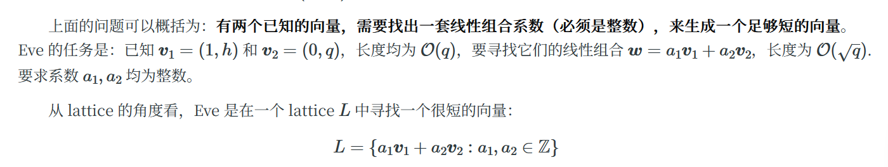

格可以被认为是向量的线性组合，即向量的集合，也可以认为是点的集合
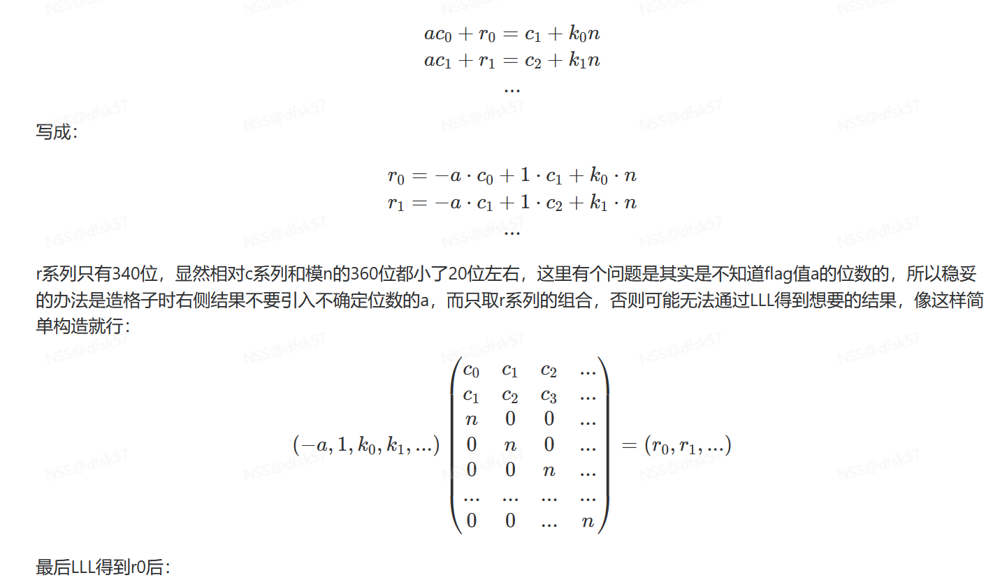

     格密码的本质理解，我们要求一个方程的解，比如这道题里面要求r0，r1...，而使用传统的解方程因为未知参数多极为困难，那么可以把方程组转换成向量的之间的乘法，这题里面因为左边的系数组成的向量
   v=(-a,1,k0,k1...),可以看成是一个整数，而构造的系数矩阵M，v*M=(r0,r1,r2...),这个向量就是由整数和一个向量的线性组合，满足格的定义，因此它v*M必然属于格L，也就可以视为格的一个分量，具体到这道题目的话就是把求方程的解和格的性质绑定在一起，r0可以看成是由数线性组合成的值，放在格里面可以理解成吧M的每一列用系数表示，作为格的基向量，然后要找到每一个ri就等同于在格L中寻找线性组合成的向量，该向量最短，总而言之，就是v*M这个向量属于格,也等于解(r,0,r1...)，然后我们使用格基规约算法对M进行格基规约可以求出一组最短向量，而这组最短向量就是这个方程的解。
    因为M就是格的一组基，对M进行格基规约就相当于在通过这组基，找到可能的最短向量，这个最短向量就是方程的解(r0,r1...),一般来说，题目的参数设计导致了(r0,r1...)这个方程的解就是格的最短向量之一，然后因为格基规约算法LLL优先输出接近最短的向量，这就导致了一般构造的格进行LLL算法后求出的最短向量就是方程的解
背包问题构造格
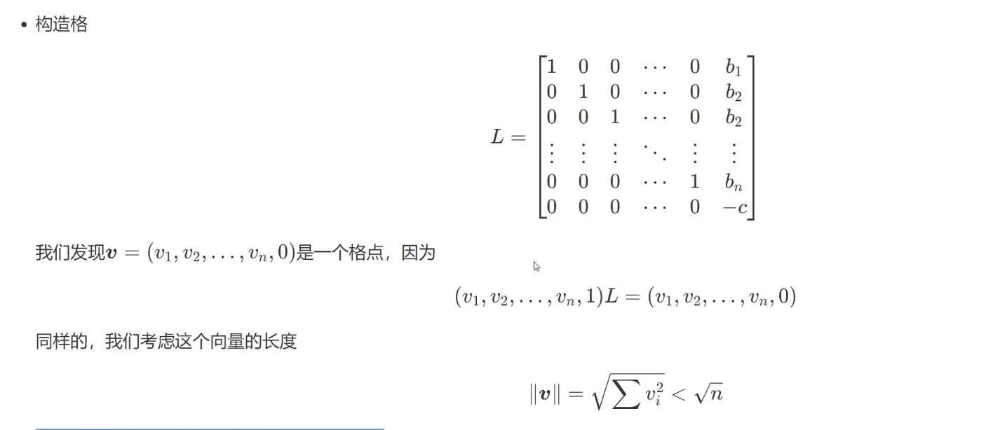

