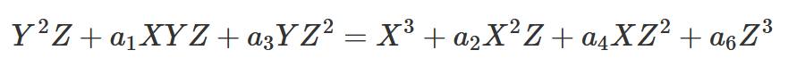
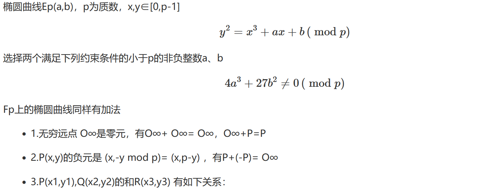
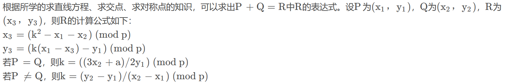
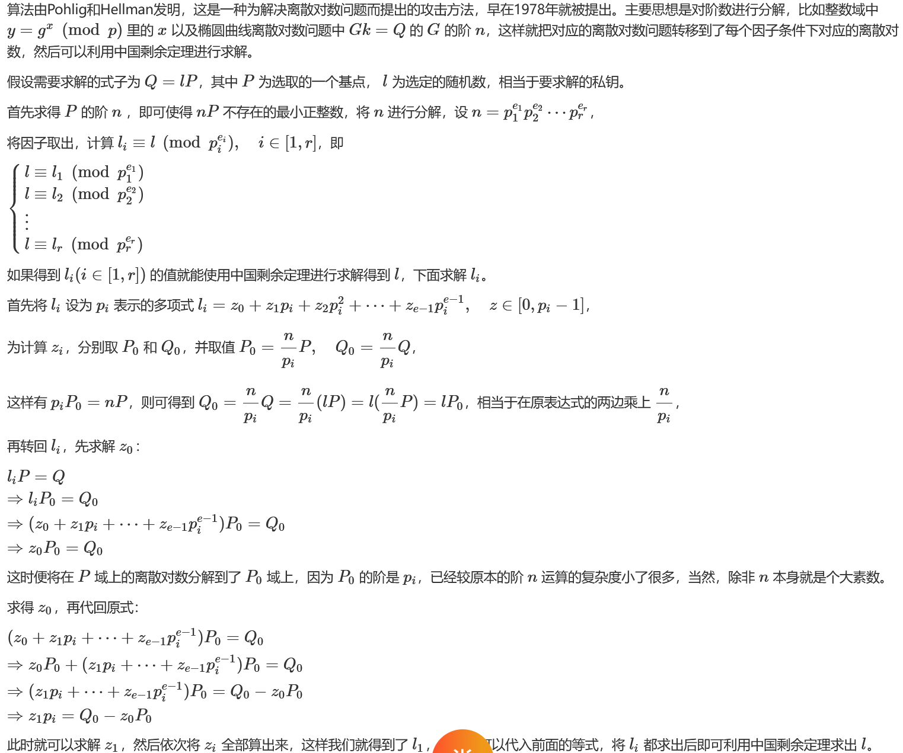

 基础参数


k是私钥，是生成的一个随机数，K是公钥，r也是生成的一个随机数，G是椭圆曲线中的一个生成元（也称基点），M是明文也是曲线上一点，E是密文=(rG,M+rk)，
c1=M+rK,c2=rG,M=c1-kc2，这里c是一个点对，c1是曲线上的点，c2也是
这里要注意是c1-k*c2，别写错，且在求出明文m的值进行运算时要把m[0]和m[1]转换成整数
ecc加密算法安全性基于对K=kg乘积的问题，对于已知k和g的问题，求解K容易，但是对已知K和g求解k是很困难的，这是椭圆曲线的离散代数问题，保证ecc加解密算法安全性
​
**二次学习**
**1.射影平面**`平面上全体无穷远点与全体平常点构成射影平面` 
对普通平面上点(x,y)，令x=X/Z，y=Y/Z，Z≠0，则投影为射影平面上的点(X:Y:Z)  
**2.椭圆曲线**
一条椭圆曲线是在射影平面上满足威尔斯特拉斯方程（Weierstrass）所有点的集合



- 1椭圆曲线方程是一个齐次方程
- 2曲线上的每个点都必须是非奇异的（光滑的），偏导数FX(X,Y,Z)、FY(X,Y,Z)、FZ(X,Y,Z)不同为0
- 3椭圆曲线的形状，并不是椭圆的。只是因为椭圆曲线的描述方程，类似于计算一个椭圆周长的方程故得名3.**有限域上的椭圆曲线**
有限域Fp, Fp中有p（p为质数）个元素0,1,2,…, p-2,p-1  ， Fp的单位元是1，零元是 0  




**4.****有限域椭圆曲线****点的阶**
 如果椭圆曲线上一点P，存在最小的正整数n使得数乘nP=O∞ ,则将n称为P的阶，若n不存在，则P是无限阶的  
p+p=2p,p+(-p)=O∞,所以当某个数比如(n-1)p=-p时，那么在加上下一个p必然等于O∞，也就是无穷远点，比如27p=-p，那么28p一定等于无穷远点，所以p的阶为28
**5.有限域椭圆曲线的阶**
 找到一个最小的 *s* 满足 *s*=|*k*−*j*|，其中 *kP*=*jP*
**6.零元和负元**
无穷远点是零元，一个点和其负元的和是零元，而负元实际上是一个点关于x轴对称的点
p(x,y)负元是-p(x,p-y)
**7.常见攻击**
1.**椭圆曲线的阶和素数 *****p***** 恰好相等，E.order()=*****p***

```plain
p = 
A = 
B = 
E = EllipticCurve(GF(p),[A,B])
P = E(,)
Q = E(,)
def SmartAttack(P,Q,p):
    E = P.curve()
    Eqp = EllipticCurve(Qp(p, 2), [ ZZ(t) + randint(0,p)*p for t in E.a_invariants() ])

    P_Qps = Eqp.lift_x(ZZ(P.xy()[0]), all=True)
    for P_Qp in P_Qps:
        if GF(p)(P_Qp.xy()[1]) == P.xy()[1]:
            break

    Q_Qps = Eqp.lift_x(ZZ(Q.xy()[0]), all=True)
    for Q_Qp in Q_Qps:
        if GF(p)(Q_Qp.xy()[1]) == Q.xy()[1]:
            break

    p_times_P = p*P_Qp
    p_times_Q = p*Q_Qp

    x_P,y_P = p_times_P.xy()
    x_Q,y_Q = p_times_Q.xy()

    phi_P = -(x_P/y_P)
    phi_Q = -(x_Q/y_Q)
    k = phi_Q/phi_P
    return ZZ(k)

r = SmartAttack(P, Q, p)
print(r)

```
2.E.order()=*p*+1

```plain
a = 
b = 
p = 
Fp = GF(p)
E = EllipticCurve(Fp, [a, b])
G = E(, )
P = E(, )

order = E.order()
k = 1
while (p**k - 1) % order:
    k += 1

K.<a> = Fp.extension(k)
EK = E.base_extend(K)
PK = EK(P)
GK = EK(G)
QK = EK.lift_x(a + 3)  # Independent from PK
AA = PK.tate_pairing(QK, E.order(), k)
GG = GK.tate_pairing(QK, E.order(), k)
r = AA.log(GG)
print(r)

```
3.Pohlig-Hellman算法 （ph算法）
使用ph算法的根本特征在于椭圆曲线的阶是小素数，即所谓的光滑数，这一情况下使用这个算法可以高效解决ECDLP问题，但现实中一般n的阶很大


这里求出来的r只是一个可能的值，实际上的k=r+t*m,这里的m是crt里面所有因式的模数乘积之和，通过分解得到的，然后遍历t的范围找到k

```plain
#Sage Code 1
p = 
a = 
b = 
gx = 
gy = 
px = 
py = 

E = EllipticCurve(GF(p), [a, b])
G = E(gx, gy)
n = E.order()
QA = E(px, py)

factors = list(factor(n))
m = 1
moduli = []
remainders = []

print(f"[+] Running Pohlig Hellman")
print(factors)

for i, j in factors:
    if i > 10**9:
        print(i)
        break
    mod = i**j
    g2 = G*(n//mod)
    q2 = QA*(n//mod)
    r = discrete_log(q2, g2, operation='+')
    remainders.append(r)
    moduli.append(mod)
    m *= mod

r = crt(remainders, moduli)
print(r)
for i in range(0x400000):
    if all(0x20<=v<0x7f for v in long_to_bytes(t)):			# 判断是否都是有效字符
        print(f'{long_to_bytes(t)}')
    t += q
```

```plain
p = 1256438680873352167711863680253958927079458741172412327087203
A = 377999945830334462584412960368612
B = 604811648267717218711247799143415167229480
E = EllipticCurve(GF(p),[A,B])
P = E(550637390822762334900354060650869238926454800955557622817950, 700751312208881169841494663466728684704743091638451132521079)
Q = E(1152079922659509908913443110457333432642379532625238229329830, 819973744403969324837069647827669815566569448190043645544592)

n = E.order()
# 对于大素数域计算离散对数效率太低，过滤
primes = list(filter(lambda x: x < 2 ** 32, (base ** exp for base, exp in factor(n))))

dlogs = []
for fac in primes:
    t = int(n) // int(fac)
    # dlog = (t*P).discrete_log(t*Q)
    dlog = discrete_log(t*Q,t*P,operation="+")
    dlogs.append(dlog)
# 最终结果 k = P.discrete_log(Q)
k = int(crt(dlogs,primes))
print(k)

```
