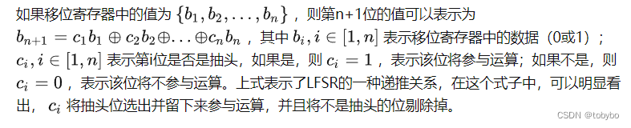
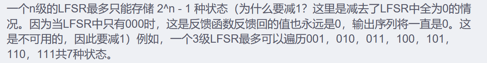
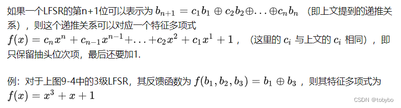
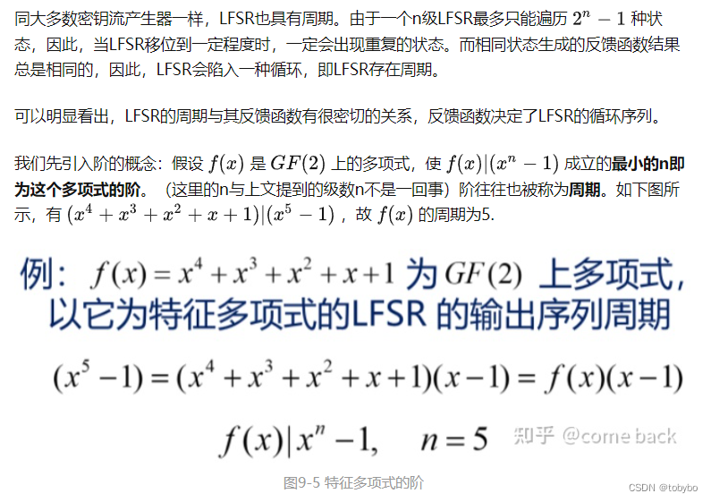
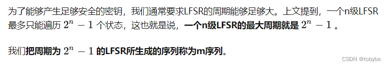
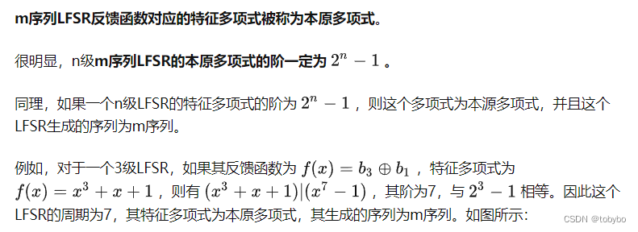
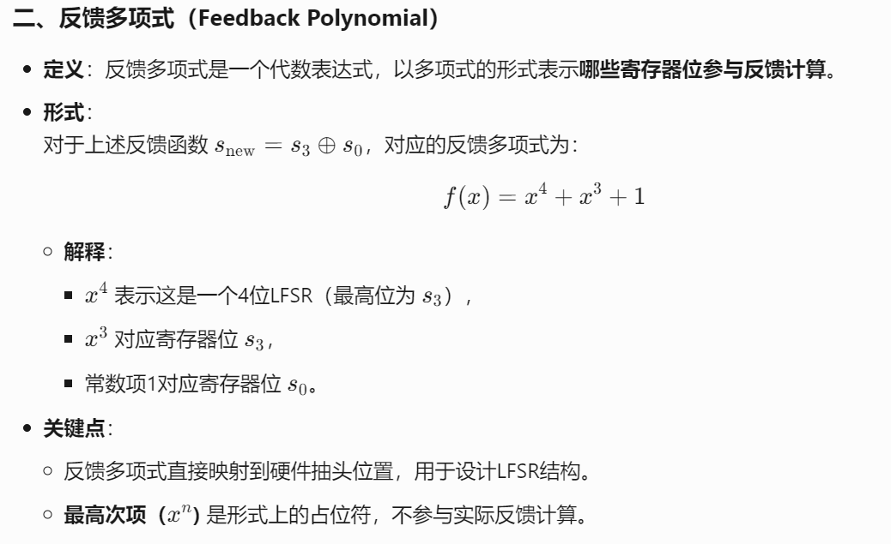
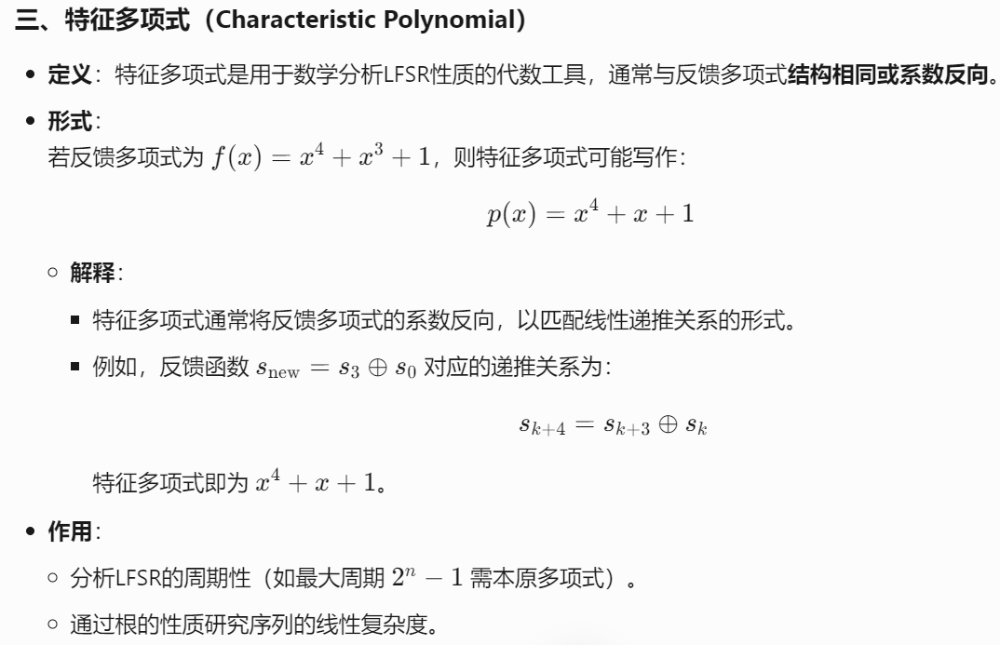

**1.流密码定义**
流密码一般逐字节或者逐比特处理信息。一般来说

- **流密码的密钥长度会与明文的长度相同。**
- **流密码的密钥派生自一个较短的密钥，派生算法通常为一个伪随机数生成算法****2**.**PRNG（伪随机数生成器）**
根据一个种子生成一个随机数序列，种子相同时生成的序列总是一致
具有周期性，最终会重复，周期长度取决于算法
**3.lcg的内容 (线性同余生成器)**
LCG属于PRNG(伪随机数生成器)和stream cipher(流密码)的一种，是一种产生伪随机数的方法。
 Xn+1=(a∗Xn+b) mod m
其中，Xn代表第n个生成的随机数，X0被称为种子值。这里还定义了三个整数：a乘数、b增量、m模数，是产生器设定的常数。
参数选择
LCG的性质与参数的选择密切相关，不同的参数可能导致不同的随机序列。一般按照如下要求选择参数：
1、m是随机序列的模数，必须一个大于0的正整数。一般是一个比较大的素数或者是2的幂，以便提供较长的周期长度。
2、a是乘数，必须是一个与m互素的正整数。
3、b是增量，也必须是一个与m互素的正整数。
​

**4.LFSR，(线性反馈移位寄存器)Linear Feedback Shift Register，LFSR**
**  移位寄存器**：若干个寄存器排成一行，每个寄存器存储一个二进制数，移位寄存器每次把最右端的数字输出，然后把整体向右移动一位，不断输出和移位。
 **反馈移位寄存器**： 在移位寄存器每次右移的左边空出的位置采用一个**反馈函数**，以寄存器中已有的某些序列作为反馈函数的输入，进过运算将反馈函数输出的结果填充到移位寄存器的最左端，那么这样的移位寄存器就会有源源不断的输出。这样的，**拥有反馈函数的移位寄存器称为反馈移位寄存器（Feedback Shift Register，FSR。**
**线性反馈移位寄存器：**反馈函数是线性函数（进行简单线性运算的函数）
**LFSR的反馈函数**就是简单地**对移位寄存器中的某些位进行异或，并将异或的结果填充到LFSR的最左端**，如图所示。对于LFSR中每一位的数据，可以参与异或，也可以不参与异或。其中，我们把参与异或的位称为**抽头。**

** LFSR中的寄存器个数称为LFSR的****级数**
 **状态**的概念：一个LFSR寄存器中当前存储的序列被称为一个状态。在LFSR输出一位，由反馈函数补充一位后，LFSR就移动到了下一个状态。  

**LFSR 特征多项式 **

**LFSR的周期：   反馈函数特征多项式的阶，就是LFSR产生序列的周期  **
**阶本质上是由f(x)|x**n-1来决定的，应该也就是等于他所能够遍历的状态的值**

**m序列：**

**本原多项式：**

**反馈函数是一个逻辑表达式，定义了如何通过异或（XOR）组合寄存器中的某些位来生成新的输入位**

