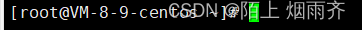
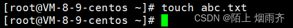
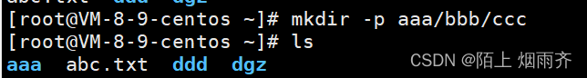
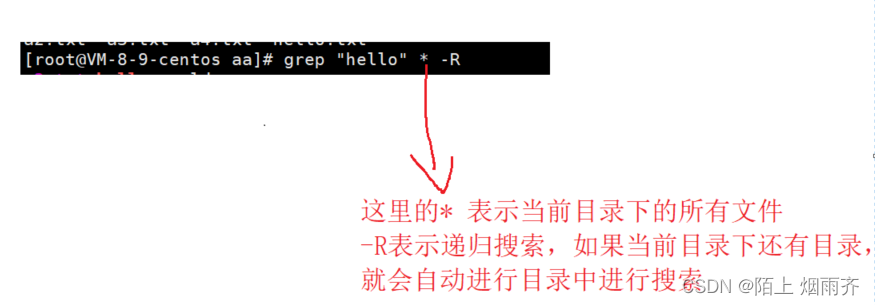
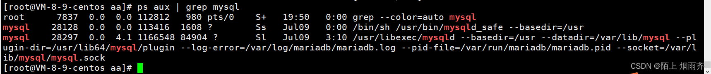
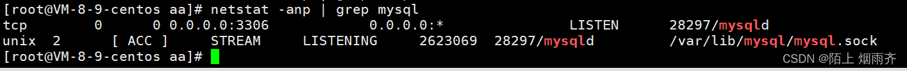

1.linux命令提示符

`root` 用户为 `#` ，普通用户为 `$` `root` 是超级用户，具备操作系统的一切权限  

- `root` ：表示用户名；
- `iZm5e8dsxce9ufaic7hi3uZ` ：表示主机名；
- `~` ：表示目前所在目录为家目录，其中 `root` 用户的家目录是 `/root` 普通用户的家目录在 /home 下；2.常用命令
1.ls   list
  ls   list  作用就是列出当前目录/指定目录下的文件或者目录。对标windows中的双击某个目录，查看里面具有有哪些东西  

2.cd  change directory  切换目录
 cd 后面跟上你想有切换目录的路径，这里的路径可以使用相对路径，也可以使用绝径 
3.pwd  显示完整路径
4.touch 创建空白文件
eg.

5.cat 读取文件内容（一般适用于小文件）
读取硬盘上的文件。
把这个文件全部显示在终端里面
6.echo  写文件
7.mkdir 创建目录 
对标Windows的邮件右键，新建文件夹
添加命令行参数 -p可以自动递归创建目录

 就是在当前目录下创建aaa目录，在aaa目录下创建bbb目录，在bbb目录下创建ccc目录  
8.rm remove 删除文件/目录
用命令行参数 -r 可以进行递归删除   m 的时候，指定了要删除的文件之后，系统会让我们确定是否删除  
删除目录时会同时删除所有文件和字目录
命令行参数 -rf就是强制删除，不询问
9.cp  copy 复制  用于复制文件或目录
  cp 后面有两个参数，一个是源文件，一个是要往哪里去复制
10.mv 剪切文件或目录
[ root@VM-8-9-centos ~]# mv a.txt  aa/a3.txt
 上述操作就是我们把当前目录的a.txt文件剪切到aa目录下，并重命名为a3.txt  
 11.vim 文件的编辑 相当于记事本

1. i: 进入插入模式，允许您输入文本。
2. Esc: 退出插入模式，返回到普通模式。
3. :w: 将当前文件保存。
4. :q: 退出 Vim。
5. :wq: 保存并退出 Vim。
6. dd: 剪切当前行。
7. yy: 复制当前行。
8. p: 粘贴已复制或剪切的文本。
9. u: 撤消上一步操作。
10. /: 查找文本。
11. n: 在查找过程中，跳转到下一个匹配项。
12. N: 在查找过程中，跳转到上一个匹配项。
13. :%s/old/new/g: 全局替换所有出现在文本中的 old 字符串为 new 字符串。
14. :set number: 显示行号。
15. :set nonumber: 隐藏行号。
16.  和 :wq 相似，也是保存并退出 Vim。但如果当前文件没有进行过更改，则不会写入保存。在普通模式下输入":x"命令即可使用此功能。12.grep 字符串匹配
 快速搜索某个文件中，是否有匹配的特点的字符串  
也可以对多个文件进行搜索
13.ps   查看进程  可以配合grep的命令使用

 | 是管道符，作用是把前一个命令的输出作为后一个命令的输入  
14.netstat -anp 查询网络状态 包括端口等
通常配合grep的命令使用

