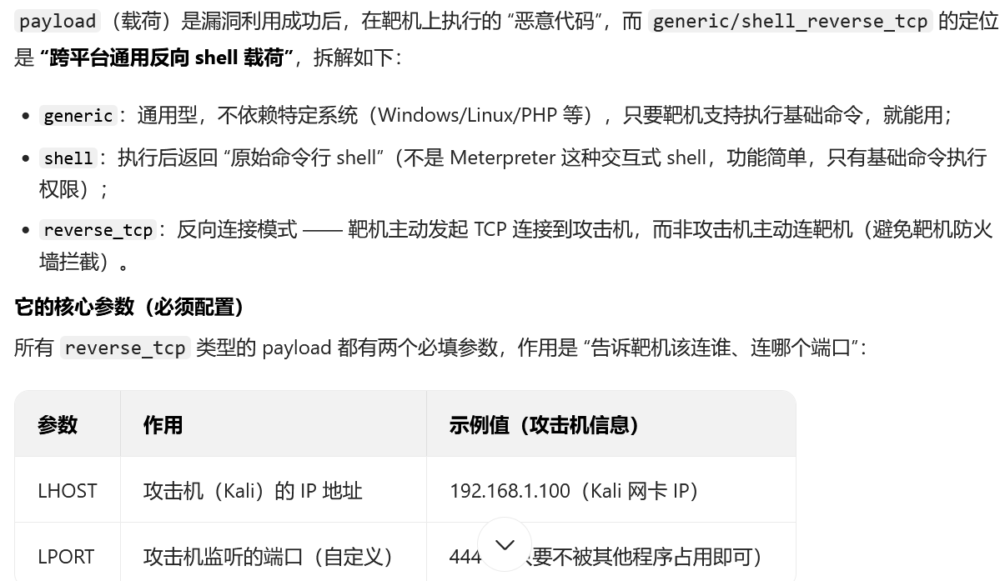

1.依旧是扫描主机和端口
2.访问对应的web服务网页，发现login网页存在登录界面，这里是直接发现LotusCMS这个东西，然后猜想可能存在漏洞，（这里登录没有尝试，不知道行不行），
3.接着使用searchsploit lotuscms ，然后得到两个东西
LotusCMS 3.0 - 'eval()' Remote Command Execution (Metasploit)             | php/remote/18565.rb      
LotusCMS 3.0.3 - Multiple Vulnerabilities                                                     php/webapps/16982.txt                                                                                           
4.然后发现第一个这个东西是来自metasploit的ruby编写的可执行脚本，而第二个是漏洞细节披露文档，需要手动进行操作，所以选择第一个
msfconsole 进入操作界面
search lotuscms 查找相关漏洞
use 路径  加载指定模块 
set RHOSTS（远程主机的ip） 192.168.89.137
set uri  /index.php?system=Admin  web漏洞的参数，靶机域名后面的内容，因为uri要指向的是漏洞的具体应用路径，而这里的登录界面就是由lotuscms提供的，所以指向这个位置的参数
set payload generic/shell_reverse_tcp 设置载荷，作用是在漏洞成功利用后把shell反弹到攻击机
**这个会话不知道为啥一直无法建立，后面有空再弄吧**

然后他这里用脚本去扫描系统信息，nmap应该也可以扫出来，反正就是 linux 2.6.24 Ubuntu 8.04，然后先尝试bash反弹shell，发现不行，接着使用Python的反弹shell（要学），可以成功反弹，然后根据这俩版本内容去searchsploit 搜索对应的提权脚本，
他这里是使用searchsploit privilege | gerp linux  | grep 2.6.2
然后得到相关脚本并传到靶机，注意这里的脚本存在已定义的编译方法，去脚本内查看得到编译方法，然后gcc编译后执行脚本，这个脚本实际上给你设置一个拥有root权限的用户，然后让你自己设置一个密码全去登录就行，然后就得到root权限，在反弹shell到kali即可
