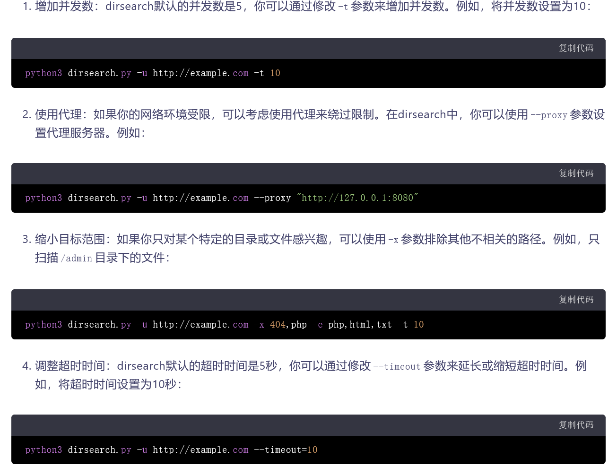

```plain
用法：dirsearch.py [-u|--url] 目标 [-e|--extensions] 扩展名 [选项]

选项:
  --version             显示程序的版本号并退出
  -h, --help            显示此帮助消息并退出

必需：
  -u URL, --url=URL     目标URL，可以使用多个选项指定多个目标URL
  -l PATH, --urls-file=PATH
                        URL列表文件
  --stdin               从标准输入读取URL
  --cidr=CIDR           目标CIDR
  --raw=PATH            从文件加载原始HTTP请求（使用'--scheme'标志设置方案）
  -s SESSION_FILE, --session=SESSION_FILE
                        会话文件
  --config=PATH         配置文件路径（默认为'DIRSEARCH_CONFIG'环境变量，否则为'config.ini'）

字典设置:
  -w WORDLISTS, --wordlists=WORDLISTS
                        单词列表文件或包含单词列表文件的目录（以逗号分隔）
  -e EXTENSIONS, --extensions=EXTENSIONS
                        扩展名列表，以逗号分隔（例如：php,asp）
  -f, --force-extensions
                        在每个单词列表条目的末尾添加扩展名。默认情况下，dirsearch只替换%EXT%关键字为扩展名。
  -O, --overwrite-extensions
                        使用指定的扩展名覆盖单词列表中的其他扩展名（通过'-e'选择）
  --exclude-extensions=EXTENSIONS
                        排除的扩展名列表，以逗号分隔（例如：asp,jsp）
  --remove-extensions   删除所有路径中的扩展名（例如：admin.php -> admin）
  --prefixes=PREFIXES   将自定义前缀添加到所有单词列表条目中（以逗号分隔）
  --suffixes=SUFFIXES   将自定义后缀添加到所有单词列表条目中，忽略目录（以逗号分隔）
  -U, --uppercase       单词列表转为大写
  -L, --lowercase       单词列表转为小写
  -C, --capital         单词首字母大写

通用设置:
  -t THREADS, --threads=THREADS
                        线程数
  -r, --recursive       递归地进行强制破解
  --deep-recursive      在每个目录深度上执行递归扫描（例如：api/users -> api/）
  --force-recursive     对找到的每个路径执行递归强制破解，而不仅仅是目录
  -R DEPTH, --max-recursion-depth=DEPTH
                        最大递归深度
  --recursion-status=CODES
                        用于执行递归扫描的有效状态码，支持范围（以逗号分隔）
  --subdirs=SUBDIRS     扫描给定URL的子目录（以逗号分隔）
  --exclude-subdirs=SUBDIRS
                        在递归扫描期间排除以下子目录（以逗号分隔）
  -i CODES, --include-status=CODES
                        包括的状态码，以逗号分隔，支持范围（例如：200,300-399）
  -x CODES, --exclude-status=CODES
                        排除的状态码，以逗号分隔，支持范围（例如：301,500-599）
  --exclude-sizes=SIZES
                        根据大小排除响应，以逗号分隔（例如：0B,4KB）
  --exclude-text=TEXTS  根据文本排除响应，可以使用多个标志
  --exclude-regex=REGEX
                        根据正则表达式排除响应
  --exclude-redirect=STRING
                        如果此正则表达式（或文本）与重定向URL匹配，则排除响应（例如：'/index.html'）
  --exclude-response=PATH
                        排除类似于此页面响应的响应，路径作为输入（例如：404.html）
  --skip-on-status=CODES
                        每当命中这些状态码之一时跳过目标，以逗号分隔，支持范围
  --min-response-size=LENGTH
                        响应的最小长度
  --max-response-size=LENGTH
                        响应的最大长度
  --max-time=SECONDS    扫描的最大运行时间
  --exit-on-error       发生错误时退出

请求设置:
  -m METHOD, --http-method=METHOD
                        HTTP请求方法（默认为GET）
  -d DATA, --data=DATA  HTTP请求数据
  --data-file=PATH      包含HTTP请求数据的文件
  -H HEADERS, --header=HEADERS
                        HTTP请求标头，可以使用多个标志
  --headers-file=PATH   包含HTTP请求标头的文件
  -F, --follow-redirects
                        跟随HTTP重定向
  --random-agent        每个请求选择一个随机User-Agent
  --auth=CREDENTIAL     认证凭据（例如：user:password或bearer token）
  --auth-type=TYPE      认证类型（basic、digest、bearer、ntlm、jwt）
  --cert-file=PATH      包含客户端证书的文件
  --key-file=PATH       包含客户端证书私钥的文件（未加密）
  --user-agent=USER_AGENT
  --cookie=COOKIE

连接设置:
  --timeout=TIMEOUT     连接超时时间
  --delay=DELAY         请求之间的延迟
  -p PROXY, --proxy=PROXY
                        代理URL（HTTP/SOCKS），可以使用多个标志
  --proxies-file=PATH   包含代理服务器的文件
  --proxy-auth=CREDENTIAL
                        代理认证凭据
  --replay-proxy=PROXY  用于重放已发现路径的代理
  --tor                 使用Tor网络作为代理
  --scheme=SCHEME       原始请求的协议或URL中没有协议时使用的协议（默认为自动检测）
  --max-rate=RATE       每秒请求数最大值
  --retries=RETRIES     失败请求的重试次数
  --ip=IP               服务器IP地址

高级设置:
  --crawl               在响应中爬取新路径

显示设置:
  --full-url            在输出中显示完整URL（在静默模式下自动启用）
  --redirects-history   显示重定向历史记录
  --no-color            不使用彩色输出
  -q, --quiet-mode      安静模式

输出设置:
  -o PATH/URL, --output=PATH/URL
                        输出文件或MySQL/PostgreSQL数据库URL（格式：
                        scheme://[username:password@]host[:port]/database-
                        name）
  --format=FORMAT       报告格式（可用：simple、plain、json、xml、md、csv、html、
                        sqlite、mysql、postgresql）
  --log=PATH            日志文件

有关示例配置文件，请参见“config.ini”


```

python dirsearch.py -u url
