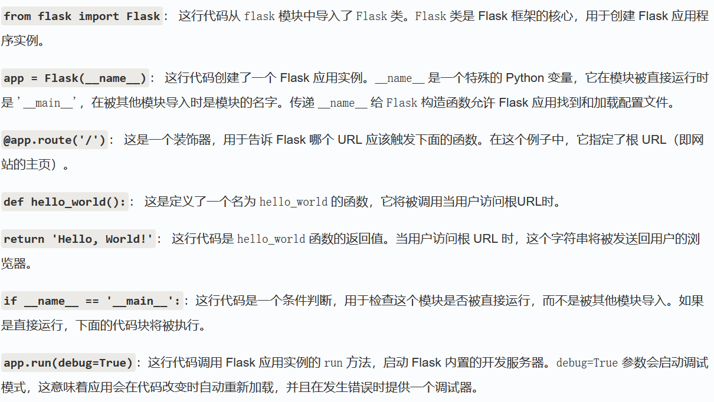

1.flask基础
flask是一个用python编写的web应用框架


**路由**：是URL到python函数的映射 @app.route('/')这种就是路由

```python
from flask import Flask

app = Flask(__name__)

@app.route('/')
def home():
    return 'Welcome to the Home Page!'

@app.route('/about')
def about():
    return 'This is the About Page.'
```

- `@app.route('/')`：将根 URL `/` 映射到 `home` 函数。
- `@app.route('/about')`：将 `/about` URL 映射到 `about` 函数也就是说，当访问根目录时，也就是' / '，时会调用home函数，访问/about时调用about函数 ，而这里的home函数和about函数就叫做视图函数
**视图函数：**视图函数是处理请求并返回响应的 Python 函数  
**请求对象**：
请求对象包含了客户端发送的请求信息，包括请求方法、URL、请求头、表单数据等。Flask 提供了 request 对象来访问这些信息  

```python
from flask import request

@app.route('/submit', methods=['POST'])
def submit():
    username = request.form.get('username')
    return f'Hello, {username}!'
```


# requests
 | 请求方式 | 读取方法 | 
|---|---|
 | GET | `request.args.get('key')` | 
 | POST 表单 | `request.form.get('key')` | 
 | POST JSON | `request.json.get('key')` | 
 | GET+POST 兼容 | `request.values.get('key')` | 
常见语句
name = request.args.get('name', 'guest')   如果存在传入?name的参数，则输出，否则输出guest，相当于guest是name的默认值
​
