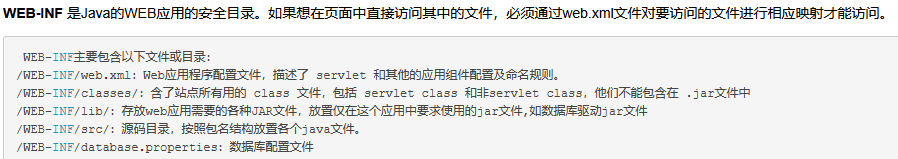

1.web-INF源码泄露

漏洞形成原因：
Tomcat的WEB-INF目录，每个j2ee的web应用部署文件默认包含这个目录。
Nginx在映射静态文件时，把WEB-INF目录映射进去，而又没有做Nginx的相关安全配置（或Nginx自身一些缺陷影响）。从而导致通过Nginx访问到Tomcat的WEB-INF目录（请注意这里，是通过Nginx，而不是Tomcat访问到的，因为上面已经说到，Tomcat是禁止访问这个目录的。）。
漏洞利用方式：
直接在域名后面加上WEB-INF/web.xml就可以了。
根据web.xml配置文件路径或通常开发时常用框架命名习惯，找到其他配置文件或类文件路径。
dump class文件进行反编译。
​
简单来说：通过找到web.xml文件，推断class文件的路径，最后直接class文件，在通过反编译class文件，得到网站源码。

