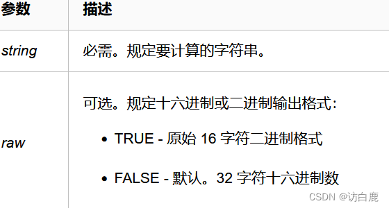

绕过原理：**md5(*****string,raw*****)**


一..弱比较
转换规则：
   1.字符型和字符型比较，为同类型，比较其内容，例''abc''==''c'' => false
   2.数字型和数字型比较，同上，例：123 == 12 => false
                                                         123 ==123=> true
   3.字符型和数字型比较，
   若字符型值开头为数字，转为数字；截止到连续数字的最后一个数字 
    即123abc456=123，后面非连续数字不算
   若开头不为数字，为 null 弱比较，即该字符串的值与 0 相等。
         例：''abc123''==123 => false
                "123abc"==123 => true
                  ''abc123''==0 => true
                   ''123''==123 => true
                  ''123abc''==12 => false
  4.字符串弱比较用0e绕过
即（"0e123456"=="0e345"） => true
   （"0e12adfc"=="0e345"） => false
在0e后面不能含有字母！！！
否则判断为False
5.布尔值true和任何字符串和数值都弱相等，除了0和false
二.弱类型 绕过
  1.0e绕过
以0e开头的字符串后面无论是什么该字符串的值始终为0
而以字母开头的字符串的值也为0
常用： 数组绕过，0e绕过QNKCDZO 240610708 常用  
 QNKCDZO240610708byGcYsonZ7yaabg7XSsaabC9RqSs878926199as155964671as214587387as1091221200a  
  2.数组绕过
md5不能加密数组 ，如 a[]=1 , b[]=1 , 传入数组会报错,但会继续执行并且返回结果为null
比如传入md5(a[]=1)==md5(b[]=2)，实际上是null==null，所以数组进行md5弱比较时，结果相等

```plain
$a=$_GET['a'];
$b=$_GET['b'];
md5($a)==md5($b)
payload:?a[]=1&b[]=2（传入的参数）
```
三.强类型绕过
  1.md5完全相同的字符绕过
  由于===对字符进行更严格的筛选，不能使用0e进行绕过，所以只能使用md5完全相同的字符进行绕过，得到flag
  2.数组绕过
  和弱类型一致
 payload：?a[]=1&b[]=2  
3.md5加密后完全相等的字符串
M%C9h%FF%0E%E3%5C%20%95r%D4w%7Br%15%87%D3o%A7%B2%1B%DCV%B7J%3D%C0x%3E%7B%95%18%AF%BF%A2%00%A8%28K%F3n%8EKU%B3_Bu%93%D8Igm%A0%D1U%5D%83%60%FB_%07%FE%A2
M%C9h%FF%0E%E3%5C%20%95r%D4w%7Br%15%87%D3o%A7%B2%1B%DCV%B7J%3D%C0x%3E%7B%95%18%AF%BF%A2%02%A8%28K%F3n%8EKU%B3_Bu%93%D8Igm%A0%D1%D5%5D%83%60%FB_%07%FE%A2

```python
二进制md5加密 8e4ef6c69a337c0de0208455ee69a416

url编码 1%00%00%00%00%00%00%00%00%00%00%00%00%00%00%00%00%00%00%00%00%00%00%00%00%00%00%00%00%00%00%00%00%00%00%00%00%00%00%00%00%00%00%00%00%00%00%00%00%00%00%00%00%00%00%00%00%00%00%00%00%00%00%00%A3njn%FD%1A%CB%3A%29Wr%02En%CE%89%9A%E3%8EF%F1%BE%E9%EE3%0E%82%2A%95%23%0D%FA%CE%1C%F2%C‍4P%C2%B7s%0F%C8t%F28%FAU%AD%2C%EB%1D%D8%D2%00%8C%3B%FCN%C9b4%DB%AC%17%A8%BF%3Fh%84i%F4%1E%B5Q%7B%FC%B9RuJ%60%B4%0D7%F9%F9%00%1E%C1%1B%16%C9M%2A%7D%B2%BBoW%02%7D%8F%7F%C0qT%D0%CF%3A%9DFH%F1%25%AC%DF%FA%C4G%27uW%CFNB%E7%EF%B0

二进制md5加密 8e4ef6c69a337c0de0208455ee69a416

url编码 1%00%00%00%00%00%00%00%00%00%00%00%00%00%00%00%00%00%00%00%00%00%00%00%00%00%00%00%00%00%00%00%00%00%00%00%00%00%00%00%00%00%00%00%00%00%00%00%00%00%00%00%00%00%00%00%00%00%00%00%00%00%00%00%A3njn%FD%1A%CB%3A%29Wr%02En%CE%89%9A%E3%8E%C6%F1%BE%E9%EE3%0E%82%2A%95%23%0D%FA%CE%1C%F2%C4P%C2%B7s%0F%C8t%F28zV%AD%2C%EB%1D%D8%D2%00%8C%3B%FCN%C9%E24%DB%AC%17%A8%BF%3Fh%84i%F4%1E%B5Q%7B%FC%B9RuJ%60%B4%0D%B7%F9%F9%00%1E%C1%1B%16%C9M%2A%7D%B2%BBoW%02%7D%8F%7F%C0qT%D0%CF%3A%1DFH%F1%25%AC%DF%FA%C4G%27uW%CF%CEB%E7%EF%B0

```
​
四.ffifdyop绕过原理：
ffifdyop经过md5加密后是：276f722736c95d99e921722cf9ed621c
在转换字符串是：'or'6<乱码>  即  'or'66�]��!r,��b
利用方法：
select * from admin where password=''or'6<乱码>'
就相当于构成永真式，即万能密码，实现SQL注入
select * from admin where password=''or 1
5.`is_string($_POST['c2'])` 传入的c2必须是字符串
`$_POST['a'])&&!preg_match('/[0-9]/'` 传入a且不包含数字，使用数组绕过
6. GET传参`aaa=114514&bbb=114514a`php的弱比较，当字符串与数字进行比较时，即进行==比较时，字符串会转换成整型/浮点型进行比较`$a='114514a'--->114514`
所以此时aaa=114514,bbb=114514，但a不等于b
7. preg_replace函数（鹤城杯2021）
只匹配第一行的数据，不能匹配多行的字符，所以我们可以使用换行符进行绕过  
payload：
level_3={"result":0}  因为PHP纯字符与0进行弱比较时为True
或者
{"result":ssss}  因为json格式的字符串解码后会变成一个数组， 会解密成一个数组；存在一个0=="efeaf"的Bypass缺陷”  
 8.==和===比较
  php有两种比较方式,一种是“= =”一种是“= = =”这两种都可以比较两个数字的大小，但是有很明显的区别。
“= =”：会把两端变量类型转换成相同的，在进行比较。这个是根据字符类型强制转换来定义的，int类型的字节数大于char类型的字节数，强制转换的过程中不会损失信息
“= = =”：会先判断两端变量类型是否相同，在进行比较。
在两个相等的符号中，一个字符串与一个数字相比较时，字符串会转换成数值。
那么password就会被强制转换成数值0。
9.科学计数法绕过
1e9=1x10的九次方，可以绕过对数值长度的限制
10.$a==md5($a)
 满足$a是0e开头，且加密后也是0e开头  

```plain
0e215962017
0e1284838308
0e1137126905
0e807097110
0e730083352
```
11.哈希长度扩展攻击
hash_ext_attack工具
​
