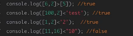
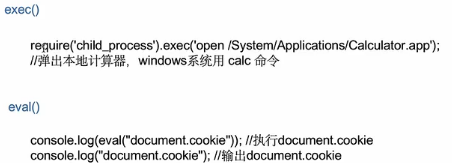
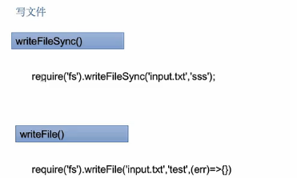
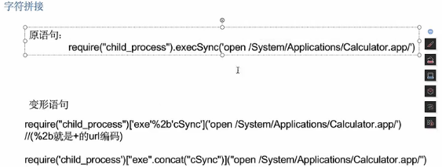
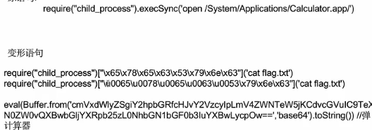
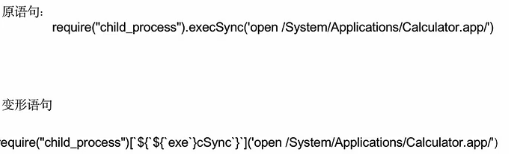

1.fs模块
该模块主要用于对文件进行操作，主要涉及到读和写两种类型的函数
2.web服务器启动（http模块）

```plain
// 导入http模块
const http = require('http')
// 创建web 服务器实例
const server = http.createServer()
// 为服务器实例绑定request事件，监听客户端的请求
server.on( 'request', (req,res) => {
	// 只要有客户端来请求我们自己的服务器，就会触发request 事件，从而调用这个事件处理函数
    console.log( 'Someone visit our web server.' )
})

// 启动服务器
server.listen(8080, () =>{
	console.log('http server running at http://127.0.0.1:8080')
})
#调用模块都要都要先导入对应模块
```
3.nodejs弱类型比较
字符串和字符串进行比较会把字符串的第一个字符转成ASCII码后再进行比较，所以会出现console.log('111'<'3')的情况出现，且字符串和任何数字比较的结果都是false
数组比较，空数组直接比较都为false，数组之间比较只比较第一个值，数组永远小于非数值型字符串，数组和数值型也只比较第一个字符


4.nodejs MD5绕过
两个不同对象在nodejs里面表示的类型是一致的，比如a={x:1},b={x:2},使用console.log输出后都是[object,object],因此进行MD5加密后的值显然是一致的
5.nodejs编码绕过
16进制编码绕过 console.log("a"==="\x61");//true
unicode编码绕过 console.log("a"==="\u0061");true
base64编码绕过  console.log(Buffer.from("dGVzdA==",'BASE64').toString())//test
6.命令执行


7.文件读写


8.rce bypass
  字符拼接


编码绕过


模板拼接


