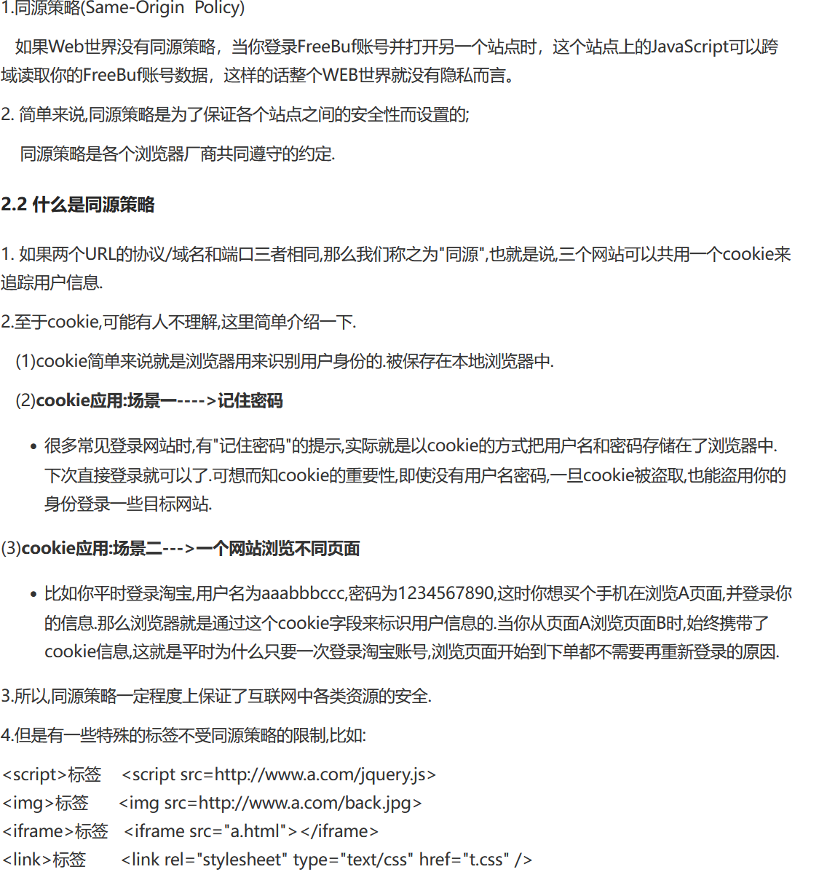
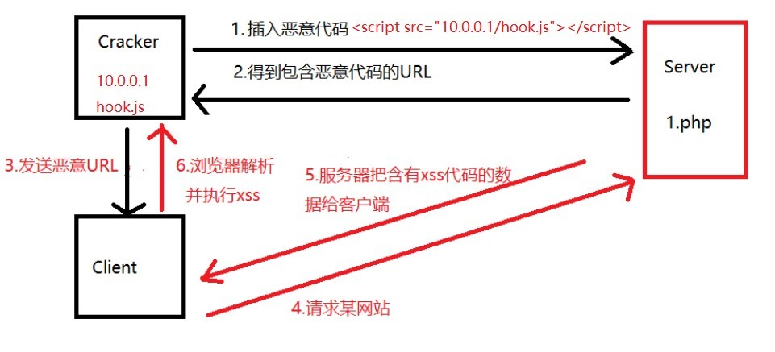
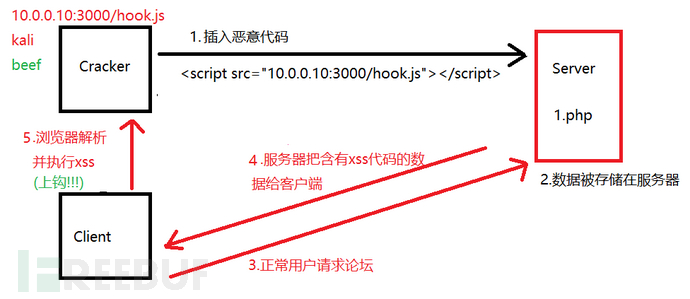

html实体转义
 | 显示 | 说明 | 实体名称 | 实体编号 | 
|---|---|---|---|
 |  | 半方大的空白 | &ensp; | &#8194; | 
 |  | 全方大的空白 | &emsp; | &#8195; | 
 |  | 不断行的空白格 | &nbsp; | &#160; | 
 | < | 小于 | &lt; | &#60; | 
 | > | 大于 | &gt; | &#62; | 
 | & | &符号 | &amp; | &#38; | 
 | " | 双引号 | &quot; | &#34; | 
 | © | 版权 | &copy; | &#169; | 
 | ® | 已注册商标 | &reg; | &#174; | 
 | ™ | 商标（美国） | ™ | &#8482; | 
 | × | 乘号 | &times; | &#215; | 
 | ÷ | 除号 | &divide; | &#247; | 
## 'onfocus=javascript:alert('xss') >

```javascript
'onfocus=javascript:alert('xss') >
'onfocus=javascript:alert('xss') >
```
**1.xss  XSS 叫做跨站脚本攻击,是(Cross Site Scripting)的缩写  **
 #恶意攻击者往Web页面里插入恶意Script代码，当用户浏览该页之时，嵌入其中Web里面的Script代码会被执行，从而达到恶意攻击用户的目的。  
**2 .XSS产生的原因**

1. 对用户端提交的数据没有过滤,或者过滤不严格.
2. 导致恶意代码输出到页面,并被当做JS代码解析;
**3.xss分类**
反射性xss：攻击者把代码插入到web服务器，得到URL，URL发送给客户并诱导客户点击，只有在用户点击执行才能触发


存储型xss：攻击脚本被永久存放在目标服务器的数据库或文件中，任何浏览该页面的用户都会触发xss漏洞


DOM型xss：xss触发依靠浏览器的DOM解析器的解析，不需要服务器解析响应的直接参与
DOM的形式
```python
#本质上只是把html文件转换成DOM树的形式，对html标签内容的改变本质上也是对DOM树的改变
- document
  └── html
      ├── head
      │   └── title（"测试"）
      └── body
          ├── h1（id="title"，内容："你好，DOM！"）
          └── p（内容："欢迎学习 JavaScript"）

```
**4.XSS漏洞可能存在的位置**
1.根据在http请求中的不同位置(1) GET型(2) POST中2.按照标签位置
(1)在html标签外:需要构造JS标签,不能构造就不存在漏洞.
<p>aaa  **<script>alert(111)</script>**
</p>
(2)在html标签内:先闭合前边的属性,再构造事件进行弹框
**
<body  ** onload="javascript:alert(111)">**
**5.xss漏洞防御**
总体思路:对用户输入进行过滤,对输出进行编码;
1. 对用户输入进行XSS防御方式有2种:基于黑名单的过滤和基于白名单的过滤. 而白名单相对来说更安全;
黑名单:只规定哪些数据不能被输入,很可能被绕过;比如对 '  "   <> 等进行过滤
白名单:只定义哪些数据正常才能被提交;
2. 设置http-only参数为true,这样JS就不能读取cookie信息了;(特殊常见可能被绕过)
3. 使用一些函数进行防御
4. 不要随意打开一些来历不明的网站或链接
