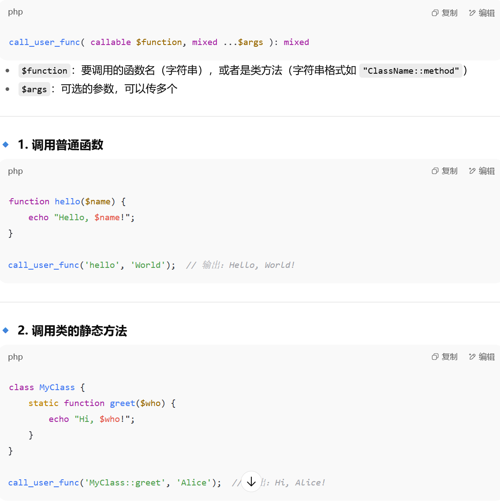

1.`strrev()` 函数用于反转字符串  
2.intval函数
 用于将变量转换为整数类型  ，转换失败则返回0，即若是转换的内容是字母的话就会转换失败，返回0
echo intval(array());                 // 0
echo intval(array('foo', 'bar'));     // 1
传入空数组返回0，非空数组返回1，也就是说可以传入一个非空数组绕过这个函数
3.`ctype_alpha` 
是 C 语言中的一个函数，用于检查一个字符是否是字母  
4.chr函数
把字符的ascii码值转换成原本的字符
5.basename函数
读取路径的文件名/?file=flag.php 使用basename（$_SERVER['PHP_SELF'] ）就可以得到flag.php，如果访问的结尾是一个参数?file=123 得到123，?file=flag.php得到flag.php
 basename（）无法处理非ascii字符，如果传入的参数中出现了非ascii字符则会把它给丢弃  
6.str_replace函数
str_replace(find, replace, string, count)
find 所要替换的目标字符或字符串
replace  所要进行替换的字符串
string  所要替换的目标字符或字符串所在的字符串或者数组，即搜索的区域
count  可选变量 指定替换的次数
7.str函数
把对象转换成字符串，包括元组，字典，整数等对象
8.`json_decode()` 函数

- **输入**：`json_decode()` 函数接受一个 JSON 格式的字符串作为输入。即以数组形式传入键值对?json={"x":"wllm"}
- **输出**：该函数尝试将输入的 JSON 字符串解析为一个 PHP 变量。如果 JSON 字符串表示一个对象，那么它将被转换为一个 PHP 对象；如果 JSON 字符串表示一个数组，那么它将被转换为一个 PHP 数组。
- **返回值**：如果解码成功，`json_decode()` 返回解码后的 PHP 变量。如果传递的字符串不是有效的 JSON，或者没有传入任何字符串，则该函数将返回 NULL 并且 `json_last_error()` 可以提供错误信息。
- `json_decode()` 还接受一个可选的第二个参数 `assoc`，当其值为 `TRUE` 时，函数将返回数组而不是对象。还有一个可选的第三个参数 `depth`，用于控制用户递归深度。  9.strstr函数  作用是在一个字符串中查找给定字符串的第一个匹配之处，并返回指向该字符串的指针。如果没有找到该字符串，则返回 NULL。[1](https://www.runoob.com/cprogramming/c-function-strstr.html)
char *strstr(const char *haystack, const char *needle);
strstr()函数的参数有两个：
    haystack：要查找的字符串，必须是一个以空字符 ‘\0’ 结尾的字符数组，也就是 C 语言中的字符串类型。
    needle：要查找的子字符串，也必须是一个以空字符 ‘\0’ 结尾的字符数组，也就是 C 语言中的字符串类型。
10.unescape函数
 unescape函数是JavaScript中的一个全局函数，用于将被转义的字符串还原成原始字符串 
11.fetch函数
可以在发送post请求的页面以post形式传入参数
12.随机数函数
mt_srand 可以指定一个种子值，影响mt_rand函数生成的随机数
mt_rand函数，随机数生成函数，可基于mt_srand
生成一个随机数
13.ctype_alpha ( $text );
 检查提供的字符串text中的所有字符是否为字母  ，
 如果文本中的每个字符都是字母，则返回TRUE，否则返回FALSE 
14. `file_get_contents` 是 PHP 中的一个函数，用于将整个文件的内容读取到一个字符串中。它通常用于快速读取数据，例如配置文件或模板文件。  
file_get_contents() file_get_content函数从用户指定的url获取内容，然后指定一个文件名 进行保存，并展示给用户。file_put_content函数把一个字符串写入文件中。
15.命令执行函数区别
system 有回显
passthru 有回显
exec 无回显，输出命令执行结果的最后一行
shell_exec 无回显
``  反引号，与shell_exec作用一致
16.strpos函数 和mb_strpos函数差不多
截取字符，strpos($page,'?'),找？在目标字符串第一次出现的位置，如果找到，返回？所在的位置（0开始），没找到返回false，可以和substr搭配使用截取某个符号签名的字符
比如substr（$page,0,strpos($page,'?')） ?file=hint.php?...,截取得到hint.php，
17.call_user_func

18.`scandir()`
'/'查看根目录的文件列表
'.'查看当前目录文件列表
