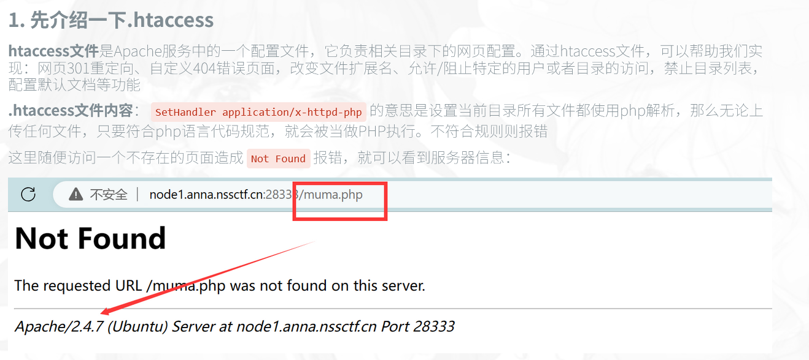

1.文件上传两种基础方式
可以直接上传php文件的直接上传php文件用phpinfo或者一句话木马蚁剑连接（这里应该也可以在上传的文件的页面post参数a，让a=phpinfo或者也可以传参a=system('cat /flag');然后去这个页面找flag）
2.前端过滤验证 
有的界面使用js验证过滤了php文件或者其他，或者要求jpg文件，可以尝试禁用js，不行在burpsuite抓包改文件后缀
3..htaccess文件上传

让目录的所有符号条件的文件使用按照php文件执行，不符合报错，是apache服务器的一个配置文件
内容不一样会影响php文件的解析，目前这个是把jpg文件解析成php文件
4.文件类型检测
可以上传php文件，然后抓包修改文件类型，改成image/jpeg的文件类型绕过检测
5.黑名单检测
在黑名单内的文件不能传入，但是可以修改文件后缀，比如改成php3，因为在php_ini文件里添加 AddType application/x-httpd-php .php .php3 .phtml  ，所以php3可以被解析成php文件，成功上传
6.大小写检测
直接大小写可以绕过
7.%00 和0x00绕过
这两个字符在URL编码中无实际意义， 当网站上传XXX.php%00.jpg时，通过白名单绕过，保存文件时，遇到%00字符就会截断后面的.jpg,文件最终保存为XXX.php   本质上和点/空格绕过是一致的，都是后面的内容被截断了
8.空格绕过和点绕过
这种本质上都是利用windows会忽略.或空格后的内容进行绕过，黑名单时，文件后缀被过滤，可以在末尾加点比如1.php. 可能可以绕过，或者1.php.jpg/1.php .jpg  服务器可能忽略只选择一个文件后缀，或者忽略空格后的内容进行绕过
9.data绕过
Tips：采用Windows流特性绕过，在这里意思是php运行在Windows上时如果文件名+":: D A T A " 会 把 : : DATA"会把:: DATA"会把::DATA之后的数据当作文件流处理，不会检测后缀名，且保持“::$DATA”之前的文件名，目的即使不检查后缀名
10.双写绕过
 str_ireplace() 函数不区分大小写，因此大小写绕过不适用，这里我们使用双写文件名绕过  
