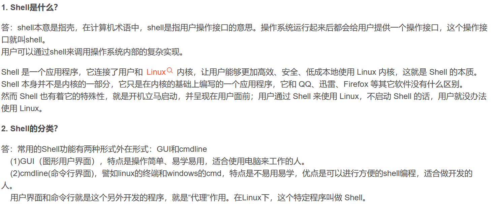
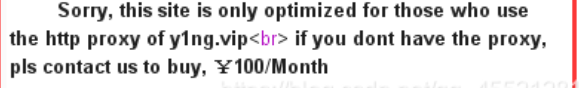

1.

2.命令拼接
 &&：[逻辑与](https://so.csdn.net/so/search?q=%E9%80%BB%E8%BE%91%E4%B8%8E&spm=1001.2101.3001.7020)，前边的命令执行成功，才会执行后边的命令；
 ||：[逻辑或](https://so.csdn.net/so/search?q=%E9%80%BB%E8%BE%91%E6%88%96&spm=1001.2101.3001.7020)，如果前边命令执行失败，后边的命令才会执行  
 |：按位或[运算符](https://so.csdn.net/so/search?q=%E8%BF%90%E7%AE%97%E7%AC%A6&spm=1001.2101.3001.7020)，直接执行后边的命令  
 &：[按位与](https://so.csdn.net/so/search?q=%E6%8C%89%E4%BD%8D%E4%B8%8E&spm=1001.2101.3001.7020)运算符，不论前边的命令执行是否成功，都会执行后边的命令  
 ；（分号）：先执行前边的命令，再执行后边的命令（分号是linux系统特有的）
3.xff：X-Forwarded-For（XFF）是用来识别通过HTTP代理或负载均衡方式连接到Web服务器的客户端最原始的IP地址的HTTP请求头字段。  IP地址
referer：HTTP来源地址。   是HTTP表头的一个字段，用来表示从哪儿链接到当前的网页，采用的格式是URL。 简单的讲，referer就是告诉服务器当前访问者是从哪个url地址跳转到自己的   from home page 127.0.0.1    网页URL地址
user-agent:哪个浏览器    Please use 'WLLM' browser!    
4.limit使用
一个参数：limit 10 将表中的前10条数据查询出来
两个参数： 第一个参数表示从第几行数据开始查，第二个参数表示查几条数据，"limit 0,2"；表示从第1行数据开始，取2条数据。  
5.ping命令是什么，有什么作用？
      用于验证与远程计算机的连接。该命令只有在安装了 TCP/IP 协议后才可以使用。Ping命令的主要作用是通过发送数据包并接收应答信息来检测两台计算机之间的网络是否连通。当网络出现故障的时候，可以用这个命令来预测故障和确定故障地点。Ping命令成功只是说明当前主机与目的主机之间存在一条连通的路径。如果不成功，则考虑：网线是否连通、网卡设置是否正确、IP地址是否可用等。
6.
 | User-Agent | User-Agent的内容包含发出请求的用户信息 | User-Agent: Mozilla/5.0 (Linux; X11) | 
|---|---|---|
 | Via | 通知中间网关或代理服务器地址，通信协议 | Via: 1.0 fred, 1.1 nowhere.com (Apache/1.1) | 
 | From | 发出请求的用户的Email | From: user@email.com | 
 | host |  告诉服务器接收请求的域名或IP地址，告诉服务器应该将请求定向到哪个域名或 IP 地址上的资源   | ​ | 
**location xff头 127.0.0.1**

  from头

via头

 host头
7.URL特殊字符编码
空格    -    %20
"          -    %22
#         -    %23
%        -    %25
&         -    %26
(          -    %28
)          -    %29
+         -    %2B
,          -    %2C
/          -    %2F
:          -    %3A
;          -    %3B
<         -    %3C
=         -    %3D
>         -    %3E
?         -    %3F
@       -    %40
\          -    %5C
|          -    %7C 
8.环境变量查看
linux系统中使用env或者printenv
打印环境变量，在getshell后可以使用
9.github上传文件
先用gitbash定位到所在文件夹，然后用git add 文件名，然后
git commit -m "添加的备注"，为该文件加备注，最后用git push origin main来上传文件
10.#和--+区别
--是注释，但需要后面有空格才能生效，而在url编码中，+会被解释为空格，因此在get传参时一般使用--+，也可以使用URL编码的%20或者%23，而在post中一般则用#来注释
11.**$_SERVE[‘PHP_SELF’] **读取的是当前执行脚本的文件名，意思就是读取文件夹下的一
 $_SERVER['REQUEST_URI']是取得当前URL的 路径地址  
：https://www.shawroot.cc/php/index.php/test/foo?username=root 
  $_SERVER['PHP_SELF'] 	得到：/php/index.php/test/foo
 $_SERVER['REQUEST_URI'] 得到：/php/index.php/test/foo?username=root 
12.sql注入之||运算符
补充：|| 或or 运算符讲解：
select command1 || command2 
情况一：若command1为非0数字，则结果为1。
情况二：若command1为0或字母，command2为非0数字，则结果为1。
情况三：command1和command2都不为非0数字，则结果为0。
**13.wsl和windowsIP地址**
wsl：172.19.115.53
windows：192.168.0.110
**14.content-type**
  用于定义网络文件的类型和网页的编码，决定浏览器将以什么形式、什么编码读取这个文件
`text/html` 内容为html文档
`application/json`  Body 给出一个 JSON 格式的数据，服务端会解析它  
`application/x-www-form-urlencoded` 是 HTML 表单默认的 `Content-Type` 类型，表示数据以键值对形式进行编码  广泛用于 GET 请求的查询字符串  
`multipart/form-data` 通常用于表单数据中包含文件上传的情景  
`text/plain` 表示内容是纯文本  

**15.**get传参中遇到具有特殊含义的字符编码可以转换成URL编码传入
**16.文件后缀**
index.php备份文件后缀名
 “.git” 、“.[svn](https://so.csdn.net/so/search?q=svn&spm=1001.2101.3001.7020)”、“ .swp”“.~”、“.bak”、“.bash_history”、“.bkf  
**17.JFIF**
** **它是 JPEG 图像文件的一种交换格式，规定了文件头中应包含的元数据，比如分辨率、颜色空间等**。  **看见JFIF说明是图片
18.waf检测特性
waf在对参数比如num进行检测时，会依据参数名严格进行检测，比如 num检测时，如果加一个空格，waf就会认为是不同的参数从而绕过检测，而php则不同，php处理参数时，会自动忽略前面的空格，点，下划线等字符，并对参数进行处理，所以可以加空格绕过waf检测
19.0day漏洞：企业未发现，漏洞未公开，但黑客已经发现并加以利用的漏洞
1day漏洞：企业已经发现并打补丁，但是部分用户还未更新
Nday漏洞：已经打补丁，漏洞早已更新，部分老旧系统存在
​
 
