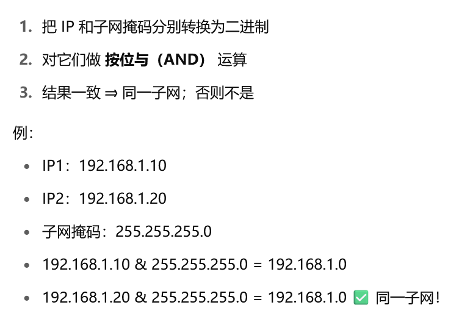
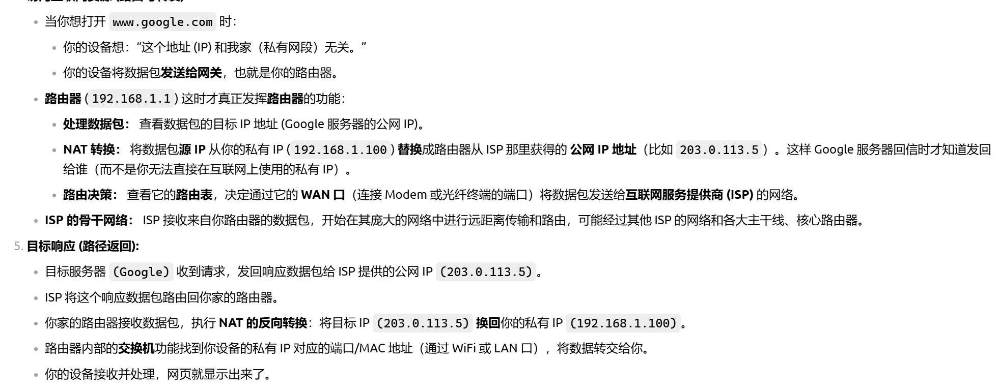
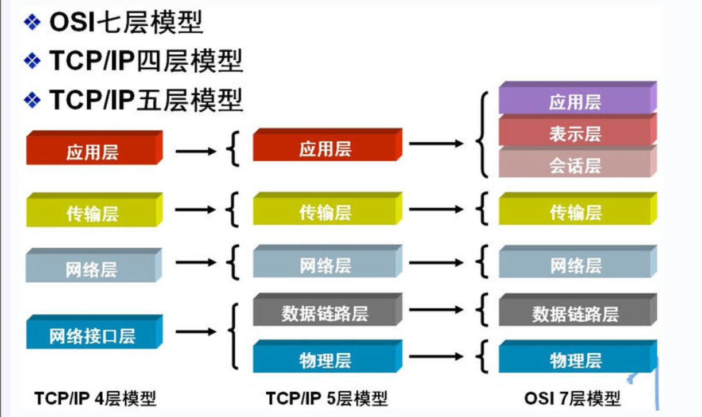
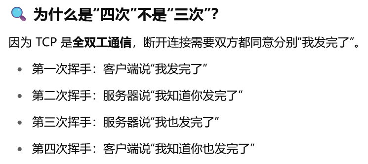
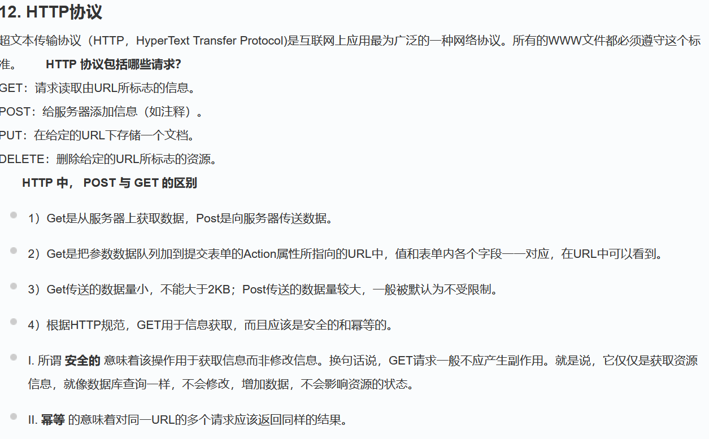
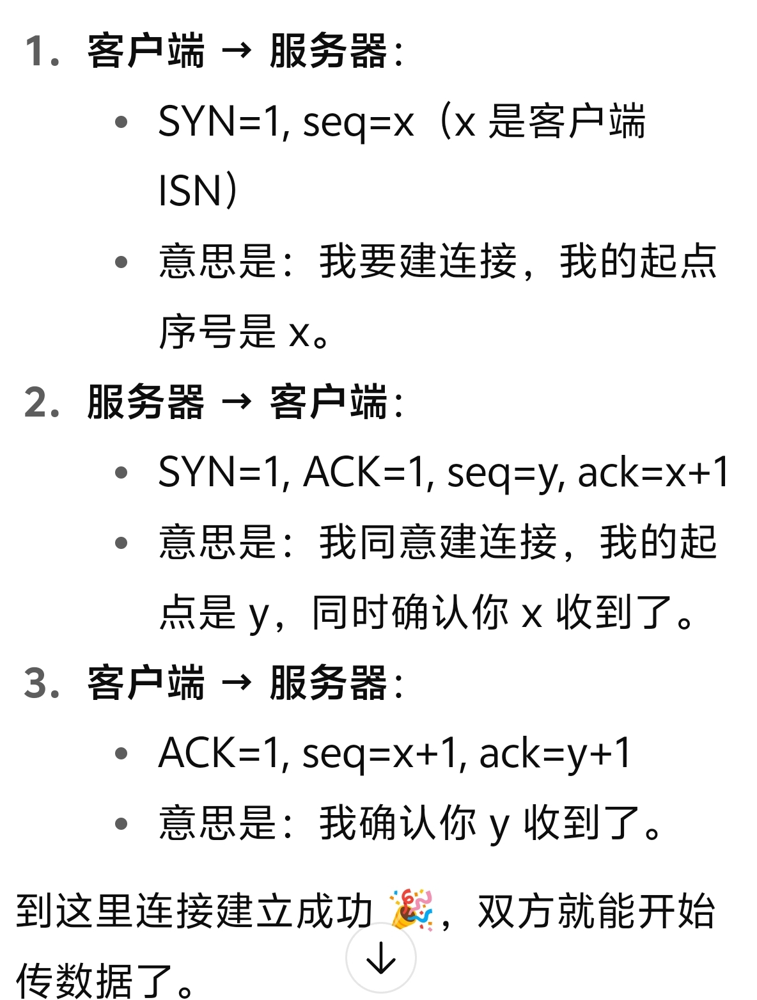

**1.ip地址**
 IP（Internet Protocol Address）是“互联网地址，每台联网设备都有一个 IP 地址 
对于ip有ipv4和ipv6两个地址，ipv4大约40亿个，用点分十进制表示，ipv6是ip最新的一代技术，约3.4x10**38个，
本机    IPv4 地址 . . . . . . . . . . . . : 192.168.89.1
IPv6 地址 . . . . . . . . . . . . : 2409:8a34:5c39:3550:9e30:2f0a:93ae:d626
**ip地址由****网络号和主机号****组成，前24位是网络号，后八位是主机号，比如192.168.1.100这个实际上是11000000.10101000.00000001.01100100（共32位），**

- **网络号：表示这个 IP 属于哪个网络**
- **主机号：表示这个网络里的哪一台主机****1****.网络地址就是主机部分为0，即192.168.1.0****，它不指向某个主机，而是代表某个192.168.1.x网段，这个网段下有很多个主机，主机ip地址是1.什么。**
**2.广播地址**则是192.168.1.255，也称为直接广播地址，区别于受限广播地址，也就是二进制数全为1转成十进制的数**， **向某个网络的广播地址发送消息时，该网络内的所有主机都能收到该广播消息。** **
**子网广播地址 网络号不变，主机号全置1**
**3.组播地址**
D类地址就是组播地址。 
先回忆下A，B，C，D类地址吧： 
A类地址以0开头，第一个字节作为网络号，地址范围为：0.0.0.0~127.255.255.255；(modified @2016.05.31) 
B类地址以10开头，前两个字节作为网络号，地址范围是：128.0.0.0~191.255.255.255; 
C类地址以110开头，前三个字节作为网络号，地址范围是192.0.0.0~223.255.255.255。 
D类地址以1110开头，地址范围是224.0.0.0~239.255.255.255，D类地址作为组播地址（一对多的通信）； 
E类地址以1111开头，地址范围是240.0.0.0~255.255.255.255，E类地址为保留地址，供以后使用。 
注：只有A,B,C有网络号和主机号之分，D类地址和E类地址没有划分网络号和主机号。 
**4.受限广播地址**：**255.255.255.255**
该IP地址指的是受限的广播地址。受限广播地址与一般广播地址（直接广播地址）的区别在于，受限广播地址只能用于本地网络。

1. ** 0.0.0.0**常用于寻找自己的ip地址
**6.回环地址**
127.0.0.0/8被用作回环地址，回环地址表示本机的地址，常用于对本机的测试，用的最多的是127.0.0.1。 
**7**.**A、B、C类私有地址**
私有地址(private address)也叫专用地址，它们不会在全球使用，只具有本地意义。 
A类私有地址：10.0.0.0/8，范围是：10.0.0.0~10.255.255.255 
B类私有地址：172.16.0.0/12，范围是：172.16.0.0~172.31.255.255 
C类私有地址：192.168.0.0/16，范围是：192.168.0.0~192.168.255.255 
**8.子网掩码**
告诉我们哪些位是网络号，哪些位是主机号，也就是可以确定主机的数量
 | 子网掩码 | CIDR 写法 | 主机数量（除去网络和广播） | 
|---|---|---|
 | 255.0.0.0 | `/8` | 16,777,214 | 
 | 255.255.0.0 | `/16` | 65,534 | 
 | 255.255.255.0 | `/24` | 254 | 
 | 255.255.255.128 | `/25` | 126 | 
 | 255.255.255.192 | `/26` | 62 | 
 | 255.255.255.252 | `/30` | 2（点对点） | 

**相与：相同为1，不同为0**
**2.端口**： 端口是主机上的服务或程序对外开放的“门”，每个服务通过不同的端口来通信。  
**3.主机**：一台联网的设备称为主机
**4. 端口扫描** = 探测一台主机开放了哪些服务
**5.服务识别**：确定端口运行的是哪个具体服务 Apache/Nginx
**6.存活探测**：判断某个ip地址对应的主机是否开机，能否通信，访问等
可以理解成一台主机里面有多个服务，每个服务有对应的端口，可以通过端口扫描来确定一台主机中开放了哪些服务，端口是关闭的服务就没有开放
**7.内网和外网**
外网ip： 全球唯一的 IP 地址，可以被任何人访问  
内网ip：不能使用互联网直接访问
8.网关：连接内网和外网的工具 通常是路由器
**9.net(网络地址转换)**：用路由器把内网ip转换成外网ip
**10**.ip和网站域名之间通过DNS系统进行转换，通常访问一个域名，然后DNS转换成对应的ip，找到这个服务器，然后进行请求和响应
**11.局域网和联网**
局域网是由多个主机和路由器等组成的局部网络，主机之间可以通过有线或无线进行连接，有线的话一般是通过以太网线进行连接（主流），无线则是通过WiFi进行连接，
**家庭局域网也就是通过wifi组成，手机或者计算机连接路由器，然后路由器在通过某种方式连接互联网，这就是可以理解成所谓的联网**

**12.网络层次划分**
 1.osi七层模型
 依次为也就是第一层到第七层：物理层（Physics Layer）、数据链路层（Data Link Layer）、网络层（Network Layer）、传输层（Transport Layer）、会话层（Session Layer）、表示层（Presentation Layer）、应用层（Application Layer）。其中第四层完成数据传送服务，上面三层面向用户  ，也就是**会话，表示，应用三层面向用户**

**(5).应用层**
为操作系统或网络应用程序提供访问网络服务的接口。 
会话层、表示层和应用层重点： 

- **1> 数据传输基本单位为报文；**
- **2> 包含的主要协议：FTP（文件传送协议）、Telnet（远程登录协议）、DNS（域名解析协议）、SMTP（邮件传送协议），POP3协议（邮局协议），HTTP协议（Hyper Text Transfer Protocol）。****关于各种协议的具体内容在最下面**
**(4).传输层**
 第一个端到端，即主机到主机的层次。传输层负责将上层数据分段并提供端到端的、可靠的或不可靠的传输。此外，传输层还要处理端到端的差错控制和流量控制问题。 传输层的任务是根据通信子网的特性，最佳的利用网络资源，为两个端系统的会话层之间，提供建立、维护和取消传输连接的功能，负责端到端的可靠数据传输。在这一层，信息传送的协议数据单元称为段或报文。 网络层只是根据网络地址将源结点发出的数据包传送到目的结点，而传输层则负责将数据可靠地传送到相应的端口  
传输层重点内容
 (1).传输层负责将上层数据分段并提供端到端的、可靠的或不可靠的传输以及端到端的差错控制和流量控制问题  。
(2).主要协议： TCP协议（Transmission Control Protocol，传输控制协议）、UDP协议（User Datagram Protocol，用户数据报协议）
(3).重要设备：网关
**(3).网络层（Network Layer）**
网络层的目的是实现两个端系统之间的数据透明传送，具体功能包括寻址和路由选择、连接的建立、保持和终止等。它提供的服务使传输层不需要了解网络中的数据传输和交换技术。如果您想用尽量少的词来记住网络层，那就是"路径选择、路由及逻辑寻址"。 
网络层中涉及众多的协议，其中包括最重要的协议，也是TCP/IP的核心协议——IP协议。IP协议非常简单，仅仅提供不可靠、无连接的传送服务。IP协议的主要功能有：无连接数据报传输、数据报路由选择和差错控制。与IP协议配套使用实现其功能的还有地址解析协议ARP、逆地址解析协议RARP、因特网报文协议ICMP、因特网组管理协议IGMP。**网络层的重点为： **

- **1> 网络层负责对子网间的数据包进行路由选择。此外，网络层还可以实现拥塞控制、网际互连等功能；**
- **2> 基本数据单位为IP数据报；**
- **3> 包含的主要协议：**
- **IP协议****（Internet Protocol，因特网互联协议）;**
- **ICMP协议****（Internet Control Message Protocol，因特网控制报文协议）;**
- **ARP协议（****Address Resolution Protocol，地址解析协议）; ip地址->MAC地址**
- **RARP协议****（Reverse Address Resolution Protocol，逆地址解析协议）**。(2).**数据链路层（Data Link Layer）**
**数据链路层在物理层提供的服务基础上为网络层提供服务****， 其最基本的服务是将源自网络层来的数据可靠地传输到相邻节点的目标机网络层  **， 为达到这一目的，数据链路必须具备一系列相应的功能，主要有：如何将数据组合成数据块，在数据链路层中称这种数据块为帧（frame），帧是数据链路层的传送单位；如何控制帧在物理信道上的传输，包括如何处理传输差错，如何调节发送速率以使与接收方相匹配；以及在两个网络实体之间提供数据链路通路的建立、维持和释放的管理。数据链路层在不可靠的物理介质上提供可靠的传输。该层的作用包括：物理地址寻址、数据的成帧、流量控制、数据的检错、重发等。  实际通信使用的是MAC地址（物理地址）
**数据链路层的两个重要设备 : 网桥和交换机，主要的协议是****以太网协议**
**网桥是局域网内部连接多个子网（扩展用的）  **
**(1).物理层**
 激活、维持、关闭通信端点之间的机械特性、电气特性、功能特性以及过程特性。**该层为上层协议提供了一个传输数据的可靠的物理媒体。简单的说，物理层确保原始的数据可在各种物理媒体上传输。**物理层记住两个重要的设备名称，中继器（Repeater，也叫放大器）和集线器 
**13.ARP/RARP协议**
地址解析协议，即ARP（Address Reso**​**lution Protocol），是根据IP地址获取物理地址的一个TCP/IP协议
 把 IP 地址解析为 MAC 地址，让网络设备能在局域网中找到目标设备的物理地址。

- 攻击者可以伪装成网关，实施 **ARP欺骗（ARP Spoofing）**
- 从而达到 **中间人攻击** 的目的 还有RARP协议，由MAC地址找到IP地址的协议
### 14. 路由选择协议
常见的路由选择协议有：RIP协议、OSPF协议。 
**RIP****协议** ：底层是贝尔曼福特算法，它选择路由的度量标准（metric)是跳数，最大跳数是15跳，如果大于15跳，它就会丢弃数据包。 
**OSPF协议** ：Open Shortest Path First开放式最短路径优先，底层是迪杰斯特拉算法，是链路状态路由选择协议，它选择路由的度量标准是带宽，延迟。 
**15.TCP/IP协议**
**TCP/IP协议是Internet最基本的协议、Internet国际互联网络的基础，由网络层的IP协议和传输层的TCP协议组成。通俗而言：TCP负责发现传输的问题，一有问题就发出信号，要求重新传输，直到所有数据安全正确地传输到目的地。而IP是给因特网的每一台联网设备规定一个地址。**
** ** (1)ip协议  在网络层上的协议
把数据包从源地址发送到目标地址
（2）TCP协议  位于传输层
tcp三次握手：客户端发出，服务器收到且发出，客户端收到，确保通信双方都能进行发送和接收
四次挥手：

**16.UDP协议**
UDP用户数据报协议，是面向无连接的通讯协议，UDP数据包括目的端口号和源端口号信息，由于通讯不需要连接，所以可以实现广播发送。
UDP是无连接的，不可靠的数据包服务，tcp是面向连接的，可靠的字节流服务，和TCP协议一样位于传输层，承载DNS请求?
**17.DNS协议**
域名解析协议，用于将url转换成对应的IP地址
**18.NAT协议**
用于将私有IP转换成公网IP地址
**19.DHCP协议**
用于给设备分配IP地址的协议
**20.http协议**

输入域名，被DNS服务器解析，得到对应服务器的IP地址，和这个ip地址所对应服务器建立连接，tcp三次握手，因为和服务器已经建立连接了，所以可以直接就发起http请求（要访问网页的这个请求，），然后服务器收到并响应，接着浏览器渲染网页，然后tcp四次挥手断开连接。
21.tcp三次握手四次挥手
syn 同步序列号
isn/seq  初始序列号  让对方知道这个是第几个字节，位置
ACK 确认标志  ack 确认的具体序号，下一位从哪里开始

四次挥手本质上多了一个服务器收到 然后再发出的过程，在四次挥手里是分开的。
因为服务器在收到fin信号时不会立即关闭socket，所以ACK和FIN要分开发送
