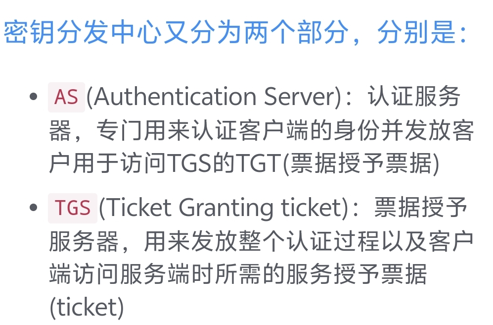
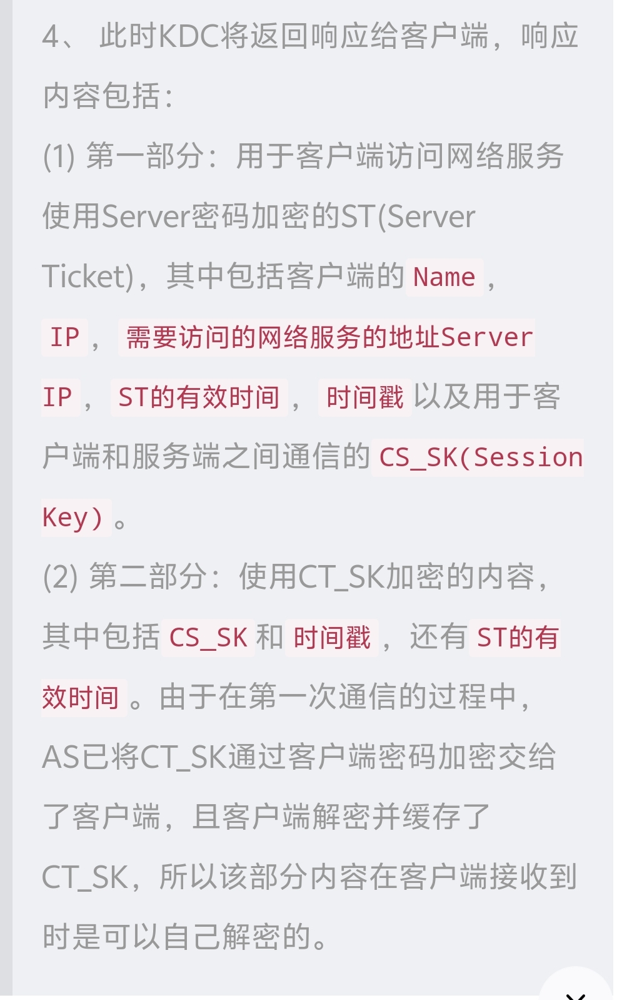

1.定义
是计算机网络认证协议，主要是为了为通信双方提供严格身份认证服务，确保身份的真实性和安全性。 侧重点就是进行通信双方身份的认证。
2.角色组成
客户端，服务端，密钥分发中心（KDC）
密钥分发中心又分为AS，TGS两个部分

3.简单流程
实际上就是客户端向KDC发起请求，获取自己想要访问的目标服务的服务授予票据，
接着客户端拿着这个服务授予票据去访问对应服务。
4.完整认证流程（三次通信）
第一次通信
目的：确认客户端身份是有权限访问KDC的客户端（KDC自身存在数据库记录有权限使用kerberos协议的用户和服务）。
主要过程：客户端发起请求，携带用户名，主机IP，当前时间戳，AS接受后在数据库查询是否存在对应用户，不存在则认证失败，存在则返回两部分内容
第一部分：TGT（票据授予票据），而这个TGT主要包含了该客户端在数据库中存储的信息的Name、IP、当前时间戳、客户端即将访问的TGS的Name、TGT的有效时间戳以及一把用于客户端和TGS间进行通信Session_key(CT_SK)，
TGT使用TGS密钥进行加密，所以客户端无法解密，且密钥因为没有在网络上传播，也不会被劫持或破解。
第二部分：使用客户端密钥加密的内容，包括Session_key(CT_SK),客户端即将访问的TGS的Name以及TGT的有效时间，和一个当前时间戳，由于使用客户端密钥加密，客户端可以正常解密并获取CT_SK密钥用于客户端和TGS通信，客户端密钥也没有在网络进行传播，无法被获取，至此，第一次通信过程完成。
​
第二次通信
先判断时间戳和自己发起请求的时间戳是否超过五分钟，若超过则认为时间戳是AS伪造的，认证失败，若未超过则继续准备向TGS发起请求
目的：获取服务授予票据
客户端行为：
1.客户端使用CT_SK加密将自己的客户端信息发送给TGS，其中包括客户端名、IP、时间戳；2. 客户端将自己想要访问的Server服务以明文的方式发送给TGS
3 .客户端将使用TGS密钥加密的TGT也原封不动的也携带给TGS；
TGS行为：
1.先查看kerberos系统里是否存在客户端要访问的服务，不存在则认证失败
2.查看时间戳判断通信过程是否超出时延，通信双方是否可靠。
3.把TGS密钥解密的TGT的信息和CT_SK客户端密钥解密的信息进行对比，判断是否一致。
4.进行响应，返回两部分内容
这里的第一部分就是ST，服务授予票据

至此，第二次通信完成。
​
第三次通信
还是先检查时间戳，无误后取出CS_SK（客户端和服务端通信的session key），准备向服务端发起请求。
客户端行为：
使用CS_SK将自己的主机信息和时间戳进行加密作为交给服务端的第一部分内容，还有ST服务授予票据作为第二部分内容也发送给服务端。
服务端行为：
检查时间戳，无误后使用自己的server密钥对ST进行解密，和由CS_SK解密的内容进行对比，判断是否一致，然后确定客户端就是带有KDC认证的客户，然后在发送一个由CS_SK加密的请求响应给客户端，客户端解密后由此确认服务端的身份。（**其实服务端在通信的过程中还会使用数字证书证明自己身份**）
至此，三次通信完成
