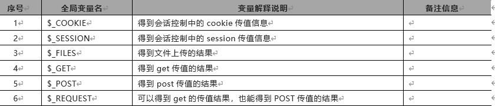
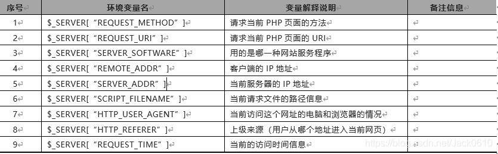
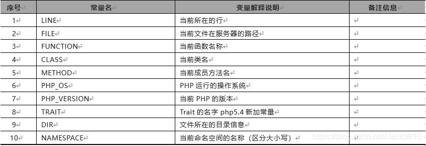

1.全局变量


2.环境变量


3.常量
可以用define（）或const关键字来定义 （具有全局作用域）
 一个常量由英文字母、下划线、和数字组成，但数字不能作为首字母出现。 (常量名不需要加 $ 修饰符)。  
define函数定义常量
bool define ( string $name , mixed $value [, bool $case_insensitive = false ] )
name：常量名称
  value：常量的值
 **case_insensitive **：可选参数，如果设置为 TRUE，该常量则大小写不敏感，默认是大小写敏感的。  
const定义常量
const CONSTANT_NAME = "value";
 在字符串中调用常量的时候，必须在引号外面  

```php
echo '我的名字是'.MY_NAME;
```


