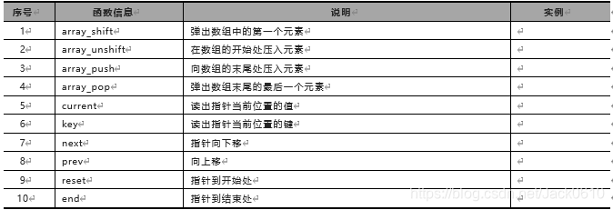
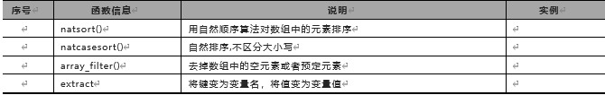

1. 数组是一个能在单个变量中存储多个值的特殊变量 
2.数组类型 

- **数值数组** - 带有数字 ID 键的数组
- **关联数组** - 带有指定的键的数组，每个键关联一个值
- **多维数组** - 包含一个或多个数组的数组3.count（数组名）获取数组的长度
4.关联数组
 $age=array("Peter"=>"35","Ben"=>"37","Joe"=>"43");  
 $age['Peter']="35";$age['Ben']="37";$age['Joe']="43";  
5.数组排序

- sort() - 对数组进行升序排列
- rsort() - 对数组进行降序排列
- asort() - 根据关联数组的值，对数组进行升序排列
- ksort() - 根据关联数组的键，对数组进行升序排列
- arsort() - 根据关联数组的值，对数组进行降序排列
- krsort() - 根据关联数组的键，对数组进行降序排列数组常用函数

​
