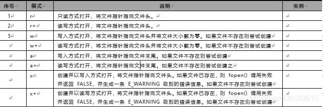
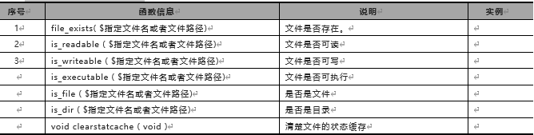
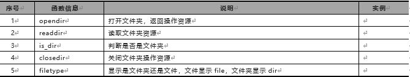

1.文件读取 readfile函数
readfile ( string: $文件名)
功能：传入一个文件路径，输出一个文件。
2.文件打开  file_get_contents  函数
<?php
   $filename = 'NoAlike.txt';
   $filestring = file_get_contents($filename);
   echo $filestring;
?>
3.修改文件内容
file_put_contents ( string $文件路径, string $写入数据)
功能：向指定的文件当中写入一个字符串，如果文件不存在则创建文件。返回的是写入的字节长度
4.fopen，fwrite，fclose函数

5.tmpfile函数 创建临时文件
6.文件重命名
rename($旧名,$新名);
功能：这个函数返回一个bool值，将旧的名字改为新的名字。
7.文件复制
copy(源文件,目标文件)
功能：将指定路径的源文件，复制一份到目标文件的位置。
8.常用文件属性函数

9.

​
​
​
​
