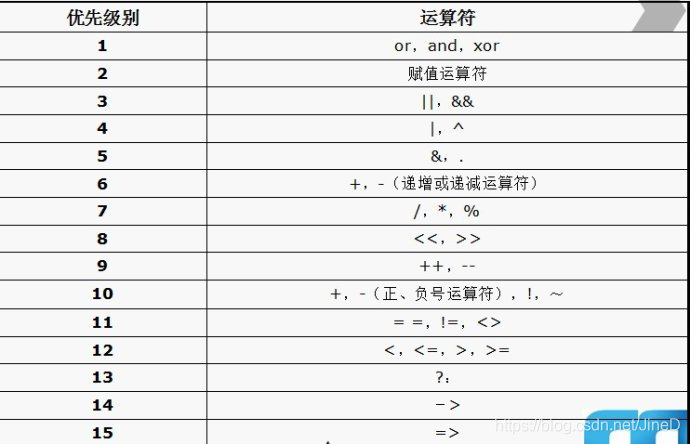

1.比较运算符
x<>y  不等于  如果x不等于y，返回true
x！==y  不绝对等于 如果x不等于y，或者类型不同，返回true
2.逻辑运算符
 | x and y | 与 | 如果 x 和 y 都为 true，则返回 true |  x=6y=3 (x < 10 and y > 1) 返回 true | 
|---|---|---|---|
 | x or y | 或 | 如果 x 和 y 至少有一个为 true，则返回 true |  x=6y=3 (x==6 or y==5) 返回 true | 
 | x xor y | 异或 | 如果 x 和 y 有且仅有一个为 true，则返回 true |  x=6y=3 (x==6 xor y==3) 返回 false | 
3.数组运算符
 | x + y | 集合 | x 和 y 的集合 | 
|---|---|---|
 | x == y | 相等 | 如果 x 和 y 具有相同的键/值对，则返回 true | 
 | x === y | 恒等 | 如果 x 和 y 具有相同的键/值对，且顺序相同类型相同，则返回 true | 
4.三元运算符
等同于C语言的条件运算符
5.组合比较符
$c = $a <=> $b;

-  如果** $a > $b**, 则 **$c** 的值为 **1**。
-  如果 **$a == $b**, 则 **$c** 的值为 **0**。
-  如果 **$a < $b**, 则 **$c** 的值为 **-1**6.运算符优先级

​
