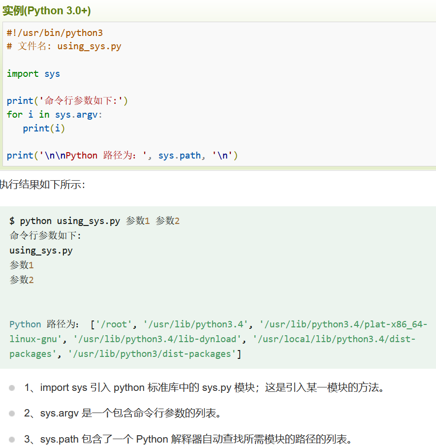
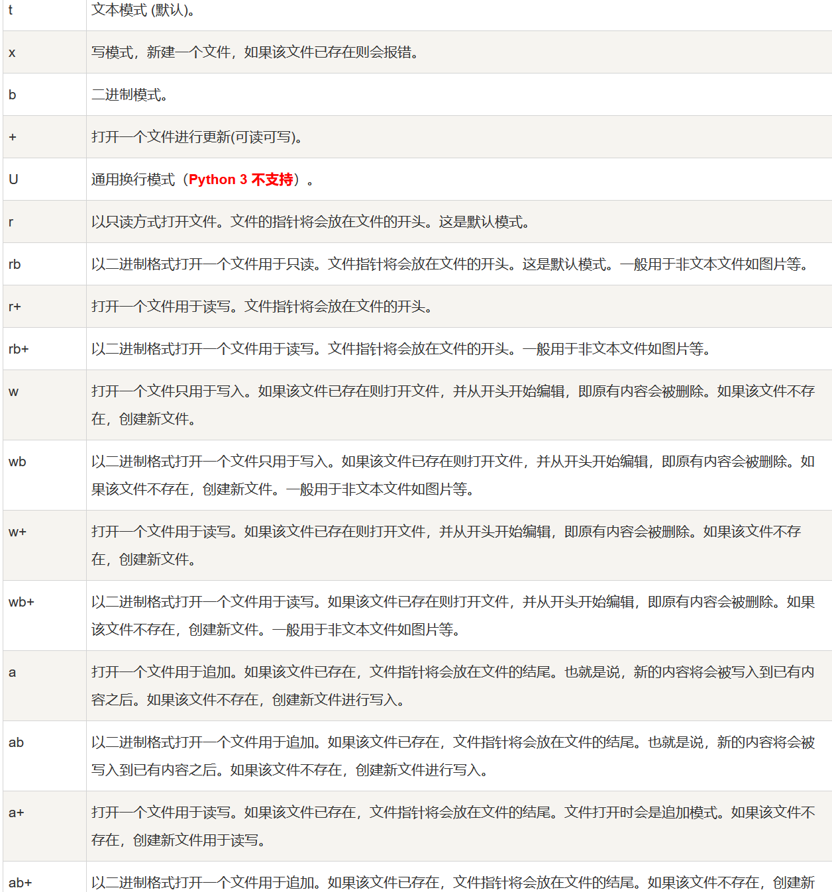

1.模块
 Python 提供了一个办法，把这些定义存放在文件中，为一些脚本或者交互式的解释器实例使用，这个文件被称为模块。  


2.import引用
def print_func(par):
 print("Hello : ", par)
return
**导入模块（ 一个模块只会被导入一次  ）**
import support
**现在可以调用模块里包含的函数了**
support.print_func("Runoob")
3.from   import 语句
从模块中导入一个指定的部分到当前命名空间中  
> from fibo import fib, fib2fib(500)1 1 2 3 5 8 13 21 34 55 89 144 233 377

4.__name__属性  （双下划线）
 每个模块都有一个__name__属性，当其值是'__main__'时，表明该模块自身在运行，否则是被引入。  
5.file 文件


6.类与对象
实例：class MyClass:
    """一个简单的类实例"""
    i = 12345
    def f(self):
        return 'hello world'
# 实例化类
x = MyClass()
# 访问类的属性和方法
print("MyClass 类的属性 i 为：", x.i)
print("MyClass 类的方法 f 输出为：", x.f())
类必须有一个额外的第一个参数名称，即为self
 self 代表的是类的实例，代表当前对象的地址，而 self.class 则指向类。  
类的方法及继承

```plain
#类定义
class people:
    #定义基本属性
    name = ''
    age = 0
    #定义私有属性,私有属性在类外部无法直接进行访问
    __weight = 0
    #定义构造方法
    def __init__(self,n,a,w):
        self.name = n
        self.age = a
        self.__weight = w
    def speak(self):
        print("%s 说: 我 %d 岁。" %(self.name,self.age))
# 实例化类
p = people('runoob',10,30)
p.speak()

#类的继承
 # 包括单继承和多继承
class sample(speaker,student):
    a =''
    def __init__(self,n,a,w,g,t):
        student.__init__(self,n,a,w,g)
        speaker.__init__(self,n,t)
```
类的属性及方法：
私有属性：两个下划线开头，不能被类的外部直接进访问
私有方法：两个下划线开头，只能在类的内部调用
 **重载：就是多个相同函数名的函数，根据传入的参数个数，参数类型而执行不同的功能  **
7.全局变量和局部变量
global关键字可以在内部作用域里面修改外部作用域的变量（全局变量）
nonlocal可以修改外层作用域的变量
8.标准库
类似于外部的python模块，里面含有函数等功能，可以直接使用
​
​
