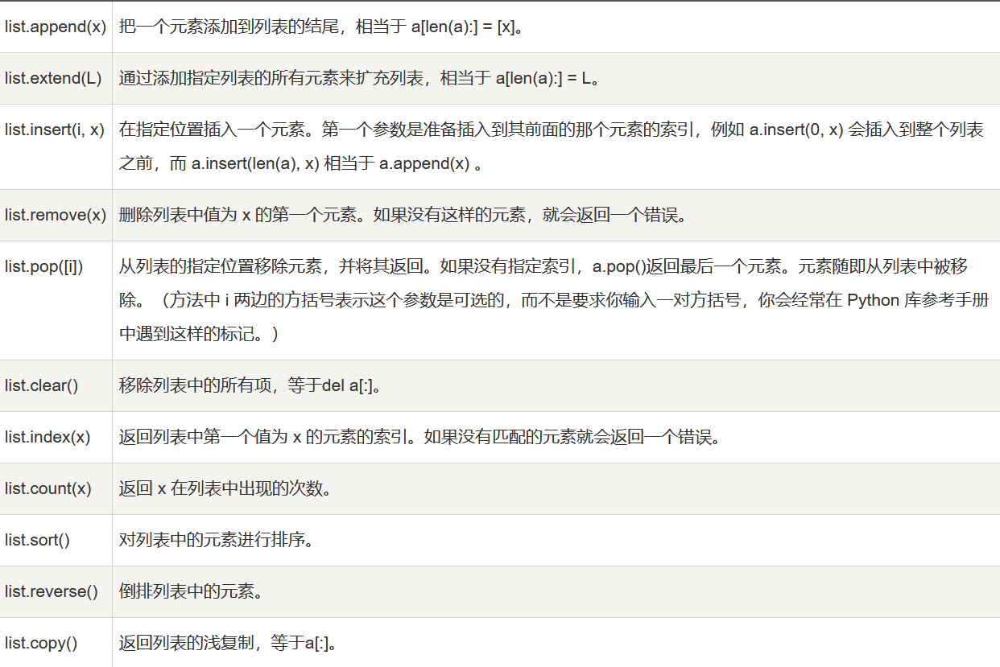

1.列表中的方法

2.栈 一种后进先出的数据结构
3.队列 一种先进先出的数据结构  
列表可以当做栈和队列来使用
4.字典中的items方法

- `items() 函数以列表返回可遍历的(键, 值) 元组。`
- `将字典中的键值对以元组存储，并将众多元组存在列表中`scores = {'甘露':23,'jock':18,'qiao':22,'谷雨':24,'嘟嘟':6}
item = scores.items()
print(item)
dict_items([('甘露', 23), ('jock', 18), ('qiao', 22), ('谷雨', 24), ('嘟嘟', 6)])
​
